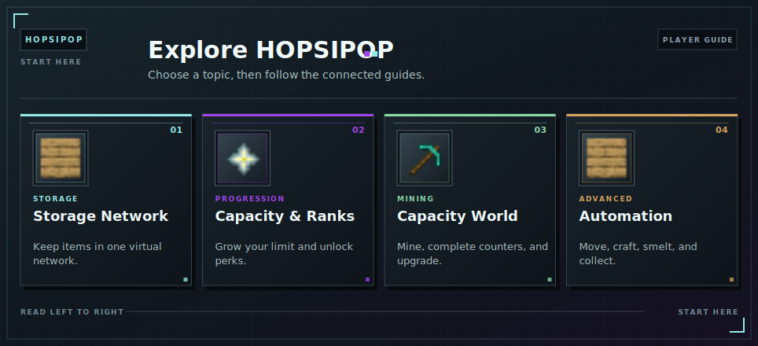

# HOPSIPOP Wiki

Find the feature you want to use, then follow the links inside each article to learn the connected systems.

<!-- ARTICLE-VISUAL:wiki-home:START -->

<!-- ARTICLE-VISUAL:wiki-home:END -->

## New Players

- [See how the complete system fits together](system-overview.md)
- [Unlock your storage network](master-chest/getting-started.md)

## Storage and Capacity

Manage items, increase your storage limit, advance through [ranks](ranks.md), and protect land.

- [Storage Network](master-chest/README.md)
- [Capacity](capacity.md)
- [Ranks](ranks.md)
- [Claims](claims.md)

## Mining and Upgrades

Enter the temporary mining world, earn [Capacity](capacity.md), mine with friends, and buy permanent upgrades.

- [Mining World](capacity-world/README.md)
- [Counters and Rewards](capacity-world/counters.md)
- [Co-op Mining](capacity-world/coop.md)
- [Upgrades](capacity-world/upgrades.md)

## Automation and Advanced Tools

Move, process, craft, and collect items with connected storage tools.

- [OmniSync](master-chest/omnisync.md)
- [Automation Jobs](master-chest/automation.md)
- [Hoppers and Access Points](master-chest/hoppers.md)
- [Chunk Drills](capacity-world/chunk-drills.md)
- [Cell Tower](tools/cell-tower.md)
- [Lava Sponge](tools/lava-sponge.md)
- [Mobile Workbench](tools/mobile-workbench.md)

## Help and Safety

- [Storage Help](master-chest/troubleshooting.md)
- [Mining Help](capacity-world/troubleshooting.md)
- [World Rules](capacity-world/world-rules.md)
- [World Resets](capacity-world/resets.md)
