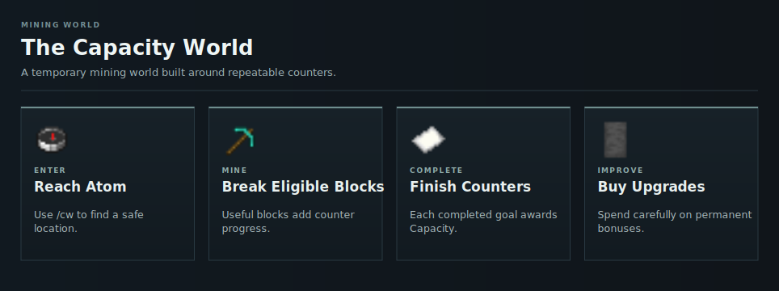

# Capacity World

The [Capacity](../capacity.md) World is a temporary mining area where completed [counter](counters.md) goals award [Capacity](../capacity.md). Atom [rank](../ranks.md) is required.

<!-- ARTICLE-VISUAL:capacity-world:START -->

<!-- ARTICLE-VISUAL:capacity-world:END -->

## Start Here

1. [Enter the World](getting-started.md)
2. [Understand Counters](counters.md)
3. [Review Mining Rewards](mining-and-rewards.md)
4. [Read World Rules](world-rules.md)

## Improve Mining

- [Counter Reduction](counter-reduction.md)
- [Lucky Break](lucky-break.md)
- [Counter Boosts](counter-boosts.md)
- [Co-op Mining](coop.md)
- [Chunk Drills](chunk-drills.md)
- [Buying Upgrades](upgrades.md)

The world resets every ten hours. Read [World Resets](resets.md) before leaving items or drills behind.
