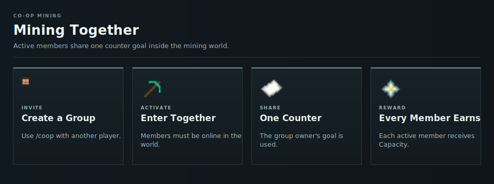

# Co-op Mining

A co-op lets active players share one mining [counter](counters.md) goal inside the [Capacity](../capacity.md) World.

<!-- ARTICLE-VISUAL:coop:START -->

<!-- ARTICLE-VISUAL:coop:END -->

## Group Size

Both the inviter and invited player must support the resulting size.

| Maximum players | Upgrade cost |
| --- | ---: |
| 2 | 5,000 [Capacity](../capacity.md) |
| 3 | 15,000 [Capacity](../capacity.md) |
| 4 | 50,000 [Capacity](../capacity.md) |

## Joining

Run `/coop <player>` or right-click the player inside the mining world. Invitations expire after 60 seconds. Mutual invitations accept automatically.

Use `/coop decline <player>` to decline or `/coop leave` to leave.

## Shared Progress

The player with the better [Counter Reduction](counter-reduction.md) becomes the initial owner. Active members use that owner's goal. If no partner is online inside the world, personal progress is used instead.

Every member normally receives one [Capacity](../capacity.md) when the shared goal completes. A [Counter Boost](counter-boosts.md) changes only the boosted player's reward.

Groups dissolve when too few members remain or during a [World Reset](resets.md).

## Continue Learning

- [Counters](counters.md)
- [Mining Rewards](mining-and-rewards.md)
- [Counter Boosts](counter-boosts.md)
