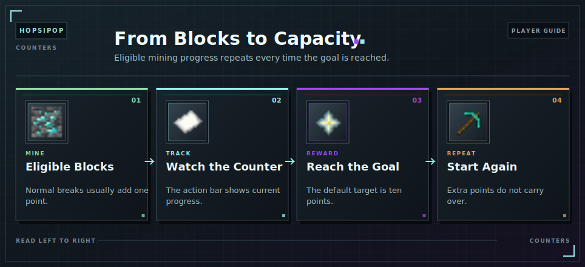

# Counters

<!-- ARTICLE-VISUAL:counters:START -->

<!-- ARTICLE-VISUAL:counters:END -->

The mining counter tracks eligible blocks toward a [Capacity](../capacity.md) reward. The default goal is ten points.

## Progress

- A normally mined eligible block adds one point.
  
  

- [Lucky Break](lucky-break.md) can add one to five points from a manual block.
- A [Chunk Drill](chunk-drills.md) adds one point per eligible block.
- Cobblestone, Basalt, air, fluids, Bedrock, barriers, and cancelled breaks do not count.

The action bar shows current progress. Extra points beyond a completed goal do not carry over.

[Counter Reduction](counter-reduction.md) lowers the required goal. In a [co-op](coop.md), active members use the group owner's goal and shared progress.

Current progress is removed by a [World Reset](resets.md).

## Continue Learning

- [Mining Rewards](mining-and-rewards.md)
- [Counter Reduction](counter-reduction.md)
- [Counter Boosts](counter-boosts.md)
