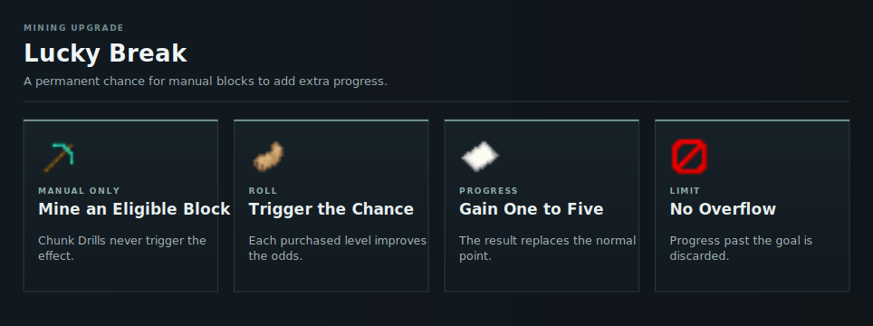

# Lucky Break

Lucky Break gives manually mined eligible blocks a chance to add one to five [counter](counters.md) points instead of one.

<!-- ARTICLE-VISUAL:lucky-break:START -->

<!-- ARTICLE-VISUAL:lucky-break:END -->

## Buying Levels

Open `/cw` and select Lucky Break. The first level costs 1,000 [Capacity](../capacity.md) and gives a 1% chance. Each later level costs 200 more [Capacity](../capacity.md) and adds 0.2 percentage points. Level 496 reaches 100%.

Purchases are permanent and not refunded.

## Limits

- A trigger can still roll one point.
- Progress beyond the current goal is discarded.
- [Chunk Drills](chunk-drills.md) never trigger Lucky Break.
- The upgrade changes progress, not the reward.

Use a [Counter Boost](counter-boosts.md) to increase the reward instead.

## Continue Learning

- [Counters](counters.md)
- [Counter Reduction](counter-reduction.md)
- [Buying Upgrades](upgrades.md)
