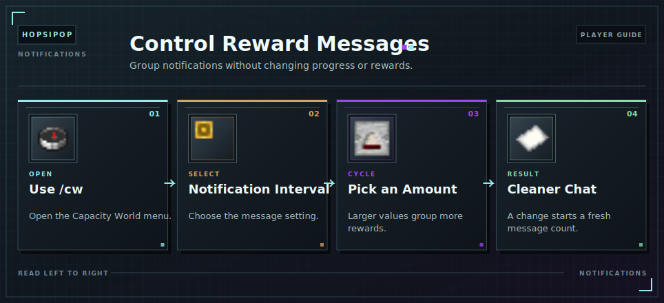

# Notifications

Notification Interval controls how often mining-reward messages appear. It does not change [counter](counters.md) progress or earned [Capacity](../capacity.md).

<!-- ARTICLE-VISUAL:notifications:START -->

<!-- ARTICLE-VISUAL:notifications:END -->

Open `/cw`, select Notification Interval, and click to cycle through the available amounts. A larger value groups more earned [Capacity](../capacity.md) into each message. Changing the value starts a fresh notification count.

## Continue Learning

- Review [Mining Rewards](mining-and-rewards.md).
- Learn how [Counter Boosts](counter-boosts.md) affect rewards.
