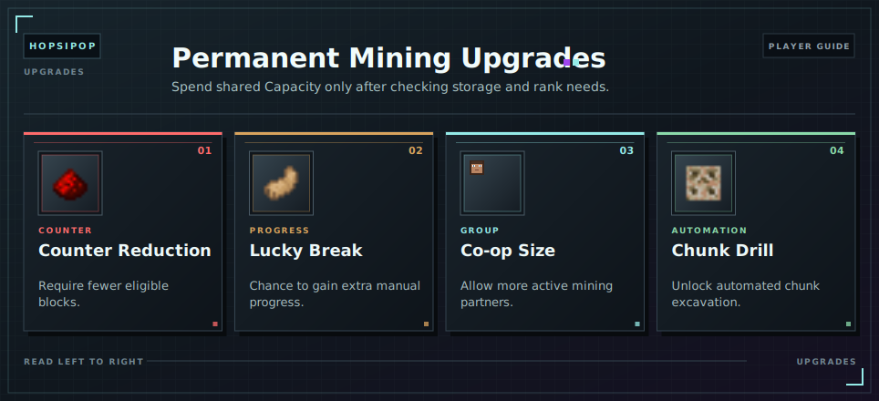

# Buying Mining Upgrades

Open `/cw` to buy permanent mining upgrades. Purchases spend [Capacity](../capacity.md) immediately and are not refunded.

<!-- ARTICLE-VISUAL:mining-upgrades:START -->

<!-- ARTICLE-VISUAL:mining-upgrades:END -->

## Available Upgrades

| Upgrade | Purpose |
| --- | --- |
| [Counter Reduction](counter-reduction.md) | Lowers the blocks required for a [counter](counters.md) goal. |
| [Lucky Break](lucky-break.md) | Can add extra progress from manual mining. |
| [Co-op Size](coop.md#group-size) | Allows larger mining groups. |
| [Chunk Drill](chunk-drills.md) | Unlocks automated chunk excavation. |

Each linked article explains its own costs and limits. Notification Interval is a free setting, not an upgrade; see [Notifications](notifications.md).

## Before Buying

The same [Capacity](../capacity.md) controls storage and [ranks](../ranks.md). Check free Master Chest space and your next [rank](../ranks.md) requirement before confirming a purchase.

## Continue Learning

- Read [Capacity](../capacity.md) before spending.
- Review [Mining Rewards](mining-and-rewards.md).
