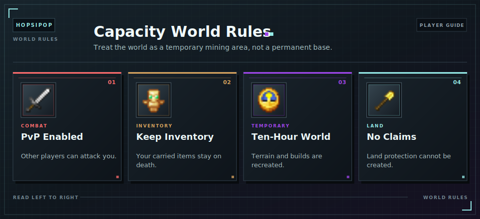

# World Rules

The [Capacity](../capacity.md) World is a temporary mining area, not a permanent building or storage world.

- PvP is enabled.
- Keep Inventory is enabled.
- The normal daylight cycle is active.
- The world border extends 10,000 blocks from the center.
- [Claims](../claims.md) cannot be created.

Store valuables in your [Master Chest](../master-chest/README.md) and do not leave important items in placed containers.

<!-- ARTICLE-VISUAL:world-rules:START -->

<!-- ARTICLE-VISUAL:world-rules:END -->

## Continue Learning

- Challenge another player through [PvP Duels](duels.md).
- Prepare for the ten-hour [World Reset](resets.md).
- Review [Access and Getting Started](getting-started.md).
