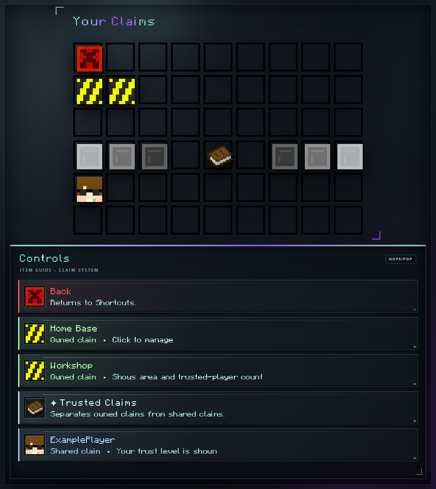

# Claims

Claims protect land and use the same [Capacity](capacity.md) as storage and [ranks](ranks.md). Each horizontal block inside a claim costs one [Capacity](capacity.md).

## Claim GUI

Open `/claimgui` or use `/mc` → Shortcuts → Claims. The GUI manages existing claims; creating and resizing still use the Golden Shovel.

<!-- GUI-WIKI:claims-list:START -->

<!-- GUI-WIKI:claims-list:END -->

The upper section shows up to 18 claims you own, including their boundaries, area, and trusted-player count. The lower section shows up to 18 claims where another owner has trusted you, together with your trust level.

Click a claim to open its management view. Back returns to Shortcuts.

## Learn by Task

- [Create or Resize a Claim](claims/creating-and-resizing.md)
- [Manage a Claim](claims/managing-a-claim.md)
- [Manage Trust](claims/trust-levels.md)
- [Configure Claim Settings](claims/settings.md)
