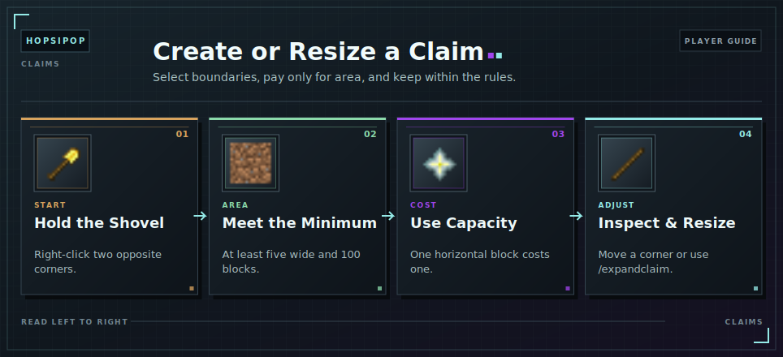

# Creating and Resizing Claims

<!-- ARTICLE-VISUAL:claim-creation:START -->

<!-- ARTICLE-VISUAL:claim-creation:END -->

## Creating a Claim

Hold a Golden Shovel and right-click two opposite corners of the area. Put the shovel away to cancel an unfinished selection.

A claim must be at least five blocks wide and cover at least 100 horizontal blocks. It cannot overlap another claim or be created in the [Capacity World](../capacity-world/README.md).

Use a Stick to inspect existing claims and display their boundaries.

## Capacity Cost

Each horizontal block costs one [Capacity](../capacity.md). There are no separate claim blocks to buy.

Creating a claim deducts its full area. Expanding deducts only the added area; shrinking refunds the released area. If the new size needs more [Capacity](../capacity.md) than you have, the resize is rejected.

Spending [Capacity](../capacity.md) can reduce storage room or lower your [rank](../ranks.md). Stored items remain safe, but new deposits can stop.

## Resizing a Claim

Right-click an existing claim corner with the Golden Shovel, then right-click its new position. Use the [Claim GUI](../claims.md) when you want to manage or delete the finished claim.

## Resizing with a Command

Stand inside the claim, hold the Golden Shovel, and look horizontally toward the boundary you want to move. Run `/expandclaim <blocks>` to move that boundary by the entered number of blocks.

A positive number expands the claim; a negative number shrinks it. For example, `/expandclaim 10` pushes the boundary in your viewing direction outward by 10 blocks, while `/expandclaim -5` pulls it inward by five blocks. Looking diagonally moves both matching boundaries, so face directly north, south, east, or west to change only one side.

The normal resize rules still apply: an expansion cannot overlap another claim or use more [Capacity](../capacity.md) than you have, and shrinking cannot make the claim smaller than the minimum size. Added area costs [Capacity](../capacity.md), while removed area is refunded. `/extendclaim` and `/resizeclaim` work as aliases.

## Continue Learning

- [Claims Overview](../claims.md)
- [Manage a Claim](managing-a-claim.md)
- [Capacity](../capacity.md)
