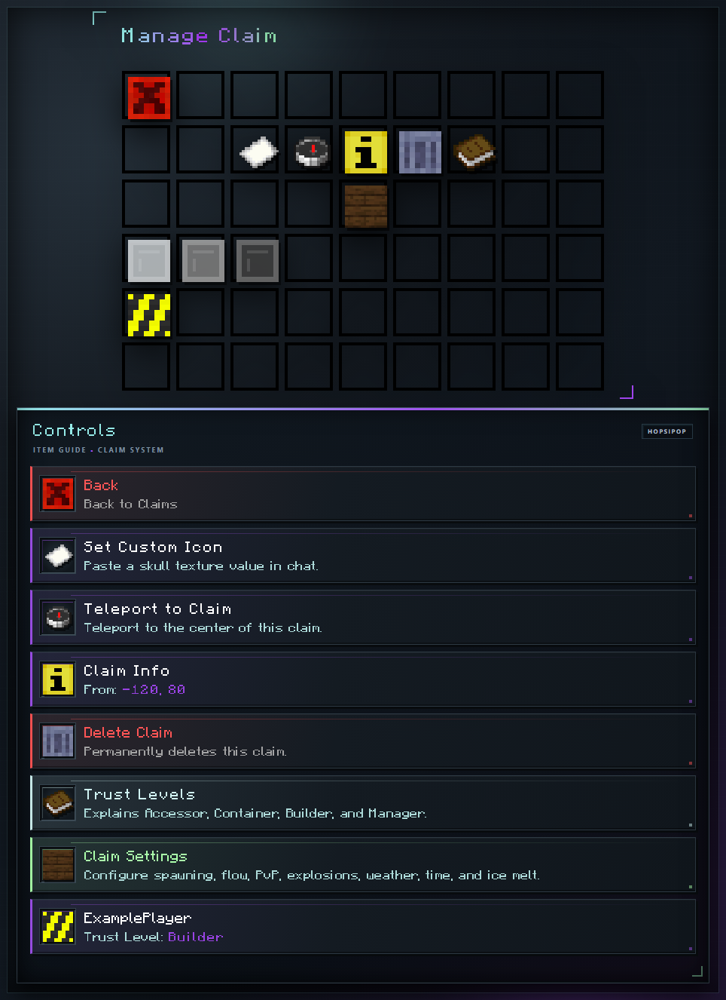

# Managing a Claim

Open the [Claim GUI](../claims.md) and select one of your claims.

<!-- GUI-WIKI:claim-management:START -->

<!-- GUI-WIKI:claim-management:END -->

| Control | Purpose |
| --- | --- |
| Claim Info | Shows boundaries and area. Click it to enter a name of up to 32 characters; enter `reset` to restore the default name. |
| Teleport to Claim | Teleports you to the surface at the center of the claim. |
| Set Custom Icon | Accepts a skull texture value from [minecraft-heads.com](https://minecraft-heads.com/) through chat; enter `reset` to restore the default icon. |
| Delete Claim | Shift-click to delete permanently and refund [Capacity](../capacity.md) equal to the claim area. |
| [Claim Settings](settings.md) | Opens the per-claim controls for an owner with Void [rank](../ranks.md). |
| [Trusted Players](trust-levels.md) | Shows and edits existing trust entries. |
| Back | Returns to the claims list. |

Rename, custom icon, deletion, and [Claim Settings](settings.md) are owner-only. A trusted player can view the claim and teleport to it. A Manager can also maintain existing trusted-player entries.
