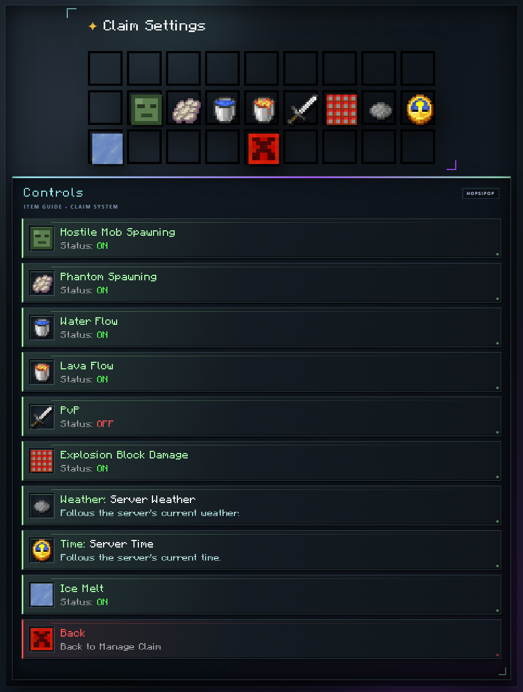

# Claim Settings

The claim owner unlocks these per-claim controls at Void [rank](../ranks.md). Open the [Claim GUI](../claims.md), select an owned claim, and choose Claim Settings.

<!-- GUI-WIKI:claim-settings:START -->

<!-- GUI-WIKI:claim-settings:END -->

## Available Settings

| Setting | Default | Effect |
| --- | --- | --- |
| Hostile Mob Spawning | On | Off blocks natural monster spawns. Spawners, spawn eggs, commands, and other explicit spawns still work. |
| Phantom Spawning | On | Off blocks natural Phantom spawns. |
| Water Flow | On | Off stops water from flowing into blocks inside the claim. |
| Lava Flow | On | Off stops lava from flowing into blocks inside the claim. |
| PvP | Off | On allows direct and projectile player damage when the victim is inside the claim. |
| Explosion Block Damage | On | On follows the normal server rules. Off protects claimed blocks from explosion damage but does not disable entity damage. |
| Weather | Server | Cycles through Server, Clear, and Rain. |
| Time | Server | Cycles through Server, Day (noon), Sunset, Night, Midnight, and Dawn. |
| Ice Melt | On | Off prevents Ice and Frosted Ice from melting inside the claim. |

## How Changes Apply

Weather and time only change what players inside the claim see; they do not change the world for everyone. Changes apply immediately. Back returns to [claim management](managing-a-claim.md).

## Continue Learning

- [Manage a Claim](managing-a-claim.md)
- [Claim Trust](trust-levels.md)
- [Ranks](../ranks.md)
