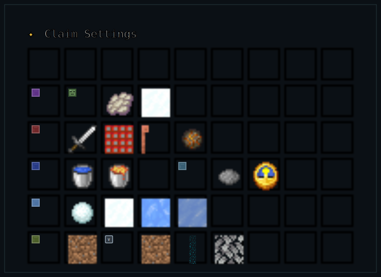

# Claim Settings

The owner of a claim unlocks these per-claim controls at Void [rank](../ranks.md). Open the [Claim GUI](../claims.md), select an owned claim, then choose Claim Settings. Click a setting to change it; changes apply immediately.

<!-- GUI-WIKI:claim-settings:START -->

<!-- GUI-WIKI:claim-settings:END -->

## Mob Spawning

| Setting | Default | Effect when Off |
| --- | --- | --- |
| Hostile Mob Spawning | On | Prevents natural monster spawns. Spawners, spawn eggs, commands, breeding, and constructed mobs still work. |
| Phantom Spawning | On | Prevents natural Phantom spawns. |
| Snowman Trails | On | Stops Snow Golems from leaving snow trails. |

## Damage & Combat

| Setting | Default | Effect when Off |
| --- | --- | --- |
| PvP | Off | Turning it On allows direct and projectile player damage inside the claim. |
| Explosion Block Damage | On | Protects blocks from explosion damage. Entity damage is unaffected. |
| Lightning | On | Prevents lightning strikes in the claim. |
| Lava Fire | On | Prevents lava from igniting blocks. |

## Fluids and Environment

| Setting | Default | Effect when Off |
| --- | --- | --- |
| Water Flow | On | Stops water from flowing into blocks inside the claim. |
| Lava Flow | On | Stops lava from flowing into blocks inside the claim. |
| Snow Fall | On | Prevents weather snow from accumulating. |
| Snow Melt | On | Prevents snow from melting naturally. |
| Ice Form | On | Prevents water from freezing into ice. |
| Ice Melt | On | Prevents Ice and Frosted Ice from melting. |

## Growth & Decay

| Setting | Default | Effect when Off |
| --- | --- | --- |
| Grass Growth | On | Stops grass from spreading. |
| Vine Growth | On | Stops vines from spreading. |
| Mycelium Spread | On | Stops mycelium from spreading. |
| Sculk Growth | On | Stops Sculk and Sculk Veins from spreading. |
| Leaf Decay | On | Prevents leaves from decaying. |

## How Changes Apply

Weather cycles through Server, Clear, and Rain. Time cycles through Server, Day, Sunset, Night, Midnight, and Dawn. Both are personal views for players inside the claim; neither changes the world for everyone. Back returns to [claim management](managing-a-claim.md).

## Continue Learning

- [Manage a Claim](managing-a-claim.md)
- [Claim Trust](trust-levels.md)
- [Ranks](../ranks.md)
