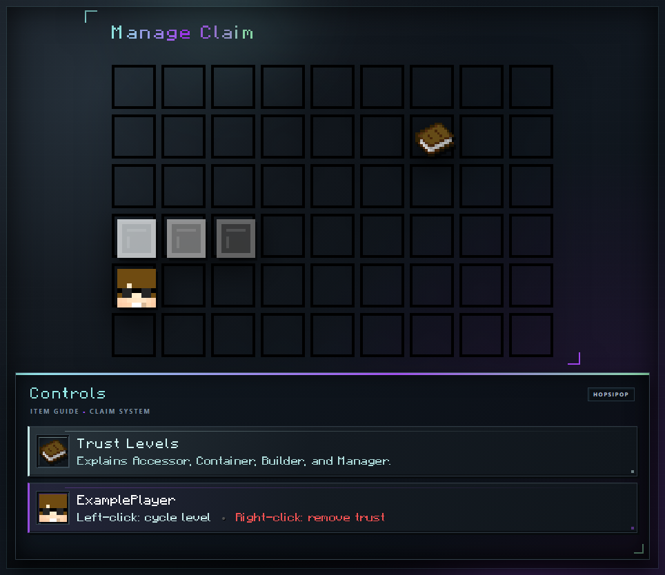

# Claim Trust

Trust gives another player specific access without transferring ownership.

## Adding a Player

Stand inside the claim before using a trust command so it affects only that claim.

| Initial level | Command | Access |
| --- | --- | --- |
| Accessor | `/accesstrust <player>` | Buttons, levers, pressure plates, beds, and crafting stations. No containers or building. |
| Container | `/containertrust <player>` | Accessor abilities plus chests and other containers. |
| Builder | `/trust <player>` | Container abilities plus placing and breaking blocks. |

Running a trust command while outside your claims applies it to all claims you own. Use `/untrust <player>` to remove access and `/trustlist` to inspect the claim you are standing in.

## Managing Trust in the GUI

Owners and Managers can manage up to 18 displayed trusted players in the [claim management view](managing-a-claim.md).

<!-- GUI-WIKI:trust-levels:START -->

<!-- GUI-WIKI:trust-levels:END -->

- Left-click a player head to cycle Accessor → Container → Builder → Manager → Accessor.
- Right-click a player head to remove trust.

Manager includes Builder access and permission to manage trusted players. Owner-only controls such as renaming, deletion, custom icons, and [Claim Settings](settings.md) remain unavailable to Managers.
