# Fish Species Catalog

This catalog lists all 1,000 MasterFishing species and uses their current 32x32 in-game icons directly from the MasterFish resource pack.

The value column shows the possible Capacity payout from the smallest to the largest specimen under the current sell configuration. A habitat of **Any biome** means the species has no biome restriction.

[Back to the Fishing Guide](fishing.md)

## Jump to a Rarity

[Common](#common) | [Uncommon](#uncommon) | [Rare](#rare) | [Epic](#epic) | [Legendary](#legendary) | [Mythic](#mythic)

## Common

350 species.

| Icon | Species | Size | Value | Habitat |
| --- | --- | ---: | ---: | --- |
|  | **River Mackerel** <code>river_mackerel</code> | 15-18 cm | 13-16 Capacity | **Any biome** |
|  | **Stream Lungfish** <code>stream_lungfish</code> | 11-15 cm | 16-20 Capacity | **Any biome** |
| 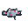 | **Pale Goby** <code>pale_goby</code> | 5-20 cm | 30-37 Capacity | **Any biome** |
|  | **Dusky Frogfish** <code>dusky_frogfish</code> | 15-29 cm | 23-29 Capacity | Desert |
|  | **Spotted Smelt** <code>spotted_smelt</code> | 5-9 cm | 33-42 Capacity | **Any biome** |
| 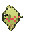 | **Common Sheepshead** <code>common_sheepshead</code> | 20-30 cm | 40-50 Capacity | **Any biome** |
|  | **Ditch Anglerfish** <code>ditch_anglerfish</code> | 22-29 cm | 23-29 Capacity | **Any biome** |
| 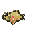 | **Brook Zander** <code>brook_zander</code> | 15-35 cm | 33-42 Capacity | **Any biome** |
| 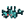 | **Banded Wyrmling** <code>banded_wyrmling</code> | 6-24 cm | 23-29 Capacity | **Any biome** |
| 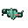 | **Common Milkfish** <code>common_milkfish</code> | 11-29 cm | 23-29 Capacity | **Any biome** |
|  | **Creek Pike** <code>creek_pike</code> | 15-32 cm | 40-50 Capacity | **Any biome** |
| 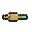 | **Willow Amberjack** <code>willow_amberjack</code> | 4-38 cm | 13-16 Capacity | Forest, Birch Forest, Old Growth Birch Forest, Flower Forest, Dark Forest, Windswept Forest, Pale Garden |
| 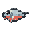 | **Warm Whitefish** <code>warm_whitefish</code> | 11-15 cm | 30-37 Capacity | **Any biome** |
| 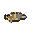 | **Bright Grunion** <code>bright_grunion</code> | 10-16 cm | 13-16 Capacity | **Any biome** |
|  | **Pale Pikeperch** <code>pale_pikeperch</code> | 7-23 cm | 23-29 Capacity | **Any biome** |
| 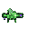 | **Willow Anchovy** <code>willow_anchovy</code> | 7-39 cm | 33-42 Capacity | **Any biome** |
| 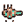 | **Striped Parrotfish** <code>striped_parrotfish</code> | 10-30 cm | 13-16 Capacity | **Any biome** |
|  | **Reed Tang** <code>reed_tang</code> | 17-19 cm | 13-16 Capacity | **Any biome** |
| 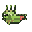 | **Rocky Wrasse** <code>rocky_wrasse</code> | 22-29 cm | 13-16 Capacity | Windswept Hills, Windswept Gravelly Hills, Jagged Peaks, Frozen Peaks, Stony Peaks, Grove, Snowy Slopes, Meadow, Cherry Grove |
| 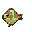 | **Brook Tang** <code>brook_tang</code> | 5-16 cm | 6-8 Capacity | **Any biome** |
| 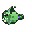 | **Fen Direfish** <code>fen_direfish</code> | 9-27 cm | 23-29 Capacity | Swamp, Mangrove Swamp |
|  | **Slick Koi** <code>slick_koi</code> | 22-24 cm | 33-42 Capacity | **Any biome** |
| 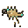 | **Bright Threadfin** <code>bright_threadfin</code> | 13-17 cm | 13-16 Capacity | **Any biome** |
| 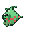 | **Quiet Carp** <code>quiet_carp</code> | 19-36 cm | 13-16 Capacity | **Any biome** |
| 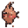 | **Brook Anglerfish** <code>brook_anglerfish</code> | 17-38 cm | 13-16 Capacity | **Any biome** |
| 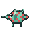 | **Plain Gar** <code>plain_gar</code> | 9-30 cm | 33-42 Capacity | **Any biome** |
|  | **Creek Minnow** <code>creek_minnow</code> | 9-34 cm | 33-42 Capacity | **Any biome** |
| 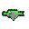 | **Fen Whiting** <code>fen_whiting</code> | 18-39 cm | 30-37 Capacity | **Any biome** |
| 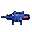 | **Dusky Gar** <code>dusky_gar</code> | 16-30 cm | 13-16 Capacity | **Any biome** |
| 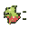 | **Clear Hatchetfish** <code>clear_hatchetfish</code> | 10-28 cm | 40-50 Capacity | **Any biome** |
| 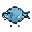 | **Quiet Piranha** <code>quiet_piranha</code> | 17-23 cm | 30-37 Capacity | **Any biome** |
| 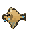 | **Speckled Amberjack** <code>speckled_amberjack</code> | 19-40 cm | 30-37 Capacity | **Any biome** |
| 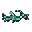 | **Banded Eelpout** <code>banded_eelpout</code> | 21-39 cm | 40-50 Capacity | **Any biome** |
| 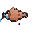 | **Clear Koi** <code>clear_koi</code> | 19-25 cm | 30-37 Capacity | **Any biome** |
| 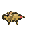 | **Humble Jack** <code>humble_jack</code> | 4-33 cm | 30-37 Capacity | **Any biome** |
| 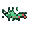 | **Spotted Eelpout** <code>spotted_eelpout</code> | 5-40 cm | 23-29 Capacity | **Any biome** |
| 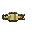 | **Fresh Hake** <code>fresh_hake</code> | 19-33 cm | 16-20 Capacity | **Any biome** |
| 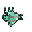 | **Common Pompano** <code>common_pompano</code> | 22-27 cm | 23-29 Capacity | **Any biome** |
| 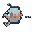 | **Silver Ray** <code>silver_ray</code> | 19-28 cm | 40-50 Capacity | **Any biome** |
| 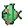 | **Warm Angelfish** <code>warm_angelfish</code> | 21-36 cm | 16-20 Capacity | Savanna, Savanna Plateau, Windswept Savanna |
| 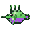 | **Mossy Marlin** <code>mossy_marlin</code> | 4-39 cm | 6-8 Capacity | **Any biome** |
| 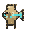 | **Fresh Sunfish** <code>fresh_sunfish</code> | 16-38 cm | 13-16 Capacity | **Any biome** |
|  | **Plain Mackerel** <code>plain_mackerel</code> | 14-29 cm | 16-20 Capacity | **Any biome** |
| 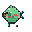 | **Creek Haddock** <code>creek_haddock</code> | 17-39 cm | 30-37 Capacity | River, Frozen River |
|  | **Spotted Ladyfish** <code>spotted_ladyfish</code> | 21-36 cm | 30-37 Capacity | **Any biome** |
|  | **Dusky Albacore** <code>dusky_albacore</code> | 12-35 cm | 23-29 Capacity | **Any biome** |
|  | **River Vendace** <code>river_vendace</code> | 17-36 cm | 40-50 Capacity | **Any biome** |
| 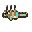 | **Bright Dace** <code>bright_dace</code> | 9-22 cm | 30-37 Capacity | **Any biome** |
| 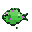 | **Willow Pompano** <code>willow_pompano</code> | 12-23 cm | 30-37 Capacity | **Any biome** |
| 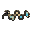 | **Bright Wyrmfish** <code>bright_wyrmfish</code> | 16-22 cm | 40-50 Capacity | **Any biome** |
| 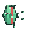 | **Banded Hatchetfish** <code>banded_hatchetfish</code> | 7-23 cm | 23-29 Capacity | **Any biome** |
| 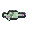 | **Willow Whitefish** <code>willow_whitefish</code> | 9-14 cm | 13-16 Capacity | **Any biome** |
| 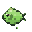 | **Weedy Bonito** <code>weedy_bonito</code> | 14-33 cm | 30-37 Capacity | Swamp, Mangrove Swamp |
| 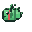 | **Striped Dragonfish** <code>striped_dragonfish</code> | 5-17 cm | 23-29 Capacity | **Any biome** |
| 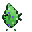 | **Reed Permit** <code>reed_permit</code> | 4-11 cm | 40-50 Capacity | **Any biome** |
| 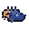 | **Dusky Char** <code>dusky_char</code> | 17-21 cm | 6-8 Capacity | **Any biome** |
| 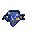 | **Dusky Sole** <code>dusky_sole</code> | 15-19 cm | 30-37 Capacity | **Any biome** |
| 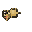 | **Cold Filefish** <code>cold_filefish</code> | 16-30 cm | 30-37 Capacity | **Any biome** |
|  | **River Ide** <code>river_ide</code> | 13-37 cm | 30-37 Capacity | **Any biome** |
| 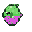 | **Reed Perch** <code>reed_perch</code> | 9-31 cm | 23-29 Capacity | **Any biome** |
|  | **Slick Blenny** <code>slick_blenny</code> | 10-39 cm | 33-42 Capacity | **Any biome** |
| 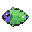 | **Fen Tuna** <code>fen_tuna</code> | 20-31 cm | 13-16 Capacity | **Any biome** |
| 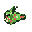 | **Plain Direfish** <code>plain_direfish</code> | 20-38 cm | 33-42 Capacity | **Any biome** |
| 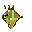 | **River Goatfish** <code>river_goatfish</code> | 9-32 cm | 6-8 Capacity | **Any biome** |
| 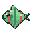 | **Pond Seatrout** <code>pond_seatrout</code> | 4-16 cm | 6-8 Capacity | **Any biome** |
| 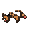 | **Weedy Wyrmling** <code>weedy_wyrmling</code> | 16-29 cm | 33-42 Capacity | **Any biome** |
|  | **Striped Cod** <code>striped_cod</code> | 22-30 cm | 30-37 Capacity | **Any biome** |
|  | **Banded Ray** <code>banded_ray</code> | 6-13 cm | 30-37 Capacity | **Any biome** |
|  | **Quiet Marlin** <code>quiet_marlin</code> | 21-34 cm | 16-20 Capacity | **Any biome** |
|  | **River Gar** <code>river_gar</code> | 12-21 cm | 30-37 Capacity | **Any biome** |
|  | **Mossy Koi** <code>mossy_koi</code> | 18-32 cm | 30-37 Capacity | Forest, Birch Forest, Old Growth Birch Forest, Flower Forest, Dark Forest, Windswept Forest, Pale Garden |
|  | **Plain Wyrmfish** <code>plain_wyrmfish</code> | 9-24 cm | 30-37 Capacity | **Any biome** |
|  | **Pond Wrasse** <code>pond_wrasse</code> | 6-40 cm | 16-20 Capacity | **Any biome** |
|  | **Still Haddock** <code>still_haddock</code> | 7-25 cm | 30-37 Capacity | **Any biome** |
|  | **Mossy Bonito** <code>mossy_bonito</code> | 22-32 cm | 33-42 Capacity | Forest, Birch Forest, Old Growth Birch Forest, Flower Forest, Dark Forest, Windswept Forest, Pale Garden |
|  | **Puddle Stonefish** <code>puddle_stonefish</code> | 16-36 cm | 23-29 Capacity | **Any biome** |
|  | **Clear Wahoo** <code>clear_wahoo</code> | 14-40 cm | 23-29 Capacity | **Any biome** |
|  | **Shallow Dace** <code>shallow_dace</code> | 22-24 cm | 23-29 Capacity | **Any biome** |
|  | **Marsh Sole** <code>marsh_sole</code> | 6-32 cm | 33-42 Capacity | **Any biome** |
|  | **Ditch Grunion** <code>ditch_grunion</code> | 11-34 cm | 33-42 Capacity | **Any biome** |
|  | **Marsh Marlin** <code>marsh_marlin</code> | 14-29 cm | 16-20 Capacity | **Any biome** |
|  | **Cold Roach** <code>cold_roach</code> | 4-22 cm | 13-16 Capacity | **Any biome** |
|  | **Brook Serpentfish** <code>brook_serpentfish</code> | 16-39 cm | 33-42 Capacity | **Any biome** |
|  | **Meadow Jack** <code>meadow_jack</code> | 6-19 cm | 23-29 Capacity | **Any biome** |
|  | **Drab Serpentfish** <code>drab_serpentfish</code> | 10-40 cm | 30-37 Capacity | **Any biome** |
|  | **Slick Jack** <code>slick_jack</code> | 10-27 cm | 33-42 Capacity | **Any biome** |
|  | **Pale Amberjack** <code>pale_amberjack</code> | 11-40 cm | 16-20 Capacity | **Any biome** |
|  | **Simple Yellowtail** <code>simple_yellowtail</code> | 10-38 cm | 13-16 Capacity | **Any biome** |
|  | **Stream Gillfin** <code>stream_gillfin</code> | 15-21 cm | 40-50 Capacity | **Any biome** |
|  | **Clear Sardine** <code>clear_sardine</code> | 6-39 cm | 30-37 Capacity | **Any biome** |
|  | **Meadow Bonefish** <code>meadow_bonefish</code> | 21-24 cm | 40-50 Capacity | **Any biome** |
|  | **Slick Sheepshead** <code>slick_sheepshead</code> | 14-31 cm | 30-37 Capacity | **Any biome** |
|  | **Quiet Halibut** <code>quiet_halibut</code> | 19-26 cm | 40-50 Capacity | **Any biome** |
|  | **Simple Triggerfish** <code>simple_triggerfish</code> | 12-26 cm | 13-16 Capacity | **Any biome** |
|  | **Stream Direfish** <code>stream_direfish</code> | 8-11 cm | 30-37 Capacity | River, Frozen River |
|  | **Ditch Pompano** <code>ditch_pompano</code> | 19-38 cm | 6-8 Capacity | **Any biome** |
|  | **Pale Cowfish** <code>pale_cowfish</code> | 16-39 cm | 40-50 Capacity | **Any biome** |
|  | **Ashen Boxfish** <code>ashen_boxfish</code> | 7-38 cm | 16-20 Capacity | **Any biome** |
|  | **Silver Swordfish** <code>silver_swordfish</code> | 4-19 cm | 23-29 Capacity | **Any biome** |
|  | **Brook Kingfish** <code>brook_kingfish</code> | 14-27 cm | 30-37 Capacity | **Any biome** |
|  | **Mossy Serpentfish** <code>mossy_serpentfish</code> | 9-28 cm | 16-20 Capacity | **Any biome** |
|  | **Meadow Milkfish** <code>meadow_milkfish</code> | 19-40 cm | 16-20 Capacity | **Any biome** |
|  | **Marsh Angelfish** <code>marsh_angelfish</code> | 19-34 cm | 13-16 Capacity | **Any biome** |
|  | **Bright Batfish** <code>bright_batfish</code> | 15-28 cm | 40-50 Capacity | **Any biome** |
|  | **Brook Direfish** <code>brook_direfish</code> | 18-25 cm | 30-37 Capacity | River, Frozen River |
|  | **Common Koi** <code>common_koi</code> | 22-31 cm | 40-50 Capacity | **Any biome** |
|  | **Silver Stonefish** <code>silver_stonefish</code> | 12-39 cm | 13-16 Capacity | **Any biome** |
|  | **Pale Anglerfish** <code>pale_anglerfish</code> | 16-24 cm | 13-16 Capacity | **Any biome** |
|  | **Banded Fangfish** <code>banded_fangfish</code> | 8-25 cm | 40-50 Capacity | **Any biome** |
|  | **Fresh Wyrmling** <code>fresh_wyrmling</code> | 17-34 cm | 13-16 Capacity | **Any biome** |
|  | **Common Moonfish** <code>common_moonfish</code> | 20-39 cm | 33-42 Capacity | Plains, Sunflower Plains, Snowy Plains |
|  | **Common Bream** <code>common_bream</code> | 19-30 cm | 16-20 Capacity | **Any biome** |
|  | **Sandy Moonfish** <code>sandy_moonfish</code> | 22-25 cm | 23-29 Capacity | **Any biome** |
|  | **Warm Tench** <code>warm_tench</code> | 9-12 cm | 13-16 Capacity | **Any biome** |
|  | **Ditch Sturgeon** <code>ditch_sturgeon</code> | 19-24 cm | 23-29 Capacity | **Any biome** |
|  | **Ashen Kingfish** <code>ashen_kingfish</code> | 12-25 cm | 16-20 Capacity | **Any biome** |
|  | **Pond Parrotfish** <code>pond_parrotfish</code> | 12-25 cm | 6-8 Capacity | **Any biome** |
|  | **Bog Fangfish** <code>bog_fangfish</code> | 15-38 cm | 30-37 Capacity | **Any biome** |
|  | **Ashen Mackerel** <code>ashen_mackerel</code> | 22-29 cm | 40-50 Capacity | **Any biome** |
|  | **Banded Ide** <code>banded_ide</code> | 14-37 cm | 30-37 Capacity | **Any biome** |
|  | **Humble Weakfish** <code>humble_weakfish</code> | 18-22 cm | 23-29 Capacity | **Any biome** |
|  | **Fresh Bass** <code>fresh_bass</code> | 18-40 cm | 13-16 Capacity | **Any biome** |
|  | **Creek Maw** <code>creek_maw</code> | 14-29 cm | 33-42 Capacity | **Any biome** |
|  | **Homely Unicornfish** <code>homely_unicornfish</code> | 16-20 cm | 6-8 Capacity | **Any biome** |
|  | **River Sturgeon** <code>river_sturgeon</code> | 11-23 cm | 16-20 Capacity | **Any biome** |
|  | **Pale Puffer** <code>pale_puffer</code> | 12-33 cm | 33-42 Capacity | Taiga, Snowy Taiga, Old Growth Pine Taiga, Old Growth Spruce Taiga |
|  | **Plain Ide** <code>plain_ide</code> | 18-31 cm | 33-42 Capacity | **Any biome** |
|  | **Stream Wrasse** <code>stream_wrasse</code> | 18-33 cm | 13-16 Capacity | **Any biome** |
|  | **Silver Haddock** <code>silver_haddock</code> | 4-14 cm | 33-42 Capacity | **Any biome** |
|  | **Quiet Stonefish** <code>quiet_stonefish</code> | 12-37 cm | 33-42 Capacity | **Any biome** |
|  | **Meadow Dragonfish** <code>meadow_dragonfish</code> | 10-17 cm | 23-29 Capacity | **Any biome** |
|  | **Marsh Rockfish** <code>marsh_rockfish</code> | 6-38 cm | 30-37 Capacity | Swamp, Mangrove Swamp |
|  | **Muddy Ling** <code>muddy_ling</code> | 16-34 cm | 40-50 Capacity | **Any biome** |
|  | **Bog Croaker** <code>bog_croaker</code> | 7-25 cm | 30-37 Capacity | **Any biome** |
|  | **Spotted Hatchetfish** <code>spotted_hatchetfish</code> | 16-27 cm | 13-16 Capacity | **Any biome** |
|  | **Cold Bonescale** <code>cold_bonescale</code> | 13-29 cm | 33-42 Capacity | **Any biome** |
|  | **Pond Serpentfish** <code>pond_serpentfish</code> | 20-27 cm | 6-8 Capacity | **Any biome** |
|  | **Brook Trout** <code>brook_trout</code> | 15-27 cm | 40-50 Capacity | **Any biome** |
|  | **Willow Bream** <code>willow_bream</code> | 21-31 cm | 30-37 Capacity | **Any biome** |
|  | **Banded Drake** <code>banded_drake</code> | 21-28 cm | 30-37 Capacity | **Any biome** |
|  | **River Trout** <code>river_trout</code> | 22-37 cm | 30-37 Capacity | **Any biome** |
|  | **Meadow Parrotfish** <code>meadow_parrotfish</code> | 21-32 cm | 16-20 Capacity | **Any biome** |
|  | **Bright Permit** <code>bright_permit</code> | 11-38 cm | 6-8 Capacity | **Any biome** |
|  | **Reed Bream** <code>reed_bream</code> | 15-30 cm | 16-20 Capacity | **Any biome** |
|  | **Simple Unicornfish** <code>simple_unicornfish</code> | 4-6 cm | 30-37 Capacity | **Any biome** |
|  | **Meadow Ling** <code>meadow_ling</code> | 8-21 cm | 16-20 Capacity | Plains, Sunflower Plains, Snowy Plains |
|  | **Brook Sole** <code>brook_sole</code> | 4-37 cm | 40-50 Capacity | **Any biome** |
|  | **Fresh Minnow** <code>fresh_minnow</code> | 4-33 cm | 40-50 Capacity | **Any biome** |
|  | **Shallow Frogfish** <code>shallow_frogfish</code> | 11-38 cm | 6-8 Capacity | Beach, Snowy Beach, Stony Shore |
|  | **Plain Stonefish** <code>plain_stonefish</code> | 10-25 cm | 30-37 Capacity | Plains, Sunflower Plains, Snowy Plains |
|  | **Pond Sole** <code>pond_sole</code> | 11-18 cm | 33-42 Capacity | **Any biome** |
|  | **Brook Damsel** <code>brook_damsel</code> | 16-30 cm | 13-16 Capacity | **Any biome** |
|  | **Warm Grunion** <code>warm_grunion</code> | 17-39 cm | 13-16 Capacity | **Any biome** |
|  | **River Frogfish** <code>river_frogfish</code> | 12-23 cm | 33-42 Capacity | **Any biome** |
|  | **Muddy Gar** <code>muddy_gar</code> | 12-27 cm | 13-16 Capacity | **Any biome** |
|  | **Cold Batfish** <code>cold_batfish</code> | 9-15 cm | 16-20 Capacity | **Any biome** |
|  | **Puddle Smelt** <code>puddle_smelt</code> | 18-39 cm | 23-29 Capacity | **Any biome** |
|  | **Speckled Chub** <code>speckled_chub</code> | 19-27 cm | 16-20 Capacity | **Any biome** |
|  | **Homely Carp** <code>homely_carp</code> | 5-8 cm | 13-16 Capacity | **Any biome** |
|  | **Muddy Seatrout** <code>muddy_seatrout</code> | 13-23 cm | 13-16 Capacity | **Any biome** |
|  | **Clear Threadfin** <code>clear_threadfin</code> | 4-20 cm | 6-8 Capacity | **Any biome** |
|  | **Homely Zander** <code>homely_zander</code> | 19-27 cm | 16-20 Capacity | **Any biome** |
|  | **Slick Whiting** <code>slick_whiting</code> | 19-32 cm | 23-29 Capacity | **Any biome** |
|  | **Pond Gar** <code>pond_gar</code> | 5-28 cm | 6-8 Capacity | **Any biome** |
|  | **Drab Maw** <code>drab_maw</code> | 8-11 cm | 16-20 Capacity | Mushroom Fields |
|  | **Bog Sablefish** <code>bog_sablefish</code> | 6-38 cm | 13-16 Capacity | **Any biome** |
|  | **Weedy Fangfish** <code>weedy_fangfish</code> | 12-40 cm | 23-29 Capacity | **Any biome** |
|  | **Still Tarpon** <code>still_tarpon</code> | 7-24 cm | 23-29 Capacity | **Any biome** |
|  | **Slick Sturgeon** <code>slick_sturgeon</code> | 18-27 cm | 33-42 Capacity | **Any biome** |
|  | **Silver Tench** <code>silver_tench</code> | 10-26 cm | 33-42 Capacity | **Any biome** |
|  | **Pond Wyrmling** <code>pond_wyrmling</code> | 20-28 cm | 23-29 Capacity | **Any biome** |
|  | **Mossy Tench** <code>mossy_tench</code> | 13-25 cm | 13-16 Capacity | **Any biome** |
|  | **Ditch Bream** <code>ditch_bream</code> | 5-40 cm | 6-8 Capacity | **Any biome** |
|  | **Fen Jack** <code>fen_jack</code> | 13-21 cm | 16-20 Capacity | **Any biome** |
|  | **Brook Needlefish** <code>brook_needlefish</code> | 10-15 cm | 13-16 Capacity | **Any biome** |
|  | **Rocky Weeverfish** <code>rocky_weeverfish</code> | 14-16 cm | 13-16 Capacity | **Any biome** |
|  | **Meadow Catfish** <code>meadow_catfish</code> | 22-27 cm | 23-29 Capacity | **Any biome** |
|  | **River Loach** <code>river_loach</code> | 4-8 cm | 30-37 Capacity | **Any biome** |
|  | **Clear Ray** <code>clear_ray</code> | 19-40 cm | 13-16 Capacity | **Any biome** |
|  | **Silver Ide** <code>silver_ide</code> | 6-23 cm | 13-16 Capacity | **Any biome** |
|  | **Muddy Damsel** <code>muddy_damsel</code> | 14-40 cm | 33-42 Capacity | **Any biome** |
|  | **Reed Blenny** <code>reed_blenny</code> | 15-37 cm | 13-16 Capacity | **Any biome** |
|  | **Simple Barracuda** <code>simple_barracuda</code> | 7-17 cm | 23-29 Capacity | **Any biome** |
|  | **Homely Marlin** <code>homely_marlin</code> | 21-34 cm | 40-50 Capacity | **Any biome** |
|  | **Mossy Permit** <code>mossy_permit</code> | 10-12 cm | 33-42 Capacity | Forest, Birch Forest, Old Growth Birch Forest, Flower Forest, Dark Forest, Windswept Forest, Pale Garden |
|  | **Cold Yellowtail** <code>cold_yellowtail</code> | 8-18 cm | 6-8 Capacity | **Any biome** |
|  | **Ditch Koi** <code>ditch_koi</code> | 18-37 cm | 16-20 Capacity | **Any biome** |
|  | **Striped Fangfish** <code>striped_fangfish</code> | 19-27 cm | 30-37 Capacity | **Any biome** |
|  | **Reed Tarpon** <code>reed_tarpon</code> | 15-27 cm | 33-42 Capacity | **Any biome** |
|  | **Sandy Tarpon** <code>sandy_tarpon</code> | 21-28 cm | 6-8 Capacity | **Any biome** |
|  | **Sandy Sablefish** <code>sandy_sablefish</code> | 18-29 cm | 40-50 Capacity | **Any biome** |
|  | **Plain Herring** <code>plain_herring</code> | 15-31 cm | 6-8 Capacity | **Any biome** |
|  | **Bright Minnow** <code>bright_minnow</code> | 20-34 cm | 33-42 Capacity | **Any biome** |
|  | **Striped Pike** <code>striped_pike</code> | 4-29 cm | 40-50 Capacity | **Any biome** |
|  | **Common Hake** <code>common_hake</code> | 14-39 cm | 6-8 Capacity | **Any biome** |
|  | **Rocky Direfish** <code>rocky_direfish</code> | 21-35 cm | 13-16 Capacity | **Any biome** |
|  | **Shallow Hatchetfish** <code>shallow_hatchetfish</code> | 19-38 cm | 13-16 Capacity | Beach, Snowy Beach, Stony Shore |
|  | **Marsh Gillfin** <code>marsh_gillfin</code> | 14-29 cm | 33-42 Capacity | **Any biome** |
|  | **Willow Dace** <code>willow_dace</code> | 7-13 cm | 6-8 Capacity | **Any biome** |
|  | **Stream Mackerel** <code>stream_mackerel</code> | 8-15 cm | 40-50 Capacity | **Any biome** |
|  | **Cold Lanternfish** <code>cold_lanternfish</code> | 7-40 cm | 13-16 Capacity | **Any biome** |
|  | **River Maw** <code>river_maw</code> | 22-36 cm | 33-42 Capacity | **Any biome** |
|  | **Plain Milkfish** <code>plain_milkfish</code> | 22-32 cm | 6-8 Capacity | **Any biome** |
|  | **Simple Boxfish** <code>simple_boxfish</code> | 6-8 cm | 13-16 Capacity | **Any biome** |
|  | **Humble Perch** <code>humble_perch</code> | 6-37 cm | 40-50 Capacity | **Any biome** |
|  | **Fresh Amberjack** <code>fresh_amberjack</code> | 15-34 cm | 33-42 Capacity | **Any biome** |
|  | **Bright Ide** <code>bright_ide</code> | 17-30 cm | 40-50 Capacity | **Any biome** |
|  | **Lake Sunfish** <code>lake_sunfish</code> | 12-30 cm | 6-8 Capacity | **Any biome** |
|  | **Mossy Nase** <code>mossy_nase</code> | 13-17 cm | 13-16 Capacity | **Any biome** |
|  | **Fen Fangfish** <code>fen_fangfish</code> | 7-15 cm | 33-42 Capacity | Swamp, Mangrove Swamp |
|  | **Pond Ide** <code>pond_ide</code> | 16-24 cm | 13-16 Capacity | **Any biome** |
|  | **Silver Goatfish** <code>silver_goatfish</code> | 11-31 cm | 33-42 Capacity | **Any biome** |
|  | **Sandy Cobia** <code>sandy_cobia</code> | 21-40 cm | 23-29 Capacity | **Any biome** |
|  | **Bog Batfish** <code>bog_batfish</code> | 22-35 cm | 33-42 Capacity | **Any biome** |
|  | **Muddy Gillfin** <code>muddy_gillfin</code> | 17-22 cm | 13-16 Capacity | Swamp, Mangrove Swamp |
|  | **Spotted Goatfish** <code>spotted_goatfish</code> | 21-35 cm | 30-37 Capacity | **Any biome** |
|  | **Plain Eel** <code>plain_eel</code> | 9-28 cm | 30-37 Capacity | **Any biome** |
|  | **Drab Permit** <code>drab_permit</code> | 15-27 cm | 30-37 Capacity | **Any biome** |
|  | **Fen Pollock** <code>fen_pollock</code> | 14-27 cm | 23-29 Capacity | **Any biome** |
|  | **Meadow Tuna** <code>meadow_tuna</code> | 17-29 cm | 30-37 Capacity | **Any biome** |
|  | **Still Anchovy** <code>still_anchovy</code> | 21-29 cm | 23-29 Capacity | **Any biome** |
|  | **Silver Goby** <code>silver_goby</code> | 12-25 cm | 23-29 Capacity | **Any biome** |
|  | **Quiet Lungfish** <code>quiet_lungfish</code> | 16-18 cm | 33-42 Capacity | **Any biome** |
|  | **Brook Pollock** <code>brook_pollock</code> | 13-34 cm | 6-8 Capacity | **Any biome** |
|  | **Grey Barbel** <code>grey_barbel</code> | 13-15 cm | 16-20 Capacity | **Any biome** |
|  | **Striped Barbel** <code>striped_barbel</code> | 10-39 cm | 16-20 Capacity | **Any biome** |
|  | **Fresh Swordfish** <code>fresh_swordfish</code> | 12-31 cm | 30-37 Capacity | **Any biome** |
|  | **Cold Marlin** <code>cold_marlin</code> | 22-28 cm | 6-8 Capacity | **Any biome** |
|  | **Meadow Direfish** <code>meadow_direfish</code> | 15-21 cm | 13-16 Capacity | **Any biome** |
|  | **Quiet Grouper** <code>quiet_grouper</code> | 22-31 cm | 13-16 Capacity | **Any biome** |
|  | **River Anglerfish** <code>river_anglerfish</code> | 13-17 cm | 30-37 Capacity | **Any biome** |
|  | **Fen Viperfish** <code>fen_viperfish</code> | 10-35 cm | 6-8 Capacity | **Any biome** |
|  | **Weedy Piranha** <code>weedy_piranha</code> | 19-26 cm | 23-29 Capacity | **Any biome** |
|  | **Striped Flounder** <code>striped_flounder</code> | 22-27 cm | 30-37 Capacity | **Any biome** |
|  | **Sandy Barbel** <code>sandy_barbel</code> | 5-31 cm | 6-8 Capacity | **Any biome** |
|  | **Marsh Wahoo** <code>marsh_wahoo</code> | 14-27 cm | 40-50 Capacity | **Any biome** |
|  | **Mossy Drumfish** <code>mossy_drumfish</code> | 7-23 cm | 33-42 Capacity | **Any biome** |
|  | **Common Hatchetfish** <code>common_hatchetfish</code> | 4-30 cm | 6-8 Capacity | **Any biome** |
|  | **River Pollock** <code>river_pollock</code> | 5-27 cm | 30-37 Capacity | River, Frozen River |
|  | **Meadow Carp** <code>meadow_carp</code> | 14-32 cm | 33-42 Capacity | **Any biome** |
|  | **Simple Hake** <code>simple_hake</code> | 5-32 cm | 23-29 Capacity | **Any biome** |
|  | **Brook Perch** <code>brook_perch</code> | 22-40 cm | 6-8 Capacity | **Any biome** |
|  | **Creek Eel** <code>creek_eel</code> | 13-40 cm | 23-29 Capacity | **Any biome** |
|  | **Grey Weeverfish** <code>grey_weeverfish</code> | 14-18 cm | 23-29 Capacity | **Any biome** |
|  | **Shallow Eel** <code>shallow_eel</code> | 5-32 cm | 16-20 Capacity | Beach, Snowy Beach, Stony Shore |
|  | **Still Threadfin** <code>still_threadfin</code> | 20-35 cm | 40-50 Capacity | **Any biome** |
|  | **Stream Grunion** <code>stream_grunion</code> | 8-25 cm | 30-37 Capacity | **Any biome** |
|  | **Ashen Ide** <code>ashen_ide</code> | 16-38 cm | 30-37 Capacity | **Any biome** |
|  | **Striped Damsel** <code>striped_damsel</code> | 20-29 cm | 13-16 Capacity | **Any biome** |
|  | **Homely Anchovy** <code>homely_anchovy</code> | 17-29 cm | 33-42 Capacity | **Any biome** |
|  | **Speckled Vendace** <code>speckled_vendace</code> | 6-15 cm | 33-42 Capacity | **Any biome** |
|  | **Cold Tang** <code>cold_tang</code> | 15-28 cm | 13-16 Capacity | **Any biome** |
|  | **Stream Cobia** <code>stream_cobia</code> | 4-25 cm | 13-16 Capacity | River, Frozen River |
|  | **Grey Moonfish** <code>grey_moonfish</code> | 18-39 cm | 13-16 Capacity | **Any biome** |
|  | **Stream Hake** <code>stream_hake</code> | 11-19 cm | 33-42 Capacity | **Any biome** |
|  | **Pond Cod** <code>pond_cod</code> | 6-15 cm | 33-42 Capacity | **Any biome** |
|  | **Shallow Bonefish** <code>shallow_bonefish</code> | 8-37 cm | 40-50 Capacity | Beach, Snowy Beach, Stony Shore |
|  | **Striped Pompano** <code>striped_pompano</code> | 4-27 cm | 33-42 Capacity | **Any biome** |
|  | **Ashen Yellowtail** <code>ashen_yellowtail</code> | 13-29 cm | 23-29 Capacity | **Any biome** |
|  | **Puddle Weakfish** <code>puddle_weakfish</code> | 10-35 cm | 30-37 Capacity | **Any biome** |
|  | **Grey Toadfish** <code>grey_toadfish</code> | 21-39 cm | 40-50 Capacity | **Any biome** |
|  | **Bright Catfish** <code>bright_catfish</code> | 19-40 cm | 33-42 Capacity | **Any biome** |
|  | **Fresh Ide** <code>fresh_ide</code> | 4-30 cm | 30-37 Capacity | **Any biome** |
|  | **Creek Bonito** <code>creek_bonito</code> | 20-23 cm | 16-20 Capacity | **Any biome** |
|  | **Creek Swordfish** <code>creek_swordfish</code> | 13-21 cm | 40-50 Capacity | River, Frozen River |
|  | **Humble Bream** <code>humble_bream</code> | 12-15 cm | 23-29 Capacity | **Any biome** |
|  | **Lake Bream** <code>lake_bream</code> | 4-10 cm | 23-29 Capacity | **Any biome** |
|  | **Puddle Lungfish** <code>puddle_lungfish</code> | 15-20 cm | 6-8 Capacity | **Any biome** |
|  | **Plain Barracuda** <code>plain_barracuda</code> | 16-25 cm | 23-29 Capacity | Plains, Sunflower Plains, Snowy Plains |
|  | **Silver Zander** <code>silver_zander</code> | 7-29 cm | 23-29 Capacity | **Any biome** |
|  | **Common Piranha** <code>common_piranha</code> | 21-25 cm | 13-16 Capacity | **Any biome** |
|  | **Silver Pikeperch** <code>silver_pikeperch</code> | 18-37 cm | 33-42 Capacity | **Any biome** |
|  | **Plain Croaker** <code>plain_croaker</code> | 11-29 cm | 16-20 Capacity | **Any biome** |
|  | **Meadow Bonescale** <code>meadow_bonescale</code> | 16-23 cm | 6-8 Capacity | **Any biome** |
|  | **Still Wyrmfish** <code>still_wyrmfish</code> | 15-28 cm | 33-42 Capacity | **Any biome** |
|  | **Homely Amberjack** <code>homely_amberjack</code> | 20-30 cm | 40-50 Capacity | **Any biome** |
|  | **Bright Herring** <code>bright_herring</code> | 12-26 cm | 40-50 Capacity | **Any biome** |
|  | **Puddle Croaker** <code>puddle_croaker</code> | 21-31 cm | 13-16 Capacity | **Any biome** |
|  | **Brook Cobia** <code>brook_cobia</code> | 16-39 cm | 13-16 Capacity | **Any biome** |
|  | **Ashen Cowfish** <code>ashen_cowfish</code> | 16-34 cm | 33-42 Capacity | **Any biome** |
|  | **Cold Stonefish** <code>cold_stonefish</code> | 11-26 cm | 13-16 Capacity | Taiga, Snowy Taiga, Old Growth Pine Taiga, Old Growth Spruce Taiga |
|  | **Spotted Anglerfish** <code>spotted_anglerfish</code> | 17-28 cm | 30-37 Capacity | **Any biome** |
|  | **Muddy Porgy** <code>muddy_porgy</code> | 21-27 cm | 13-16 Capacity | **Any biome** |
|  | **Spotted Tench** <code>spotted_tench</code> | 22-30 cm | 40-50 Capacity | **Any biome** |
|  | **Sandy Sturgeon** <code>sandy_sturgeon</code> | 20-26 cm | 23-29 Capacity | **Any biome** |
|  | **Grey Hake** <code>grey_hake</code> | 8-30 cm | 30-37 Capacity | **Any biome** |
|  | **Fresh Hatchetfish** <code>fresh_hatchetfish</code> | 14-18 cm | 30-37 Capacity | **Any biome** |
|  | **Mossy Damsel** <code>mossy_damsel</code> | 7-20 cm | 16-20 Capacity | **Any biome** |
|  | **Warm Dace** <code>warm_dace</code> | 8-33 cm | 6-8 Capacity | **Any biome** |
|  | **Puddle Bream** <code>puddle_bream</code> | 17-32 cm | 16-20 Capacity | **Any biome** |
|  | **Lake Salmon** <code>lake_salmon</code> | 12-18 cm | 40-50 Capacity | **Any biome** |
|  | **Homely Cobia** <code>homely_cobia</code> | 8-15 cm | 6-8 Capacity | **Any biome** |
|  | **Ashen Puffer** <code>ashen_puffer</code> | 12-33 cm | 30-37 Capacity | **Any biome** |
|  | **Quiet Frogfish** <code>quiet_frogfish</code> | 11-20 cm | 33-42 Capacity | **Any biome** |
|  | **River Hake** <code>river_hake</code> | 6-38 cm | 13-16 Capacity | **Any biome** |
|  | **Cold Ling** <code>cold_ling</code> | 19-32 cm | 13-16 Capacity | **Any biome** |
|  | **Silver Koi** <code>silver_koi</code> | 19-36 cm | 13-16 Capacity | **Any biome** |
|  | **Pond Drake** <code>pond_drake</code> | 11-14 cm | 23-29 Capacity | **Any biome** |
|  | **Common Chub** <code>common_chub</code> | 4-23 cm | 23-29 Capacity | **Any biome** |
|  | **Brook Jack** <code>brook_jack</code> | 10-36 cm | 13-16 Capacity | **Any biome** |
|  | **Muddy Threadfin** <code>muddy_threadfin</code> | 18-39 cm | 23-29 Capacity | Swamp, Mangrove Swamp |
|  | **Common Skipjack** <code>common_skipjack</code> | 18-27 cm | 23-29 Capacity | **Any biome** |
|  | **Drab Tuna** <code>drab_tuna</code> | 5-31 cm | 33-42 Capacity | **Any biome** |
|  | **Homely Hatchetfish** <code>homely_hatchetfish</code> | 22-40 cm | 33-42 Capacity | **Any biome** |
|  | **Quiet Bream** <code>quiet_bream</code> | 5-40 cm | 6-8 Capacity | **Any biome** |
|  | **Pale Hake** <code>pale_hake</code> | 5-22 cm | 30-37 Capacity | **Any biome** |
|  | **Warm Threadfin** <code>warm_threadfin</code> | 5-31 cm | 30-37 Capacity | Savanna, Savanna Plateau, Windswept Savanna |
|  | **Banded Cowfish** <code>banded_cowfish</code> | 5-19 cm | 16-20 Capacity | **Any biome** |
|  | **Puddle Puffer** <code>puddle_puffer</code> | 13-39 cm | 40-50 Capacity | **Any biome** |
|  | **Clear Tuna** <code>clear_tuna</code> | 9-24 cm | 16-20 Capacity | **Any biome** |
|  | **Still Permit** <code>still_permit</code> | 5-40 cm | 13-16 Capacity | **Any biome** |
|  | **Pale Sturgeon** <code>pale_sturgeon</code> | 18-22 cm | 33-42 Capacity | Taiga, Snowy Taiga, Old Growth Pine Taiga, Old Growth Spruce Taiga |
|  | **Cold Amberjack** <code>cold_amberjack</code> | 9-35 cm | 30-37 Capacity | Taiga, Snowy Taiga, Old Growth Pine Taiga, Old Growth Spruce Taiga |
|  | **Clear Goby** <code>clear_goby</code> | 21-27 cm | 23-29 Capacity | **Any biome** |
|  | **Marsh Snook** <code>marsh_snook</code> | 18-20 cm | 13-16 Capacity | **Any biome** |
|  | **Creek Ray** <code>creek_ray</code> | 10-40 cm | 23-29 Capacity | **Any biome** |
|  | **Common Eelpout** <code>common_eelpout</code> | 14-38 cm | 33-42 Capacity | Plains, Sunflower Plains, Snowy Plains |
|  | **Still Blenny** <code>still_blenny</code> | 9-33 cm | 33-42 Capacity | **Any biome** |
|  | **Humble Wyrmfish** <code>humble_wyrmfish</code> | 7-37 cm | 33-42 Capacity | **Any biome** |
|  | **Warm Cowfish** <code>warm_cowfish</code> | 20-34 cm | 33-42 Capacity | **Any biome** |
|  | **Shallow Salmon** <code>shallow_salmon</code> | 20-27 cm | 23-29 Capacity | **Any biome** |
|  | **Puddle Drumfish** <code>puddle_drumfish</code> | 5-17 cm | 16-20 Capacity | **Any biome** |
|  | **Speckled Yellowtail** <code>speckled_yellowtail</code> | 8-15 cm | 40-50 Capacity | **Any biome** |
|  | **Mossy Weeverfish** <code>mossy_weeverfish</code> | 5-33 cm | 16-20 Capacity | Forest, Birch Forest, Old Growth Birch Forest, Flower Forest, Dark Forest, Windswept Forest, Pale Garden |
|  | **Clear Tench** <code>clear_tench</code> | 18-29 cm | 33-42 Capacity | **Any biome** |
|  | **Muddy Barracuda** <code>muddy_barracuda</code> | 8-40 cm | 13-16 Capacity | **Any biome** |
|  | **Plain Grayling** <code>plain_grayling</code> | 12-14 cm | 23-29 Capacity | Plains, Sunflower Plains, Snowy Plains |
|  | **Fen Tench** <code>fen_tench</code> | 19-38 cm | 40-50 Capacity | **Any biome** |
|  | **Common Tang** <code>common_tang</code> | 19-28 cm | 13-16 Capacity | **Any biome** |
|  | **Marsh Carp** <code>marsh_carp</code> | 19-35 cm | 23-29 Capacity | **Any biome** |
|  | **Striped Surgeonfish** <code>striped_surgeonfish</code> | 4-21 cm | 30-37 Capacity | **Any biome** |
|  | **Dusky Trout** <code>dusky_trout</code> | 21-29 cm | 6-8 Capacity | **Any biome** |
|  | **Striped Snook** <code>striped_snook</code> | 5-29 cm | 6-8 Capacity | **Any biome** |
|  | **Fen Filefish** <code>fen_filefish</code> | 5-26 cm | 16-20 Capacity | **Any biome** |
|  | **Fresh Zander** <code>fresh_zander</code> | 5-13 cm | 23-29 Capacity | **Any biome** |
|  | **Still Cod** <code>still_cod</code> | 9-32 cm | 16-20 Capacity | **Any biome** |
|  | **Willow Permit** <code>willow_permit</code> | 22-29 cm | 23-29 Capacity | **Any biome** |
|  | **Pond Tench** <code>pond_tench</code> | 15-18 cm | 6-8 Capacity | **Any biome** |
|  | **Fresh Piranha** <code>fresh_piranha</code> | 14-27 cm | 23-29 Capacity | **Any biome** |
|  | **Rocky Grunion** <code>rocky_grunion</code> | 17-36 cm | 6-8 Capacity | **Any biome** |
|  | **Bog Blenny** <code>bog_blenny</code> | 8-13 cm | 33-42 Capacity | **Any biome** |
|  | **Brook Piranha** <code>brook_piranha</code> | 14-32 cm | 23-29 Capacity | **Any biome** |
|  | **Lake Ladyfish** <code>lake_ladyfish</code> | 10-31 cm | 6-8 Capacity | **Any biome** |
|  | **Puddle Loach** <code>puddle_loach</code> | 20-24 cm | 23-29 Capacity | **Any biome** |
|  | **Willow Whiting** <code>willow_whiting</code> | 13-28 cm | 30-37 Capacity | Forest, Birch Forest, Old Growth Birch Forest, Flower Forest, Dark Forest, Windswept Forest, Pale Garden |
|  | **Rocky Porgy** <code>rocky_porgy</code> | 12-30 cm | 30-37 Capacity | Windswept Hills, Windswept Gravelly Hills, Jagged Peaks, Frozen Peaks, Stony Peaks, Grove, Snowy Slopes, Meadow, Cherry Grove |
|  | **Silver Sablefish** <code>silver_sablefish</code> | 15-21 cm | 30-37 Capacity | **Any biome** |
|  | **Dusky Flounder** <code>dusky_flounder</code> | 20-37 cm | 23-29 Capacity | **Any biome** |
|  | **Drab Wahoo** <code>drab_wahoo</code> | 11-35 cm | 16-20 Capacity | **Any biome** |
|  | **Banded Weakfish** <code>banded_weakfish</code> | 4-13 cm | 6-8 Capacity | **Any biome** |

## Uncommon

250 species.

| Icon | Species | Size | Value | Habitat |
| --- | --- | ---: | ---: | --- |
|  | **Slate Amberjack** <code>slate_amberjack</code> | 26-30 cm | 34-43 Capacity | **Any biome** |
|  | **Marble Sole** <code>marble_sole</code> | 11-37 cm | 38-48 Capacity | **Any biome** |
|  | **Rust Cowfish** <code>rust_cowfish</code> | 21-31 cm | 32-41 Capacity | **Any biome** |
|  | **Coral Surgeonfish** <code>coral_surgeonfish</code> | 23-45 cm | 32-41 Capacity | **Any biome** |
|  | **Sapphire Chub** <code>sapphire_chub</code> | 20-35 cm | 29-37 Capacity | **Any biome** |
|  | **Rust Flounder** <code>rust_flounder</code> | 9-34 cm | 40-50 Capacity | Badlands, Eroded Badlands, Wooded Badlands |
|  | **Flint Frogfish** <code>flint_frogfish</code> | 8-19 cm | 31-39 Capacity | **Any biome** |
|  | **Violet Eelpout** <code>violet_eelpout</code> | 12-30 cm | 29-37 Capacity | **Any biome** |
|  | **Brass Char** <code>brass_char</code> | 13-15 cm | 26-33 Capacity | **Any biome** |
|  | **Wave Rudd** <code>wave_rudd</code> | 20-34 cm | 38-48 Capacity | **Any biome** |
|  | **Teal Anglerfish** <code>teal_anglerfish</code> | 10-45 cm | 29-37 Capacity | **Any biome** |
|  | **Golden Pike** <code>golden_pike</code> | 13-41 cm | 34-43 Capacity | **Any biome** |
|  | **Sapphire Bonefish** <code>sapphire_bonefish</code> | 17-35 cm | 37-46 Capacity | **Any biome** |
|  | **Cinder Lungfish** <code>cinder_lungfish</code> | 20-40 cm | 31-39 Capacity | **Any biome** |
|  | **Brass Amberjack** <code>brass_amberjack</code> | 10-18 cm | 40-50 Capacity | **Any biome** |
|  | **Amber Blenny** <code>amber_blenny</code> | 19-25 cm | 31-39 Capacity | Savanna, Savanna Plateau, Windswept Savanna |
|  | **Copper Milkfish** <code>copper_milkfish</code> | 20-44 cm | 31-39 Capacity | Badlands, Eroded Badlands, Wooded Badlands |
|  | **Golden Perch** <code>golden_perch</code> | 13-41 cm | 35-44 Capacity | **Any biome** |
|  | **Ivory Milkfish** <code>ivory_milkfish</code> | 10-38 cm | 37-46 Capacity | **Any biome** |
|  | **Bronze Snapper** <code>bronze_snapper</code> | 17-42 cm | 34-43 Capacity | **Any biome** |
|  | **Rust Anchovy** <code>rust_anchovy</code> | 19-26 cm | 28-35 Capacity | **Any biome** |
|  | **Wave Whiting** <code>wave_whiting</code> | 13-31 cm | 26-33 Capacity | **Any biome** |
|  | **Rust Milkfish** <code>rust_milkfish</code> | 14-21 cm | 29-37 Capacity | Desert |
|  | **Violet Stonefish** <code>violet_stonefish</code> | 13-40 cm | 29-37 Capacity | **Any biome** |
|  | **Steel Porgy** <code>steel_porgy</code> | 21-37 cm | 40-50 Capacity | **Any biome** |
|  | **Pearl Eelpout** <code>pearl_eelpout</code> | 11-23 cm | 26-33 Capacity | **Any biome** |
|  | **Crimson Grouper** <code>crimson_grouper</code> | 20-25 cm | 31-39 Capacity | Nether Wastes, Crimson Forest, Warped Forest, Basalt Deltas, Soul Sand Valley |
|  | **Mist Hake** <code>mist_hake</code> | 8-25 cm | 35-44 Capacity | **Any biome** |
|  | **Rose Bleak** <code>rose_bleak</code> | 11-13 cm | 25-31 Capacity | **Any biome** |
|  | **Brass Tang** <code>brass_tang</code> | 8-12 cm | 26-33 Capacity | **Any biome** |
|  | **Copper Barracuda** <code>copper_barracuda</code> | 8-34 cm | 38-48 Capacity | **Any biome** |
|  | **Violet Chub** <code>violet_chub</code> | 16-33 cm | 35-44 Capacity | **Any biome** |
|  | **Golden Eelpout** <code>golden_eelpout</code> | 21-33 cm | 32-41 Capacity | **Any biome** |
|  | **Flint Sturgeon** <code>flint_sturgeon</code> | 18-30 cm | 29-37 Capacity | **Any biome** |
|  | **Shadow Puffer** <code>shadow_puffer</code> | 20-34 cm | 38-48 Capacity | **Any biome** |
|  | **Jade Parrotfish** <code>jade_parrotfish</code> | 19-31 cm | 26-33 Capacity | **Any biome** |
|  | **Wave Gillfin** <code>wave_gillfin</code> | 20-45 cm | 28-35 Capacity | **Any biome** |
|  | **Whisper Hake** <code>whisper_hake</code> | 11-30 cm | 29-37 Capacity | **Any biome** |
|  | **Golden Kingfish** <code>golden_kingfish</code> | 23-41 cm | 34-43 Capacity | Savanna, Savanna Plateau, Windswept Savanna |
|  | **Brass Drake** <code>brass_drake</code> | 8-30 cm | 25-31 Capacity | **Any biome** |
|  | **Whisper Haddock** <code>whisper_haddock</code> | 9-31 cm | 40-50 Capacity | **Any biome** |
|  | **Teal Puffer** <code>teal_puffer</code> | 23-37 cm | 38-48 Capacity | **Any biome** |
|  | **Cinder Gulper** <code>cinder_gulper</code> | 19-34 cm | 35-44 Capacity | **Any biome** |
|  | **Pearl Salmon** <code>pearl_salmon</code> | 11-37 cm | 31-39 Capacity | **Any biome** |
|  | **Slate Tang** <code>slate_tang</code> | 12-16 cm | 28-35 Capacity | **Any biome** |
|  | **Teal Kingfish** <code>teal_kingfish</code> | 10-31 cm | 40-50 Capacity | **Any biome** |
|  | **Emerald Ide** <code>emerald_ide</code> | 22-29 cm | 35-44 Capacity | **Any biome** |
|  | **Crimson Eel** <code>crimson_eel</code> | 23-42 cm | 29-37 Capacity | **Any biome** |
|  | **Current Parrotfish** <code>current_parrotfish</code> | 13-39 cm | 40-50 Capacity | **Any biome** |
|  | **Cloud Hatchetfish** <code>cloud_hatchetfish</code> | 11-40 cm | 25-31 Capacity | **Any biome** |
|  | **Emerald Cod** <code>emerald_cod</code> | 18-32 cm | 31-39 Capacity | **Any biome** |
|  | **Copper Rudd** <code>copper_rudd</code> | 16-39 cm | 35-44 Capacity | **Any biome** |
|  | **Tide Carp** <code>tide_carp</code> | 11-21 cm | 37-46 Capacity | **Any biome** |
|  | **Rust Stonefish** <code>rust_stonefish</code> | 23-27 cm | 32-41 Capacity | **Any biome** |
|  | **Indigo Wyrmling** <code>indigo_wyrmling</code> | 26-30 cm | 40-50 Capacity | **Any biome** |
|  | **Mist Halibut** <code>mist_halibut</code> | 20-42 cm | 40-50 Capacity | **Any biome** |
|  | **Glass Serpentfish** <code>glass_serpentfish</code> | 21-30 cm | 29-37 Capacity | **Any biome** |
|  | **Current Bonito** <code>current_bonito</code> | 17-21 cm | 26-33 Capacity | **Any biome** |
|  | **Cinder Anglerfish** <code>cinder_anglerfish</code> | 26-34 cm | 26-33 Capacity | **Any biome** |
|  | **Chalk Cowfish** <code>chalk_cowfish</code> | 12-34 cm | 34-43 Capacity | **Any biome** |
|  | **Flint Croaker** <code>flint_croaker</code> | 8-29 cm | 25-31 Capacity | **Any biome** |
|  | **Marble Pompano** <code>marble_pompano</code> | 14-43 cm | 34-43 Capacity | **Any biome** |
|  | **Steel Ladyfish** <code>steel_ladyfish</code> | 18-44 cm | 32-41 Capacity | **Any biome** |
|  | **Coral Sardine** <code>coral_sardine</code> | 12-28 cm | 26-33 Capacity | **Any biome** |
|  | **Violet Mullet** <code>violet_mullet</code> | 25-41 cm | 32-41 Capacity | **Any biome** |
|  | **Slate Gillfin** <code>slate_gillfin</code> | 17-45 cm | 29-37 Capacity | **Any biome** |
|  | **Chalk Grunion** <code>chalk_grunion</code> | 22-28 cm | 38-48 Capacity | **Any biome** |
|  | **Rose Wahoo** <code>rose_wahoo</code> | 9-31 cm | 31-39 Capacity | **Any biome** |
|  | **Hazel Gudgeon** <code>hazel_gudgeon</code> | 11-30 cm | 38-48 Capacity | **Any biome** |
|  | **Emerald Kingfish** <code>emerald_kingfish</code> | 14-31 cm | 31-39 Capacity | Jungle, Sparse Jungle, Bamboo Jungle |
|  | **Hazel Seatrout** <code>hazel_seatrout</code> | 20-23 cm | 32-41 Capacity | **Any biome** |
|  | **Brass Perch** <code>brass_perch</code> | 14-43 cm | 29-37 Capacity | **Any biome** |
|  | **Bronze Barbel** <code>bronze_barbel</code> | 9-22 cm | 35-44 Capacity | **Any biome** |
|  | **Wave Dace** <code>wave_dace</code> | 17-45 cm | 40-50 Capacity | **Any biome** |
|  | **Wave Eelpout** <code>wave_eelpout</code> | 13-15 cm | 37-46 Capacity | **Any biome** |
|  | **Chalk Sole** <code>chalk_sole</code> | 21-44 cm | 35-44 Capacity | **Any biome** |
|  | **Jade Sardine** <code>jade_sardine</code> | 20-34 cm | 26-33 Capacity | **Any biome** |
|  | **Tide Wyrmling** <code>tide_wyrmling</code> | 17-28 cm | 29-37 Capacity | **Any biome** |
|  | **Bronze Sardine** <code>bronze_sardine</code> | 25-39 cm | 26-33 Capacity | **Any biome** |
|  | **Sapphire Goatfish** <code>sapphire_goatfish</code> | 26-29 cm | 31-39 Capacity | **Any biome** |
|  | **Azure Boxfish** <code>azure_boxfish</code> | 13-33 cm | 28-35 Capacity | **Any biome** |
|  | **Frost Salmon** <code>frost_salmon</code> | 23-34 cm | 28-35 Capacity | **Any biome** |
|  | **Whisper Eelpout** <code>whisper_eelpout</code> | 14-39 cm | 40-50 Capacity | **Any biome** |
|  | **Teal Zander** <code>teal_zander</code> | 26-31 cm | 40-50 Capacity | **Any biome** |
|  | **Bronze Viperfish** <code>bronze_viperfish</code> | 12-38 cm | 34-43 Capacity | **Any biome** |
|  | **Rose Sturgeon** <code>rose_sturgeon</code> | 13-44 cm | 25-31 Capacity | **Any biome** |
|  | **Pearl Albacore** <code>pearl_albacore</code> | 23-30 cm | 25-31 Capacity | **Any biome** |
|  | **Pearl Milkfish** <code>pearl_milkfish</code> | 24-36 cm | 38-48 Capacity | Beach, Snowy Beach, Stony Shore |
|  | **Steel Gillfin** <code>steel_gillfin</code> | 12-39 cm | 29-37 Capacity | **Any biome** |
|  | **Indigo Ray** <code>indigo_ray</code> | 15-29 cm | 35-44 Capacity | **Any biome** |
|  | **Cinder Piranha** <code>cinder_piranha</code> | 13-35 cm | 34-43 Capacity | Nether Wastes, Crimson Forest, Warped Forest, Basalt Deltas, Soul Sand Valley |
|  | **Shadow Snapper** <code>shadow_snapper</code> | 10-41 cm | 40-50 Capacity | **Any biome** |
|  | **Cinder Chub** <code>cinder_chub</code> | 22-35 cm | 25-31 Capacity | **Any biome** |
|  | **Mist Jack** <code>mist_jack</code> | 10-19 cm | 35-44 Capacity | **Any biome** |
|  | **Copper Lanternfish** <code>copper_lanternfish</code> | 24-33 cm | 25-31 Capacity | **Any biome** |
|  | **Coral Gulper** <code>coral_gulper</code> | 26-43 cm | 31-39 Capacity | **Any biome** |
|  | **Chalk Chub** <code>chalk_chub</code> | 11-24 cm | 34-43 Capacity | **Any biome** |
|  | **Slate Dace** <code>slate_dace</code> | 21-32 cm | 38-48 Capacity | **Any biome** |
|  | **Shadow Carp** <code>shadow_carp</code> | 18-22 cm | 37-46 Capacity | Dripstone Caves, Lush Caves, Deep Dark, Sulfur Caves |
|  | **Cloud Blenny** <code>cloud_blenny</code> | 8-35 cm | 37-46 Capacity | **Any biome** |
|  | **Marble Viperfish** <code>marble_viperfish</code> | 24-41 cm | 26-33 Capacity | **Any biome** |
|  | **Golden Nase** <code>golden_nase</code> | 26-45 cm | 40-50 Capacity | **Any biome** |
|  | **Current Goatfish** <code>current_goatfish</code> | 14-37 cm | 26-33 Capacity | Ocean, Deep Ocean, Warm Ocean, Lukewarm Ocean, Deep Lukewarm Ocean, Cold Ocean, Deep Cold Ocean, Frozen Ocean, Deep Frozen Ocean |
|  | **Azure Snook** <code>azure_snook</code> | 13-15 cm | 37-46 Capacity | **Any biome** |
|  | **Emerald Mullet** <code>emerald_mullet</code> | 18-23 cm | 25-31 Capacity | **Any biome** |
|  | **Ivory Bleak** <code>ivory_bleak</code> | 14-36 cm | 28-35 Capacity | **Any biome** |
|  | **Cinder Filefish** <code>cinder_filefish</code> | 16-45 cm | 25-31 Capacity | **Any biome** |
|  | **Rust Yellowtail** <code>rust_yellowtail</code> | 11-45 cm | 31-39 Capacity | Desert |
|  | **Glass Wyrmfish** <code>glass_wyrmfish</code> | 25-32 cm | 34-43 Capacity | **Any biome** |
|  | **Tide Croaker** <code>tide_croaker</code> | 8-25 cm | 31-39 Capacity | **Any biome** |
|  | **Brass Sheepshead** <code>brass_sheepshead</code> | 24-35 cm | 40-50 Capacity | **Any biome** |
|  | **Chalk Perch** <code>chalk_perch</code> | 12-45 cm | 32-41 Capacity | **Any biome** |
|  | **Rust Boxfish** <code>rust_boxfish</code> | 19-40 cm | 37-46 Capacity | Desert |
|  | **Glass Wyrmling** <code>glass_wyrmling</code> | 11-15 cm | 29-37 Capacity | **Any biome** |
|  | **Emerald Goby** <code>emerald_goby</code> | 12-33 cm | 29-37 Capacity | **Any biome** |
|  | **Cinder Maw** <code>cinder_maw</code> | 25-33 cm | 38-48 Capacity | Nether Wastes, Crimson Forest, Warped Forest, Basalt Deltas, Soul Sand Valley |
|  | **Iron Koi** <code>iron_koi</code> | 12-41 cm | 26-33 Capacity | **Any biome** |
|  | **Jade Wahoo** <code>jade_wahoo</code> | 16-30 cm | 40-50 Capacity | **Any biome** |
|  | **Frost Boxfish** <code>frost_boxfish</code> | 20-36 cm | 26-33 Capacity | **Any biome** |
|  | **Pearl Amberjack** <code>pearl_amberjack</code> | 21-45 cm | 28-35 Capacity | Beach, Snowy Beach, Stony Shore |
|  | **Whisper Cowfish** <code>whisper_cowfish</code> | 10-29 cm | 40-50 Capacity | **Any biome** |
|  | **Golden Char** <code>golden_char</code> | 14-38 cm | 32-41 Capacity | **Any biome** |
|  | **Flint Piranha** <code>flint_piranha</code> | 24-45 cm | 28-35 Capacity | **Any biome** |
|  | **Tide Zander** <code>tide_zander</code> | 12-34 cm | 34-43 Capacity | **Any biome** |
|  | **Pearl Barracuda** <code>pearl_barracuda</code> | 15-19 cm | 31-39 Capacity | **Any biome** |
|  | **Iron Catfish** <code>iron_catfish</code> | 11-39 cm | 26-33 Capacity | **Any biome** |
|  | **Chalk Swordfish** <code>chalk_swordfish</code> | 10-35 cm | 32-41 Capacity | **Any biome** |
|  | **Coral Toadfish** <code>coral_toadfish</code> | 12-28 cm | 31-39 Capacity | **Any biome** |
|  | **Emerald Triggerfish** <code>emerald_triggerfish</code> | 20-29 cm | 34-43 Capacity | Jungle, Sparse Jungle, Bamboo Jungle |
|  | **Rose Wyrmling** <code>rose_wyrmling</code> | 11-24 cm | 37-46 Capacity | **Any biome** |
|  | **Frost Mackerel** <code>frost_mackerel</code> | 17-37 cm | 35-44 Capacity | **Any biome** |
|  | **Steel Tarpon** <code>steel_tarpon</code> | 19-43 cm | 38-48 Capacity | **Any biome** |
|  | **Ivory Triggerfish** <code>ivory_triggerfish</code> | 25-35 cm | 38-48 Capacity | **Any biome** |
|  | **Pearl Unicornfish** <code>pearl_unicornfish</code> | 9-21 cm | 32-41 Capacity | **Any biome** |
|  | **Flint Triggerfish** <code>flint_triggerfish</code> | 20-27 cm | 32-41 Capacity | **Any biome** |
|  | **Ivory Frogfish** <code>ivory_frogfish</code> | 25-44 cm | 38-48 Capacity | **Any biome** |
|  | **Pearl Seatrout** <code>pearl_seatrout</code> | 20-37 cm | 38-48 Capacity | **Any biome** |
|  | **Rose Gudgeon** <code>rose_gudgeon</code> | 8-42 cm | 28-35 Capacity | **Any biome** |
|  | **Sapphire Surgeonfish** <code>sapphire_surgeonfish</code> | 12-38 cm | 38-48 Capacity | **Any biome** |
|  | **Sapphire Ide** <code>sapphire_ide</code> | 9-34 cm | 29-37 Capacity | Mushroom Fields |
|  | **Marble Salmon** <code>marble_salmon</code> | 21-45 cm | 35-44 Capacity | **Any biome** |
|  | **Frost Koi** <code>frost_koi</code> | 19-35 cm | 37-46 Capacity | **Any biome** |
|  | **Coral Roach** <code>coral_roach</code> | 21-39 cm | 29-37 Capacity | **Any biome** |
|  | **Marble Ide** <code>marble_ide</code> | 10-31 cm | 34-43 Capacity | **Any biome** |
|  | **Azure Permit** <code>azure_permit</code> | 10-17 cm | 26-33 Capacity | **Any biome** |
|  | **Copper Ling** <code>copper_ling</code> | 10-22 cm | 38-48 Capacity | Badlands, Eroded Badlands, Wooded Badlands |
|  | **Copper Catfish** <code>copper_catfish</code> | 17-36 cm | 35-44 Capacity | Badlands, Eroded Badlands, Wooded Badlands |
|  | **Cloud Boxfish** <code>cloud_boxfish</code> | 8-37 cm | 40-50 Capacity | **Any biome** |
|  | **Current Direfish** <code>current_direfish</code> | 12-44 cm | 35-44 Capacity | **Any biome** |
|  | **Sapphire Needlefish** <code>sapphire_needlefish</code> | 25-30 cm | 34-43 Capacity | **Any biome** |
|  | **Chalk Sheepshead** <code>chalk_sheepshead</code> | 14-45 cm | 25-31 Capacity | **Any biome** |
|  | **Amber Frogfish** <code>amber_frogfish</code> | 25-38 cm | 29-37 Capacity | **Any biome** |
|  | **Violet Smelt** <code>violet_smelt</code> | 24-45 cm | 25-31 Capacity | **Any biome** |
|  | **Teal Fangfish** <code>teal_fangfish</code> | 13-36 cm | 37-46 Capacity | **Any biome** |
|  | **Rust Minnow** <code>rust_minnow</code> | 13-17 cm | 32-41 Capacity | **Any biome** |
|  | **Copper Bonescale** <code>copper_bonescale</code> | 24-37 cm | 25-31 Capacity | Badlands, Eroded Badlands, Wooded Badlands |
|  | **Amber Goatfish** <code>amber_goatfish</code> | 20-27 cm | 32-41 Capacity | **Any biome** |
|  | **Glass Ide** <code>glass_ide</code> | 18-41 cm | 29-37 Capacity | **Any biome** |
|  | **Ivory Toadfish** <code>ivory_toadfish</code> | 11-31 cm | 31-39 Capacity | **Any biome** |
|  | **Bronze Gulper** <code>bronze_gulper</code> | 16-24 cm | 25-31 Capacity | **Any biome** |
|  | **Violet Haddock** <code>violet_haddock</code> | 26-40 cm | 29-37 Capacity | **Any biome** |
|  | **Frost Barbel** <code>frost_barbel</code> | 24-27 cm | 35-44 Capacity | **Any biome** |
|  | **Slate Porgy** <code>slate_porgy</code> | 23-26 cm | 32-41 Capacity | **Any biome** |
|  | **Shadow Moonfish** <code>shadow_moonfish</code> | 22-34 cm | 31-39 Capacity | **Any biome** |
|  | **Indigo Ladyfish** <code>indigo_ladyfish</code> | 8-32 cm | 28-35 Capacity | **Any biome** |
|  | **Steel Clownfish** <code>steel_clownfish</code> | 8-16 cm | 34-43 Capacity | **Any biome** |
|  | **Indigo Serpentfish** <code>indigo_serpentfish</code> | 10-45 cm | 37-46 Capacity | **Any biome** |
|  | **Hazel Permit** <code>hazel_permit</code> | 21-26 cm | 35-44 Capacity | **Any biome** |
|  | **Rust Maw** <code>rust_maw</code> | 16-25 cm | 35-44 Capacity | Badlands, Eroded Badlands, Wooded Badlands |
|  | **Rust Wahoo** <code>rust_wahoo</code> | 17-30 cm | 34-43 Capacity | Desert |
|  | **Emerald Grayling** <code>emerald_grayling</code> | 25-35 cm | 26-33 Capacity | **Any biome** |
|  | **Mist Bonefish** <code>mist_bonefish</code> | 22-29 cm | 28-35 Capacity | **Any biome** |
|  | **Shadow Pollock** <code>shadow_pollock</code> | 21-23 cm | 32-41 Capacity | **Any biome** |
|  | **Golden Piranha** <code>golden_piranha</code> | 14-19 cm | 29-37 Capacity | Savanna, Savanna Plateau, Windswept Savanna |
|  | **Current Ling** <code>current_ling</code> | 12-39 cm | 34-43 Capacity | **Any biome** |
|  | **Cloud Gar** <code>cloud_gar</code> | 9-21 cm | 40-50 Capacity | **Any biome** |
|  | **Hazel Grayling** <code>hazel_grayling</code> | 23-33 cm | 26-33 Capacity | **Any biome** |
|  | **Emerald Serpentfish** <code>emerald_serpentfish</code> | 25-42 cm | 40-50 Capacity | Jungle, Sparse Jungle, Bamboo Jungle |
|  | **Amber Barracuda** <code>amber_barracuda</code> | 18-44 cm | 34-43 Capacity | **Any biome** |
|  | **Chalk Vendace** <code>chalk_vendace</code> | 20-26 cm | 26-33 Capacity | **Any biome** |
|  | **Wave Wrasse** <code>wave_wrasse</code> | 8-18 cm | 28-35 Capacity | **Any biome** |
|  | **Marble Loach** <code>marble_loach</code> | 8-25 cm | 25-31 Capacity | **Any biome** |
|  | **Golden Rockfish** <code>golden_rockfish</code> | 18-33 cm | 38-48 Capacity | Savanna, Savanna Plateau, Windswept Savanna |
|  | **Marble Amberjack** <code>marble_amberjack</code> | 21-38 cm | 31-39 Capacity | **Any biome** |
|  | **Mist Gulper** <code>mist_gulper</code> | 10-39 cm | 29-37 Capacity | **Any biome** |
|  | **Jade Swordfish** <code>jade_swordfish</code> | 24-31 cm | 29-37 Capacity | Jungle, Sparse Jungle, Bamboo Jungle |
|  | **Coral Puffer** <code>coral_puffer</code> | 11-29 cm | 29-37 Capacity | **Any biome** |
|  | **Coral Zander** <code>coral_zander</code> | 21-29 cm | 35-44 Capacity | **Any biome** |
|  | **Crimson Bonefish** <code>crimson_bonefish</code> | 11-45 cm | 38-48 Capacity | **Any biome** |
|  | **Mist Ling** <code>mist_ling</code> | 26-32 cm | 29-37 Capacity | **Any biome** |
|  | **Emerald Boxfish** <code>emerald_boxfish</code> | 20-23 cm | 31-39 Capacity | Jungle, Sparse Jungle, Bamboo Jungle |
|  | **Emerald Rockfish** <code>emerald_rockfish</code> | 12-41 cm | 25-31 Capacity | Jungle, Sparse Jungle, Bamboo Jungle |
|  | **Slate Sturgeon** <code>slate_sturgeon</code> | 10-15 cm | 34-43 Capacity | **Any biome** |
|  | **Ivory Surgeonfish** <code>ivory_surgeonfish</code> | 17-41 cm | 40-50 Capacity | **Any biome** |
|  | **Azure Cod** <code>azure_cod</code> | 15-27 cm | 34-43 Capacity | **Any biome** |
|  | **Teal Halibut** <code>teal_halibut</code> | 24-39 cm | 40-50 Capacity | **Any biome** |
|  | **Cinder Batfish** <code>cinder_batfish</code> | 11-30 cm | 32-41 Capacity | **Any biome** |
|  | **Violet Filefish** <code>violet_filefish</code> | 19-43 cm | 34-43 Capacity | **Any biome** |
|  | **Teal Mullet** <code>teal_mullet</code> | 9-22 cm | 25-31 Capacity | **Any biome** |
|  | **Flint Maw** <code>flint_maw</code> | 18-26 cm | 31-39 Capacity | **Any biome** |
|  | **Current Sablefish** <code>current_sablefish</code> | 11-40 cm | 28-35 Capacity | **Any biome** |
|  | **Glass Viperfish** <code>glass_viperfish</code> | 23-36 cm | 32-41 Capacity | **Any biome** |
|  | **Iron Triggerfish** <code>iron_triggerfish</code> | 11-13 cm | 40-50 Capacity | **Any biome** |
|  | **Emerald Flounder** <code>emerald_flounder</code> | 12-35 cm | 32-41 Capacity | **Any biome** |
|  | **Brass Mullet** <code>brass_mullet</code> | 19-44 cm | 38-48 Capacity | **Any biome** |
|  | **Rust Roach** <code>rust_roach</code> | 19-28 cm | 40-50 Capacity | **Any biome** |
|  | **Steel Grouper** <code>steel_grouper</code> | 26-40 cm | 26-33 Capacity | **Any biome** |
|  | **Ivory Parrotfish** <code>ivory_parrotfish</code> | 12-21 cm | 25-31 Capacity | **Any biome** |
|  | **Frost Vendace** <code>frost_vendace</code> | 14-22 cm | 35-44 Capacity | Taiga, Snowy Taiga, Old Growth Pine Taiga, Old Growth Spruce Taiga |
|  | **Indigo Seatrout** <code>indigo_seatrout</code> | 10-33 cm | 31-39 Capacity | Mushroom Fields |
|  | **Shadow Surgeonfish** <code>shadow_surgeonfish</code> | 14-33 cm | 28-35 Capacity | **Any biome** |
|  | **Frost Gillfin** <code>frost_gillfin</code> | 14-29 cm | 37-46 Capacity | Taiga, Snowy Taiga, Old Growth Pine Taiga, Old Growth Spruce Taiga |
|  | **Chalk Grouper** <code>chalk_grouper</code> | 25-38 cm | 32-41 Capacity | **Any biome** |
|  | **Tide Pompano** <code>tide_pompano</code> | 11-40 cm | 26-33 Capacity | **Any biome** |
|  | **Whisper Frogfish** <code>whisper_frogfish</code> | 24-42 cm | 25-31 Capacity | **Any biome** |
|  | **Shadow Cobia** <code>shadow_cobia</code> | 16-40 cm | 28-35 Capacity | Dripstone Caves, Lush Caves, Deep Dark, Sulfur Caves |
|  | **Cloud Hake** <code>cloud_hake</code> | 26-29 cm | 29-37 Capacity | **Any biome** |
|  | **Violet Boxfish** <code>violet_boxfish</code> | 20-37 cm | 40-50 Capacity | **Any biome** |
|  | **Rust Blenny** <code>rust_blenny</code> | 24-28 cm | 28-35 Capacity | **Any biome** |
|  | **Hazel Barbel** <code>hazel_barbel</code> | 24-38 cm | 37-46 Capacity | **Any biome** |
|  | **Rose Bonescale** <code>rose_bonescale</code> | 20-41 cm | 31-39 Capacity | **Any biome** |
|  | **Coral Moonfish** <code>coral_moonfish</code> | 8-20 cm | 38-48 Capacity | **Any biome** |
|  | **Bronze Char** <code>bronze_char</code> | 8-42 cm | 35-44 Capacity | **Any biome** |
|  | **Coral Filefish** <code>coral_filefish</code> | 24-34 cm | 31-39 Capacity | **Any biome** |
|  | **Shadow Ray** <code>shadow_ray</code> | 17-41 cm | 31-39 Capacity | **Any biome** |
|  | **Chalk Yellowtail** <code>chalk_yellowtail</code> | 13-22 cm | 25-31 Capacity | **Any biome** |
|  | **Ivory Fangfish** <code>ivory_fangfish</code> | 17-20 cm | 40-50 Capacity | **Any biome** |
|  | **Rose Sardine** <code>rose_sardine</code> | 16-22 cm | 31-39 Capacity | **Any biome** |
|  | **Mist Puffer** <code>mist_puffer</code> | 9-26 cm | 29-37 Capacity | **Any biome** |
|  | **Current Dace** <code>current_dace</code> | 8-32 cm | 40-50 Capacity | **Any biome** |
|  | **Current Permit** <code>current_permit</code> | 19-31 cm | 26-33 Capacity | **Any biome** |
|  | **Glass Smelt** <code>glass_smelt</code> | 25-35 cm | 28-35 Capacity | **Any biome** |
|  | **Emerald Ray** <code>emerald_ray</code> | 17-29 cm | 25-31 Capacity | **Any biome** |
|  | **Crimson Marlin** <code>crimson_marlin</code> | 8-32 cm | 29-37 Capacity | Nether Wastes, Crimson Forest, Warped Forest, Basalt Deltas, Soul Sand Valley |
|  | **Hazel Needlefish** <code>hazel_needlefish</code> | 16-23 cm | 31-39 Capacity | **Any biome** |
|  | **Cinder Halibut** <code>cinder_halibut</code> | 25-45 cm | 26-33 Capacity | **Any biome** |
|  | **Steel Milkfish** <code>steel_milkfish</code> | 20-42 cm | 31-39 Capacity | **Any biome** |
|  | **Hazel Frogfish** <code>hazel_frogfish</code> | 25-33 cm | 35-44 Capacity | **Any biome** |
|  | **Cloud Needlefish** <code>cloud_needlefish</code> | 16-24 cm | 38-48 Capacity | **Any biome** |
|  | **Coral Chub** <code>coral_chub</code> | 20-26 cm | 35-44 Capacity | Ocean, Deep Ocean, Warm Ocean, Lukewarm Ocean, Deep Lukewarm Ocean, Cold Ocean, Deep Cold Ocean, Frozen Ocean, Deep Frozen Ocean |
|  | **Mist Carp** <code>mist_carp</code> | 21-34 cm | 28-35 Capacity | **Any biome** |
|  | **Frost Anglerfish** <code>frost_anglerfish</code> | 10-43 cm | 28-35 Capacity | **Any biome** |
|  | **Azure Drake** <code>azure_drake</code> | 13-21 cm | 38-48 Capacity | **Any biome** |
|  | **Rose Grunion** <code>rose_grunion</code> | 13-35 cm | 31-39 Capacity | **Any biome** |
|  | **Glass Hatchetfish** <code>glass_hatchetfish</code> | 13-43 cm | 28-35 Capacity | **Any biome** |
|  | **Frost Ladyfish** <code>frost_ladyfish</code> | 14-18 cm | 28-35 Capacity | **Any biome** |
|  | **Flint Vendace** <code>flint_vendace</code> | 15-31 cm | 40-50 Capacity | **Any biome** |
|  | **Rust Direfish** <code>rust_direfish</code> | 11-21 cm | 25-31 Capacity | Desert |
|  | **Chalk Damsel** <code>chalk_damsel</code> | 20-34 cm | 25-31 Capacity | **Any biome** |
|  | **Amber Albacore** <code>amber_albacore</code> | 8-12 cm | 28-35 Capacity | **Any biome** |

## Rare

180 species.

| Icon | Species | Size | Value | Habitat |
| --- | --- | ---: | ---: | --- |
|  | **Gale Barracuda** <code>gale_barracuda</code> | 41-71 cm | 182-228 Capacity | **Any biome** |
|  | **Vortex Haddock** <code>vortex_haddock</code> | 37-77 cm | 56-70 Capacity | **Any biome** |
|  | **Comet Toadfish** <code>comet_toadfish</code> | 29-64 cm | 104-130 Capacity | **Any biome** |
|  | **Blizzard Toadfish** <code>blizzard_toadfish</code> | 43-81 cm | 116-145 Capacity | **Any biome** |
|  | **Arcane Herring** <code>arcane_herring</code> | 39-86 cm | 80-100 Capacity | **Any biome** |
|  | **Electric Sturgeon** <code>electric_sturgeon</code> | 39-71 cm | 182-228 Capacity | **Any biome** |
|  | **Fathom Flounder** <code>fathom_flounder</code> | 38-49 cm | 188-235 Capacity | **Any biome** |
|  | **Quartz Hake** <code>quartz_hake</code> | 28-39 cm | 164-205 Capacity | **Any biome** |
|  | **Prism Gulper** <code>prism_gulper</code> | 44-62 cm | 170-213 Capacity | **Any biome** |
|  | **Onyx Flounder** <code>onyx_flounder</code> | 33-72 cm | 104-130 Capacity | **Any biome** |
|  | **Blizzard Cowfish** <code>blizzard_cowfish</code> | 20-55 cm | 116-145 Capacity | **Any biome** |
|  | **Solar Triggerfish** <code>solar_triggerfish</code> | 53-80 cm | 140-175 Capacity | **Any biome** |
|  | **Solar Lungfish** <code>solar_lungfish</code> | 30-54 cm | 170-213 Capacity | **Any biome** |
|  | **Glacial Wrasse** <code>glacial_wrasse</code> | 52-74 cm | 146-183 Capacity | Ice Spikes |
|  | **Quartz Pikeperch** <code>quartz_pikeperch</code> | 51-63 cm | 146-183 Capacity | Windswept Hills, Windswept Gravelly Hills, Jagged Peaks, Frozen Peaks, Stony Peaks, Grove, Snowy Slopes, Meadow, Cherry Grove |
|  | **Dawn Bonefish** <code>dawn_bonefish</code> | 50-76 cm | 50-63 Capacity | **Any biome** |
|  | **Squall Direfish** <code>squall_direfish</code> | 24-69 cm | 92-115 Capacity | **Any biome** |
|  | **Glacial Direfish** <code>glacial_direfish</code> | 34-45 cm | 98-123 Capacity | Ice Spikes |
|  | **Storm Serpentfish** <code>storm_serpentfish</code> | 27-70 cm | 86-108 Capacity | **Any biome** |
|  | **Dusk Carp** <code>dusk_carp</code> | 49-87 cm | 170-213 Capacity | **Any biome** |
|  | **Runic Goatfish** <code>runic_goatfish</code> | 53-69 cm | 188-235 Capacity | **Any biome** |
|  | **Riptide Rockfish** <code>riptide_rockfish</code> | 22-75 cm | 170-213 Capacity | **Any biome** |
|  | **Thunder Chub** <code>thunder_chub</code> | 41-75 cm | 62-78 Capacity | **Any biome** |
|  | **Twilight Barbel** <code>twilight_barbel</code> | 54-90 cm | 62-78 Capacity | **Any biome** |
|  | **Onyx Permit** <code>onyx_permit</code> | 23-82 cm | 158-198 Capacity | **Any biome** |
|  | **Solar Frogfish** <code>solar_frogfish</code> | 35-53 cm | 200-250 Capacity | **Any biome** |
|  | **Ember Loach** <code>ember_loach</code> | 35-51 cm | 182-228 Capacity | **Any biome** |
|  | **Prism Direfish** <code>prism_direfish</code> | 31-35 cm | 164-205 Capacity | **Any biome** |
|  | **Comet Viperfish** <code>comet_viperfish</code> | 37-44 cm | 188-235 Capacity | **Any biome** |
|  | **Runic Sole** <code>runic_sole</code> | 24-42 cm | 146-183 Capacity | **Any biome** |
|  | **Cyclone Skipjack** <code>cyclone_skipjack</code> | 33-49 cm | 92-115 Capacity | **Any biome** |
|  | **Thunder Eelpout** <code>thunder_eelpout</code> | 50-81 cm | 68-85 Capacity | **Any biome** |
|  | **Twilight Needlefish** <code>twilight_needlefish</code> | 23-65 cm | 200-250 Capacity | **Any biome** |
|  | **Riptide Fangfish** <code>riptide_fangfish</code> | 32-64 cm | 68-85 Capacity | **Any biome** |
|  | **Sunfire Damsel** <code>sunfire_damsel</code> | 50-64 cm | 68-85 Capacity | **Any biome** |
|  | **Sunfire Rudd** <code>sunfire_rudd</code> | 33-73 cm | 140-175 Capacity | **Any biome** |
|  | **Lunar Direfish** <code>lunar_direfish</code> | 20-77 cm | 68-85 Capacity | **Any biome** |
|  | **Volcanic Sunfish** <code>volcanic_sunfish</code> | 48-62 cm | 158-198 Capacity | **Any biome** |
|  | **Thunder Vendace** <code>thunder_vendace</code> | 49-51 cm | 98-123 Capacity | **Any biome** |
|  | **Moonlit Weeverfish** <code>moonlit_weeverfish</code> | 37-70 cm | 170-213 Capacity | **Any biome** |
|  | **Squall Anglerfish** <code>squall_anglerfish</code> | 52-84 cm | 146-183 Capacity | **Any biome** |
|  | **Storm Carp** <code>storm_carp</code> | 39-57 cm | 152-190 Capacity | **Any biome** |
|  | **Dawn Porgy** <code>dawn_porgy</code> | 37-82 cm | 152-190 Capacity | **Any biome** |
|  | **Volcanic Milkfish** <code>volcanic_milkfish</code> | 48-57 cm | 194-243 Capacity | **Any biome** |
|  | **Opal Stonefish** <code>opal_stonefish</code> | 51-53 cm | 110-138 Capacity | **Any biome** |
|  | **Obsidian Unicornfish** <code>obsidian_unicornfish</code> | 52-84 cm | 140-175 Capacity | **Any biome** |
|  | **Quartz Bonescale** <code>quartz_bonescale</code> | 24-81 cm | 176-220 Capacity | **Any biome** |
|  | **Blizzard Frogfish** <code>blizzard_frogfish</code> | 48-71 cm | 170-213 Capacity | **Any biome** |
|  | **Lunar Damsel** <code>lunar_damsel</code> | 31-45 cm | 194-243 Capacity | **Any biome** |
|  | **Dusk Goatfish** <code>dusk_goatfish</code> | 34-49 cm | 104-130 Capacity | **Any biome** |
|  | **Storm Cobia** <code>storm_cobia</code> | 40-75 cm | 140-175 Capacity | **Any biome** |
|  | **Ember Wyrmling** <code>ember_wyrmling</code> | 39-80 cm | 86-108 Capacity | **Any biome** |
|  | **Cyclone Viperfish** <code>cyclone_viperfish</code> | 29-51 cm | 80-100 Capacity | **Any biome** |
|  | **Squall Wyrmfish** <code>squall_wyrmfish</code> | 45-57 cm | 80-100 Capacity | **Any biome** |
|  | **Thunder Whiting** <code>thunder_whiting</code> | 30-52 cm | 146-183 Capacity | **Any biome** |
|  | **Runic Fangfish** <code>runic_fangfish</code> | 46-65 cm | 92-115 Capacity | **Any biome** |
|  | **Vortex Char** <code>vortex_char</code> | 50-71 cm | 116-145 Capacity | **Any biome** |
|  | **Nightfall Damsel** <code>nightfall_damsel</code> | 41-89 cm | 116-145 Capacity | **Any biome** |
|  | **Runic Bream** <code>runic_bream</code> | 40-70 cm | 104-130 Capacity | **Any biome** |
|  | **Prism Porgy** <code>prism_porgy</code> | 45-73 cm | 50-63 Capacity | **Any biome** |
|  | **Vortex Eelpout** <code>vortex_eelpout</code> | 45-50 cm | 128-160 Capacity | **Any biome** |
|  | **Dusk Gudgeon** <code>dusk_gudgeon</code> | 28-59 cm | 194-243 Capacity | **Any biome** |
|  | **Vortex Smelt** <code>vortex_smelt</code> | 32-47 cm | 176-220 Capacity | **Any biome** |
|  | **Fathom Filefish** <code>fathom_filefish</code> | 38-63 cm | 50-63 Capacity | Ocean, Deep Ocean, Warm Ocean, Lukewarm Ocean, Deep Lukewarm Ocean, Cold Ocean, Deep Cold Ocean, Frozen Ocean, Deep Frozen Ocean |
|  | **Lunar Whiting** <code>lunar_whiting</code> | 44-66 cm | 152-190 Capacity | **Any biome** |
|  | **Sunfire Cowfish** <code>sunfire_cowfish</code> | 32-85 cm | 86-108 Capacity | **Any biome** |
|  | **Gale Cod** <code>gale_cod</code> | 48-67 cm | 68-85 Capacity | **Any biome** |
|  | **Ember Snapper** <code>ember_snapper</code> | 30-52 cm | 188-235 Capacity | **Any biome** |
|  | **Twilight Ide** <code>twilight_ide</code> | 50-54 cm | 194-243 Capacity | **Any biome** |
|  | **Arcane Amberjack** <code>arcane_amberjack</code> | 51-68 cm | 98-123 Capacity | **Any biome** |
|  | **Dusk Sablefish** <code>dusk_sablefish</code> | 44-49 cm | 68-85 Capacity | **Any biome** |
|  | **Glacial Snook** <code>glacial_snook</code> | 41-60 cm | 152-190 Capacity | Ice Spikes |
|  | **Tidal Frogfish** <code>tidal_frogfish</code> | 38-47 cm | 140-175 Capacity | **Any biome** |
|  | **Dawn Boxfish** <code>dawn_boxfish</code> | 24-67 cm | 194-243 Capacity | **Any biome** |
|  | **Riptide Wahoo** <code>riptide_wahoo</code> | 29-86 cm | 74-93 Capacity | Ocean, Deep Ocean, Warm Ocean, Lukewarm Ocean, Deep Lukewarm Ocean, Cold Ocean, Deep Cold Ocean, Frozen Ocean, Deep Frozen Ocean |
|  | **Thunder Toadfish** <code>thunder_toadfish</code> | 32-69 cm | 62-78 Capacity | **Any biome** |
|  | **Solar Herring** <code>solar_herring</code> | 40-78 cm | 152-190 Capacity | **Any biome** |
|  | **Prism Gudgeon** <code>prism_gudgeon</code> | 36-73 cm | 146-183 Capacity | **Any biome** |
|  | **Arcane Ling** <code>arcane_ling</code> | 21-40 cm | 194-243 Capacity | **Any biome** |
|  | **Gale Kingfish** <code>gale_kingfish</code> | 40-65 cm | 194-243 Capacity | **Any biome** |
|  | **Vortex Grayling** <code>vortex_grayling</code> | 33-46 cm | 110-138 Capacity | **Any biome** |
|  | **Dawn Snapper** <code>dawn_snapper</code> | 49-74 cm | 110-138 Capacity | **Any biome** |
|  | **Moonlit Piranha** <code>moonlit_piranha</code> | 36-54 cm | 164-205 Capacity | **Any biome** |
|  | **Electric Jack** <code>electric_jack</code> | 21-40 cm | 68-85 Capacity | **Any biome** |
|  | **Lunar Ray** <code>lunar_ray</code> | 47-74 cm | 200-250 Capacity | **Any biome** |
|  | **Squall Lungfish** <code>squall_lungfish</code> | 23-32 cm | 146-183 Capacity | **Any biome** |
|  | **Ember Sheepshead** <code>ember_sheepshead</code> | 47-51 cm | 146-183 Capacity | **Any biome** |
|  | **Dusk Jack** <code>dusk_jack</code> | 40-76 cm | 140-175 Capacity | **Any biome** |
|  | **Glacial Sunfish** <code>glacial_sunfish</code> | 41-83 cm | 62-78 Capacity | **Any biome** |
|  | **Glacial Pikeperch** <code>glacial_pikeperch</code> | 25-41 cm | 152-190 Capacity | **Any biome** |
|  | **Prism Batfish** <code>prism_batfish</code> | 52-59 cm | 158-198 Capacity | **Any biome** |
|  | **Cyclone Cod** <code>cyclone_cod</code> | 32-82 cm | 62-78 Capacity | **Any biome** |
|  | **Opal Weakfish** <code>opal_weakfish</code> | 47-66 cm | 134-168 Capacity | **Any biome** |
|  | **Tidal Bream** <code>tidal_bream</code> | 29-72 cm | 110-138 Capacity | **Any biome** |
|  | **Quartz Parrotfish** <code>quartz_parrotfish</code> | 41-72 cm | 146-183 Capacity | **Any biome** |
|  | **Arcane Barbel** <code>arcane_barbel</code> | 47-50 cm | 122-153 Capacity | **Any biome** |
|  | **Squall Ladyfish** <code>squall_ladyfish</code> | 20-71 cm | 50-63 Capacity | Ocean, Deep Ocean, Warm Ocean, Lukewarm Ocean, Deep Lukewarm Ocean, Cold Ocean, Deep Cold Ocean, Frozen Ocean, Deep Frozen Ocean |
|  | **Electric Dace** <code>electric_dace</code> | 40-69 cm | 74-93 Capacity | **Any biome** |
|  | **Solar Sturgeon** <code>solar_sturgeon</code> | 34-73 cm | 176-220 Capacity | **Any biome** |
|  | **Moonlit Cobia** <code>moonlit_cobia</code> | 54-85 cm | 170-213 Capacity | **Any biome** |
|  | **Squall Roach** <code>squall_roach</code> | 42-89 cm | 158-198 Capacity | Ocean, Deep Ocean, Warm Ocean, Lukewarm Ocean, Deep Lukewarm Ocean, Cold Ocean, Deep Cold Ocean, Frozen Ocean, Deep Frozen Ocean |
|  | **Riptide Cobia** <code>riptide_cobia</code> | 29-44 cm | 104-130 Capacity | **Any biome** |
|  | **Lunar Loach** <code>lunar_loach</code> | 21-28 cm | 194-243 Capacity | **Any biome** |
|  | **Ember Ling** <code>ember_ling</code> | 42-48 cm | 110-138 Capacity | **Any biome** |
|  | **Electric Sheepshead** <code>electric_sheepshead</code> | 34-78 cm | 86-108 Capacity | **Any biome** |
|  | **Lunar Chub** <code>lunar_chub</code> | 30-59 cm | 98-123 Capacity | **Any biome** |
|  | **Dusk Lungfish** <code>dusk_lungfish</code> | 33-84 cm | 116-145 Capacity | **Any biome** |
|  | **Comet Rudd** <code>comet_rudd</code> | 48-57 cm | 122-153 Capacity | **Any biome** |
|  | **Comet Cowfish** <code>comet_cowfish</code> | 33-59 cm | 56-70 Capacity | **Any biome** |
|  | **Nightfall Weeverfish** <code>nightfall_weeverfish</code> | 45-59 cm | 86-108 Capacity | **Any biome** |
|  | **Prism Sablefish** <code>prism_sablefish</code> | 27-34 cm | 80-100 Capacity | **Any biome** |
|  | **Moonlit Tang** <code>moonlit_tang</code> | 53-62 cm | 80-100 Capacity | **Any biome** |
|  | **Tidal Tench** <code>tidal_tench</code> | 27-89 cm | 140-175 Capacity | **Any biome** |
|  | **Nightfall Piranha** <code>nightfall_piranha</code> | 42-64 cm | 128-160 Capacity | **Any biome** |
|  | **Runic Serpentfish** <code>runic_serpentfish</code> | 25-73 cm | 140-175 Capacity | **Any biome** |
|  | **Electric Vendace** <code>electric_vendace</code> | 27-89 cm | 134-168 Capacity | **Any biome** |
|  | **Ember Bonito** <code>ember_bonito</code> | 44-72 cm | 122-153 Capacity | **Any biome** |
|  | **Ember Smelt** <code>ember_smelt</code> | 26-50 cm | 116-145 Capacity | **Any biome** |
|  | **Obsidian Pikeperch** <code>obsidian_pikeperch</code> | 24-81 cm | 170-213 Capacity | Windswept Hills, Windswept Gravelly Hills, Jagged Peaks, Frozen Peaks, Stony Peaks, Grove, Snowy Slopes, Meadow, Cherry Grove |
|  | **Comet Gillfin** <code>comet_gillfin</code> | 25-76 cm | 140-175 Capacity | **Any biome** |
|  | **Lunar Eelpout** <code>lunar_eelpout</code> | 37-85 cm | 170-213 Capacity | **Any biome** |
|  | **Arcane Ladyfish** <code>arcane_ladyfish</code> | 22-42 cm | 92-115 Capacity | **Any biome** |
|  | **Dusk Milkfish** <code>dusk_milkfish</code> | 20-38 cm | 146-183 Capacity | **Any biome** |
|  | **Ember Piranha** <code>ember_piranha</code> | 50-54 cm | 56-70 Capacity | **Any biome** |
|  | **Arcane Toadfish** <code>arcane_toadfish</code> | 33-90 cm | 188-235 Capacity | **Any biome** |
|  | **Sunfire Boxfish** <code>sunfire_boxfish</code> | 43-84 cm | 128-160 Capacity | **Any biome** |
|  | **Onyx Grayling** <code>onyx_grayling</code> | 46-59 cm | 80-100 Capacity | Dripstone Caves, Lush Caves, Deep Dark, Sulfur Caves |
|  | **Onyx Grouper** <code>onyx_grouper</code> | 29-78 cm | 200-250 Capacity | **Any biome** |
|  | **Blizzard Skipjack** <code>blizzard_skipjack</code> | 31-56 cm | 68-85 Capacity | **Any biome** |
|  | **Onyx Filefish** <code>onyx_filefish</code> | 21-86 cm | 86-108 Capacity | **Any biome** |
|  | **Cyclone Filefish** <code>cyclone_filefish</code> | 43-61 cm | 164-205 Capacity | **Any biome** |
|  | **Obsidian Carp** <code>obsidian_carp</code> | 21-65 cm | 50-63 Capacity | **Any biome** |
|  | **Obsidian Snapper** <code>obsidian_snapper</code> | 22-42 cm | 128-160 Capacity | **Any biome** |
|  | **Fathom Barbel** <code>fathom_barbel</code> | 44-84 cm | 188-235 Capacity | **Any biome** |
|  | **Gale Eel** <code>gale_eel</code> | 30-38 cm | 50-63 Capacity | **Any biome** |
|  | **Solar Trout** <code>solar_trout</code> | 34-41 cm | 128-160 Capacity | **Any biome** |
|  | **Electric Sardine** <code>electric_sardine</code> | 27-90 cm | 140-175 Capacity | **Any biome** |
|  | **Blizzard Mullet** <code>blizzard_mullet</code> | 46-82 cm | 134-168 Capacity | **Any biome** |
|  | **Blizzard Minnow** <code>blizzard_minnow</code> | 20-61 cm | 140-175 Capacity | **Any biome** |
|  | **Dawn Triggerfish** <code>dawn_triggerfish</code> | 36-46 cm | 110-138 Capacity | **Any biome** |
|  | **Lunar Clownfish** <code>lunar_clownfish</code> | 43-84 cm | 176-220 Capacity | **Any biome** |
|  | **Dawn Surgeonfish** <code>dawn_surgeonfish</code> | 50-83 cm | 188-235 Capacity | **Any biome** |
|  | **Glacial Weakfish** <code>glacial_weakfish</code> | 32-42 cm | 92-115 Capacity | **Any biome** |
|  | **Quartz Stonefish** <code>quartz_stonefish</code> | 29-45 cm | 176-220 Capacity | Windswept Hills, Windswept Gravelly Hills, Jagged Peaks, Frozen Peaks, Stony Peaks, Grove, Snowy Slopes, Meadow, Cherry Grove |
|  | **Glacial Smelt** <code>glacial_smelt</code> | 26-73 cm | 122-153 Capacity | Ice Spikes |
|  | **Dusk Anchovy** <code>dusk_anchovy</code> | 26-43 cm | 92-115 Capacity | **Any biome** |
|  | **Glacial Sheepshead** <code>glacial_sheepshead</code> | 39-62 cm | 182-228 Capacity | **Any biome** |
|  | **Blizzard Grayling** <code>blizzard_grayling</code> | 53-88 cm | 158-198 Capacity | **Any biome** |
|  | **Prism Koi** <code>prism_koi</code> | 37-87 cm | 74-93 Capacity | **Any biome** |
|  | **Blizzard Roach** <code>blizzard_roach</code> | 43-87 cm | 74-93 Capacity | **Any biome** |
|  | **Nightfall Skipjack** <code>nightfall_skipjack</code> | 22-73 cm | 170-213 Capacity | **Any biome** |
|  | **Lunar Cod** <code>lunar_cod</code> | 32-45 cm | 50-63 Capacity | **Any biome** |
|  | **Solar Boxfish** <code>solar_boxfish</code> | 22-54 cm | 80-100 Capacity | **Any biome** |
|  | **Thunder Dragonfish** <code>thunder_dragonfish</code> | 20-83 cm | 140-175 Capacity | **Any biome** |
|  | **Glacial Cowfish** <code>glacial_cowfish</code> | 32-74 cm | 158-198 Capacity | **Any biome** |
|  | **Gale Filefish** <code>gale_filefish</code> | 33-64 cm | 164-205 Capacity | **Any biome** |
|  | **Lunar Snook** <code>lunar_snook</code> | 48-57 cm | 188-235 Capacity | **Any biome** |
|  | **Squall Dace** <code>squall_dace</code> | 52-75 cm | 110-138 Capacity | **Any biome** |
|  | **Quartz Bass** <code>quartz_bass</code> | 31-49 cm | 110-138 Capacity | **Any biome** |
|  | **Quartz Grunion** <code>quartz_grunion</code> | 51-88 cm | 134-168 Capacity | **Any biome** |
|  | **Moonlit Grouper** <code>moonlit_grouper</code> | 41-76 cm | 98-123 Capacity | **Any biome** |
|  | **Riptide Stonefish** <code>riptide_stonefish</code> | 43-72 cm | 170-213 Capacity | **Any biome** |
|  | **Storm Chub** <code>storm_chub</code> | 54-64 cm | 68-85 Capacity | **Any biome** |
|  | **Twilight Lungfish** <code>twilight_lungfish</code> | 49-58 cm | 68-85 Capacity | **Any biome** |
|  | **Electric Haddock** <code>electric_haddock</code> | 38-48 cm | 116-145 Capacity | **Any biome** |
|  | **Tidal Triggerfish** <code>tidal_triggerfish</code> | 47-84 cm | 62-78 Capacity | **Any biome** |
|  | **Prism Pike** <code>prism_pike</code> | 52-65 cm | 122-153 Capacity | **Any biome** |
|  | **Twilight Gar** <code>twilight_gar</code> | 52-66 cm | 74-93 Capacity | **Any biome** |
|  | **Solar Bonito** <code>solar_bonito</code> | 34-85 cm | 50-63 Capacity | **Any biome** |
|  | **Ember Perch** <code>ember_perch</code> | 42-77 cm | 164-205 Capacity | **Any biome** |
|  | **Fathom Halibut** <code>fathom_halibut</code> | 53-88 cm | 56-70 Capacity | **Any biome** |
|  | **Arcane Bonefish** <code>arcane_bonefish</code> | 43-79 cm | 92-115 Capacity | **Any biome** |
|  | **Squall Croaker** <code>squall_croaker</code> | 53-65 cm | 116-145 Capacity | **Any biome** |
|  | **Twilight Carp** <code>twilight_carp</code> | 30-72 cm | 170-213 Capacity | **Any biome** |
|  | **Thunder Bass** <code>thunder_bass</code> | 34-89 cm | 194-243 Capacity | **Any biome** |
|  | **Thunder Sheepshead** <code>thunder_sheepshead</code> | 54-83 cm | 86-108 Capacity | **Any biome** |
|  | **Moonlit Toadfish** <code>moonlit_toadfish</code> | 45-65 cm | 122-153 Capacity | **Any biome** |
|  | **Quartz Fangfish** <code>quartz_fangfish</code> | 46-78 cm | 134-168 Capacity | Windswept Hills, Windswept Gravelly Hills, Jagged Peaks, Frozen Peaks, Stony Peaks, Grove, Snowy Slopes, Meadow, Cherry Grove |
|  | **Squall Sheepshead** <code>squall_sheepshead</code> | 39-41 cm | 62-78 Capacity | **Any biome** |
|  | **Blizzard Lungfish** <code>blizzard_lungfish</code> | 55-76 cm | 86-108 Capacity | **Any biome** |

## Epic

120 species.

| Icon | Species | Size | Value | Habitat |
| --- | --- | ---: | ---: | --- |
|  | **Radiant Cobia** <code>radiant_cobia</code> | 35-81 cm | 326-408 Capacity | **Any biome** |
|  | **Spectral Hatchetfish** <code>spectral_hatchetfish</code> | 47-81 cm | 298-373 Capacity | **Any biome** |
|  | **Spectral Dace** <code>spectral_dace</code> | 50-78 cm | 379-474 Capacity | **Any biome** |
|  | **Specter Perch** <code>specter_perch</code> | 44-88 cm | 301-376 Capacity | **Any biome** |
|  | **Nova Sheepshead** <code>nova_sheepshead</code> | 54-65 cm | 364-455 Capacity | **Any biome** |
|  | **Astral Flounder** <code>astral_flounder</code> | 30-35 cm | 344-430 Capacity | The End, End Highlands, End Midlands, Small End Islands, End Barrens |
|  | **Radiant Lanternfish** <code>radiant_lanternfish</code> | 34-42 cm | 320-400 Capacity | **Any biome** |
|  | **Spectral Yellowtail** <code>spectral_yellowtail</code> | 29-49 cm | 374-468 Capacity | **Any biome** |
|  | **Feral Loach** <code>feral_loach</code> | 45-84 cm | 287-359 Capacity | **Any biome** |
|  | **Meteor Perch** <code>meteor_perch</code> | 52-80 cm | 268-335 Capacity | **Any biome** |
|  | **Nebula Direfish** <code>nebula_direfish</code> | 44-59 cm | 395-494 Capacity | **Any biome** |
|  | **Phantom Carp** <code>phantom_carp</code> | 27-52 cm | 275-344 Capacity | **Any biome** |
|  | **Void Moonfish** <code>void_moonfish</code> | 47-53 cm | 257-321 Capacity | The End, End Highlands, End Midlands, Small End Islands, End Barrens |
|  | **Gilded Milkfish** <code>gilded_milkfish</code> | 41-67 cm | 278-348 Capacity | **Any biome** |
|  | **Ghostly Unicornfish** <code>ghostly_unicornfish</code> | 54-81 cm | 377-471 Capacity | **Any biome** |
|  | **Phantom Grouper** <code>phantom_grouper</code> | 45-75 cm | 271-339 Capacity | **Any biome** |
|  | **Phantom Drumfish** <code>phantom_drumfish</code> | 52-74 cm | 397-496 Capacity | **Any biome** |
|  | **Umbral Pollock** <code>umbral_pollock</code> | 36-38 cm | 389-486 Capacity | **Any biome** |
|  | **Chaos Batfish** <code>chaos_batfish</code> | 41-69 cm | 262-328 Capacity | **Any biome** |
|  | **Wraith Parrotfish** <code>wraith_parrotfish</code> | 46-57 cm | 254-318 Capacity | **Any biome** |
|  | **Meteor Mackerel** <code>meteor_mackerel</code> | 40-74 cm | 346-433 Capacity | **Any biome** |
|  | **Astral Carp** <code>astral_carp</code> | 42-56 cm | 367-459 Capacity | **Any biome** |
|  | **Wraith Unicornfish** <code>wraith_unicornfish</code> | 27-78 cm | 250-313 Capacity | **Any biome** |
|  | **Specter Bonito** <code>specter_bonito</code> | 46-87 cm | 308-385 Capacity | **Any biome** |
|  | **Phantom Ladyfish** <code>phantom_ladyfish</code> | 31-63 cm | 374-468 Capacity | **Any biome** |
|  | **Meteor Piranha** <code>meteor_piranha</code> | 57-71 cm | 283-354 Capacity | **Any biome** |
|  | **Feral Blenny** <code>feral_blenny</code> | 57-76 cm | 334-418 Capacity | **Any biome** |
|  | **Ancient Bonito** <code>ancient_bonito</code> | 37-66 cm | 374-468 Capacity | **Any biome** |
|  | **Ghostly Tuna** <code>ghostly_tuna</code> | 27-58 cm | 367-459 Capacity | **Any biome** |
|  | **Nova Rudd** <code>nova_rudd</code> | 43-79 cm | 371-464 Capacity | **Any biome** |
|  | **Frozen Weakfish** <code>frozen_weakfish</code> | 43-66 cm | 253-316 Capacity | **Any biome** |
|  | **Gilded Swordfish** <code>gilded_swordfish</code> | 29-61 cm | 385-481 Capacity | **Any biome** |
|  | **Chaos Triggerfish** <code>chaos_triggerfish</code> | 54-70 cm | 400-500 Capacity | **Any biome** |
|  | **Eclipse Sardine** <code>eclipse_sardine</code> | 39-69 cm | 290-363 Capacity | **Any biome** |
|  | **Specter Whiting** <code>specter_whiting</code> | 27-81 cm | 286-358 Capacity | **Any biome** |
|  | **Gilded Stonefish** <code>gilded_stonefish</code> | 41-68 cm | 290-363 Capacity | **Any biome** |
|  | **Ancient Catfish** <code>ancient_catfish</code> | 39-43 cm | 286-358 Capacity | **Any biome** |
|  | **Spectral Jack** <code>spectral_jack</code> | 53-70 cm | 313-391 Capacity | **Any biome** |
|  | **Spectral Drumfish** <code>spectral_drumfish</code> | 28-34 cm | 379-474 Capacity | **Any biome** |
|  | **Nebula Gillfin** <code>nebula_gillfin</code> | 51-54 cm | 331-414 Capacity | **Any biome** |
|  | **Frozen Fangfish** <code>frozen_fangfish</code> | 44-84 cm | 356-445 Capacity | **Any biome** |
|  | **Primal Yellowtail** <code>primal_yellowtail</code> | 38-74 cm | 356-445 Capacity | **Any biome** |
|  | **Hollow Goby** <code>hollow_goby</code> | 32-88 cm | 287-359 Capacity | **Any biome** |
|  | **Gilded Carp** <code>gilded_carp</code> | 49-86 cm | 367-459 Capacity | **Any biome** |
|  | **Frozen Bream** <code>frozen_bream</code> | 37-39 cm | 359-449 Capacity | Ice Spikes |
|  | **Frozen Sunfish** <code>frozen_sunfish</code> | 46-89 cm | 287-359 Capacity | Ice Spikes |
|  | **Celestial Haddock** <code>celestial_haddock</code> | 26-34 cm | 271-339 Capacity | **Any biome** |
|  | **Eclipse Skipjack** <code>eclipse_skipjack</code> | 41-53 cm | 356-445 Capacity | The End, End Highlands, End Midlands, Small End Islands, End Barrens |
|  | **Infernal Goatfish** <code>infernal_goatfish</code> | 41-69 cm | 275-344 Capacity | Nether Wastes, Crimson Forest, Warped Forest, Basalt Deltas, Soul Sand Valley |
|  | **Umbral Ladyfish** <code>umbral_ladyfish</code> | 38-86 cm | 275-344 Capacity | **Any biome** |
|  | **Feral Mullet** <code>feral_mullet</code> | 43-64 cm | 337-421 Capacity | **Any biome** |
|  | **Spectral Haddock** <code>spectral_haddock</code> | 29-35 cm | 272-340 Capacity | **Any biome** |
|  | **Spectral Barracuda** <code>spectral_barracuda</code> | 25-57 cm | 260-325 Capacity | **Any biome** |
|  | **Chaos Tarpon** <code>chaos_tarpon</code> | 42-55 cm | 268-335 Capacity | **Any biome** |
|  | **Radiant Drumfish** <code>radiant_drumfish</code> | 46-55 cm | 331-414 Capacity | **Any biome** |
|  | **Nova Cowfish** <code>nova_cowfish</code> | 54-88 cm | 268-335 Capacity | **Any biome** |
|  | **Ancient Flounder** <code>ancient_flounder</code> | 42-49 cm | 305-381 Capacity | **Any biome** |
|  | **Nova Pike** <code>nova_pike</code> | 47-60 cm | 311-389 Capacity | **Any biome** |
|  | **Infernal Wrasse** <code>infernal_wrasse</code> | 41-89 cm | 253-316 Capacity | **Any biome** |
|  | **Hollow Tang** <code>hollow_tang</code> | 30-36 cm | 275-344 Capacity | Dripstone Caves, Lush Caves, Deep Dark, Sulfur Caves |
|  | **Spectral Lungfish** <code>spectral_lungfish</code> | 35-70 cm | 382-478 Capacity | **Any biome** |
|  | **Radiant Wyrmling** <code>radiant_wyrmling</code> | 37-69 cm | 400-500 Capacity | **Any biome** |
|  | **Warped Croaker** <code>warped_croaker</code> | 47-50 cm | 304-380 Capacity | **Any biome** |
|  | **Void Pompano** <code>void_pompano</code> | 52-60 cm | 379-474 Capacity | **Any biome** |
|  | **Nebula Albacore** <code>nebula_albacore</code> | 50-65 cm | 275-344 Capacity | **Any biome** |
|  | **Warped Cod** <code>warped_cod</code> | 55-61 cm | 370-463 Capacity | **Any biome** |
|  | **Astral Wahoo** <code>astral_wahoo</code> | 56-87 cm | 311-389 Capacity | **Any biome** |
|  | **Nebula Rudd** <code>nebula_rudd</code> | 48-62 cm | 395-494 Capacity | The End, End Highlands, End Midlands, Small End Islands, End Barrens |
|  | **Ancient Lanternfish** <code>ancient_lanternfish</code> | 53-67 cm | 250-313 Capacity | **Any biome** |
|  | **Nebula Tang** <code>nebula_tang</code> | 26-70 cm | 400-500 Capacity | **Any biome** |
|  | **Ancient Bleak** <code>ancient_bleak</code> | 46-74 cm | 370-463 Capacity | **Any biome** |
|  | **Wraith Filefish** <code>wraith_filefish</code> | 45-76 cm | 262-328 Capacity | **Any biome** |
|  | **Eclipse Loach** <code>eclipse_loach</code> | 31-71 cm | 334-418 Capacity | The End, End Highlands, End Midlands, Small End Islands, End Barrens |
|  | **Warped Whitefish** <code>warped_whitefish</code> | 32-71 cm | 271-339 Capacity | Nether Wastes, Crimson Forest, Warped Forest, Basalt Deltas, Soul Sand Valley |
|  | **Frozen Bonescale** <code>frozen_bonescale</code> | 46-55 cm | 349-436 Capacity | **Any biome** |
|  | **Chaos Blenny** <code>chaos_blenny</code> | 45-62 cm | 298-373 Capacity | **Any biome** |
|  | **Nebula Kingfish** <code>nebula_kingfish</code> | 52-72 cm | 254-318 Capacity | **Any biome** |
|  | **Wraith Cod** <code>wraith_cod</code> | 28-90 cm | 298-373 Capacity | **Any biome** |
|  | **Wraith Smelt** <code>wraith_smelt</code> | 33-79 cm | 290-363 Capacity | **Any biome** |
|  | **Celestial Surgeonfish** <code>celestial_surgeonfish</code> | 34-53 cm | 304-380 Capacity | **Any biome** |
|  | **Celestial Frogfish** <code>celestial_frogfish</code> | 29-64 cm | 308-385 Capacity | **Any biome** |
|  | **Wraith Frogfish** <code>wraith_frogfish</code> | 44-65 cm | 316-395 Capacity | **Any biome** |
|  | **Radiant Pollock** <code>radiant_pollock</code> | 43-65 cm | 278-348 Capacity | **Any biome** |
|  | **Frozen Eelpout** <code>frozen_eelpout</code> | 33-68 cm | 346-433 Capacity | **Any biome** |
|  | **Void Loach** <code>void_loach</code> | 31-56 cm | 268-335 Capacity | **Any biome** |
|  | **Umbral Salmon** <code>umbral_salmon</code> | 41-64 cm | 301-376 Capacity | **Any biome** |
|  | **Nebula Whiting** <code>nebula_whiting</code> | 36-74 cm | 283-354 Capacity | **Any biome** |
|  | **Feral Triggerfish** <code>feral_triggerfish</code> | 30-46 cm | 257-321 Capacity | **Any biome** |
|  | **Specter Goatfish** <code>specter_goatfish</code> | 30-83 cm | 364-455 Capacity | **Any biome** |
|  | **Astral Rockfish** <code>astral_rockfish</code> | 44-81 cm | 356-445 Capacity | **Any biome** |
|  | **Void Eelpout** <code>void_eelpout</code> | 50-54 cm | 298-373 Capacity | **Any biome** |
|  | **Hollow Direfish** <code>hollow_direfish</code> | 51-58 cm | 356-445 Capacity | Dripstone Caves, Lush Caves, Deep Dark, Sulfur Caves |
|  | **Radiant Flounder** <code>radiant_flounder</code> | 28-38 cm | 260-325 Capacity | **Any biome** |
|  | **Meteor Blenny** <code>meteor_blenny</code> | 25-40 cm | 395-494 Capacity | **Any biome** |
|  | **Chaos Ling** <code>chaos_ling</code> | 55-80 cm | 313-391 Capacity | **Any biome** |
|  | **Chaos Stonefish** <code>chaos_stonefish</code> | 41-53 cm | 344-430 Capacity | **Any biome** |
|  | **Infernal Lungfish** <code>infernal_lungfish</code> | 40-47 cm | 304-380 Capacity | **Any biome** |
|  | **Frozen Cod** <code>frozen_cod</code> | 31-73 cm | 379-474 Capacity | **Any biome** |
|  | **Ancient Ladyfish** <code>ancient_ladyfish</code> | 38-86 cm | 364-455 Capacity | **Any biome** |
|  | **Eclipse Mullet** <code>eclipse_mullet</code> | 57-74 cm | 316-395 Capacity | The End, End Highlands, End Midlands, Small End Islands, End Barrens |
|  | **Feral Angelfish** <code>feral_angelfish</code> | 42-80 cm | 377-471 Capacity | **Any biome** |
|  | **Celestial Barracuda** <code>celestial_barracuda</code> | 37-70 cm | 338-423 Capacity | **Any biome** |
|  | **Feral Yellowtail** <code>feral_yellowtail</code> | 52-67 cm | 349-436 Capacity | **Any biome** |
|  | **Hollow Marlin** <code>hollow_marlin</code> | 37-72 cm | 296-370 Capacity | Dripstone Caves, Lush Caves, Deep Dark, Sulfur Caves |
|  | **Wraith Bonescale** <code>wraith_bonescale</code> | 50-89 cm | 316-395 Capacity | **Any biome** |
|  | **Gilded Ide** <code>gilded_ide</code> | 43-62 cm | 287-359 Capacity | **Any biome** |
|  | **Wraith Barbel** <code>wraith_barbel</code> | 32-79 cm | 316-395 Capacity | **Any biome** |
|  | **Warped Wahoo** <code>warped_wahoo</code> | 56-58 cm | 268-335 Capacity | **Any biome** |
|  | **Primal Wyrmfish** <code>primal_wyrmfish</code> | 37-86 cm | 290-363 Capacity | **Any biome** |
|  | **Primal Ray** <code>primal_ray</code> | 36-90 cm | 353-441 Capacity | **Any biome** |
|  | **Spectral Wrasse** <code>spectral_wrasse</code> | 40-50 cm | 364-455 Capacity | **Any biome** |
|  | **Specter Herring** <code>specter_herring</code> | 40-89 cm | 254-318 Capacity | **Any biome** |
|  | **Ancient Angelfish** <code>ancient_angelfish</code> | 50-60 cm | 283-354 Capacity | **Any biome** |
|  | **Phantom Needlefish** <code>phantom_needlefish</code> | 32-70 cm | 250-313 Capacity | **Any biome** |
|  | **Phantom Roach** <code>phantom_roach</code> | 32-87 cm | 362-453 Capacity | **Any biome** |
|  | **Ancient Batfish** <code>ancient_batfish</code> | 31-54 cm | 283-354 Capacity | **Any biome** |
|  | **Warped Bonefish** <code>warped_bonefish</code> | 34-82 cm | 353-441 Capacity | **Any biome** |
|  | **Feral Bleak** <code>feral_bleak</code> | 48-70 cm | 316-395 Capacity | **Any biome** |
|  | **Eclipse Hake** <code>eclipse_hake</code> | 42-72 cm | 356-445 Capacity | **Any biome** |
|  | **Umbral Marlin** <code>umbral_marlin</code> | 34-49 cm | 311-389 Capacity | **Any biome** |

## Legendary

70 species.

| Icon | Species | Size | Value | Habitat |
| --- | --- | ---: | ---: | --- |
|  | **Divine Wrasse** <code>divine_wrasse</code> | 44-163 cm | 512-640 Capacity | **Any biome** |
|  | **Chrono Skipjack** <code>chrono_skipjack</code> | 50-105 cm | 630-788 Capacity | Mushroom Fields |
|  | **Wyrmking Ray** <code>wyrmking_ray</code> | 41-48 cm | 640-800 Capacity | **Any biome** |
|  | **Sublime Clownfish** <code>sublime_clownfish</code> | 103-147 cm | 640-800 Capacity | **Any biome** |
|  | **Exalted Frogfish** <code>exalted_frogfish</code> | 105-196 cm | 618-772 Capacity | **Any biome** |
|  | **Empyrean Marlin** <code>empyrean_marlin</code> | 68-120 cm | 586-732 Capacity | **Any biome** |
|  | **Divine Anchovy** <code>divine_anchovy</code> | 124-191 cm | 534-668 Capacity | **Any biome** |
|  | **Behemoth Herring** <code>behemoth_herring</code> | 135-162 cm | 501-626 Capacity | **Any biome** |
|  | **Exalted Cod** <code>exalted_cod</code> | 90-113 cm | 538-672 Capacity | **Any biome** |
|  | **Paragon Cobia** <code>paragon_cobia</code> | 93-118 cm | 608-760 Capacity | **Any biome** |
|  | **Exalted Salmon** <code>exalted_salmon</code> | 48-151 cm | 509-636 Capacity | **Any biome** |
|  | **Behemoth Barbel** <code>behemoth_barbel</code> | 123-144 cm | 520-650 Capacity | **Any biome** |
|  | **Eternal Triggerfish** <code>eternal_triggerfish</code> | 45-222 cm | 626-782 Capacity | **Any biome** |
|  | **Eternal Rudd** <code>eternal_rudd</code> | 82-203 cm | 634-792 Capacity | **Any biome** |
|  | **Divine Lanternfish** <code>divine_lanternfish</code> | 36-67 cm | 608-760 Capacity | **Any biome** |
|  | **Zenith Whitefish** <code>zenith_whitefish</code> | 116-140 cm | 520-650 Capacity | **Any biome** |
|  | **Paragon Snook** <code>paragon_snook</code> | 81-109 cm | 523-654 Capacity | **Any biome** |
|  | **Wyrmking Gudgeon** <code>wyrmking_gudgeon</code> | 35-67 cm | 611-764 Capacity | **Any biome** |
|  | **Aeon Zander** <code>aeon_zander</code> | 87-123 cm | 629-786 Capacity | **Any biome** |
|  | **Titan Char** <code>titan_char</code> | 125-245 cm | 595-744 Capacity | **Any biome** |
|  | **Sublime Rudd** <code>sublime_rudd</code> | 61-113 cm | 611-764 Capacity | **Any biome** |
|  | **Zenith Skipjack** <code>zenith_skipjack</code> | 57-68 cm | 552-690 Capacity | **Any biome** |
|  | **Titan Wahoo** <code>titan_wahoo</code> | 85-184 cm | 560-700 Capacity | **Any biome** |
|  | **Aeon Wyrmfish** <code>aeon_wyrmfish</code> | 31-202 cm | 531-664 Capacity | **Any biome** |
|  | **Empyrean Puffer** <code>empyrean_puffer</code> | 115-194 cm | 638-798 Capacity | **Any biome** |
|  | **Wyrmking Minnow** <code>wyrmking_minnow</code> | 49-246 cm | 640-800 Capacity | **Any biome** |
|  | **Sovereign Viperfish** <code>sovereign_viperfish</code> | 42-67 cm | 550-688 Capacity | **Any biome** |
|  | **Transcendent Koi** <code>transcendent_koi</code> | 101-204 cm | 611-764 Capacity | **Any biome** |
|  | **Immortal Sunfish** <code>immortal_sunfish</code> | 73-77 cm | 603-754 Capacity | **Any biome** |
|  | **Starforged Frogfish** <code>starforged_frogfish</code> | 47-87 cm | 606-758 Capacity | **Any biome** |
|  | **Zenith Viperfish** <code>zenith_viperfish</code> | 46-52 cm | 606-758 Capacity | **Any biome** |
|  | **Divine Fangfish** <code>divine_fangfish</code> | 138-186 cm | 562-702 Capacity | **Any biome** |
|  | **Sovereign Bleak** <code>sovereign_bleak</code> | 137-240 cm | 512-640 Capacity | **Any biome** |
|  | **Aeon Bleak** <code>aeon_bleak</code> | 124-209 cm | 499-624 Capacity | **Any biome** |
|  | **Exalted Haddock** <code>exalted_haddock</code> | 57-242 cm | 619-774 Capacity | **Any biome** |
|  | **Behemoth Salmon** <code>behemoth_salmon</code> | 74-108 cm | 640-800 Capacity | **Any biome** |
|  | **Sublime Sole** <code>sublime_sole</code> | 93-99 cm | 638-798 Capacity | **Any biome** |
|  | **Immortal Gillfin** <code>immortal_gillfin</code> | 88-120 cm | 525-656 Capacity | **Any biome** |
|  | **Transcendent Mullet** <code>transcendent_mullet</code> | 84-177 cm | 598-748 Capacity | **Any biome** |
|  | **Behemoth Gudgeon** <code>behemoth_gudgeon</code> | 76-177 cm | 555-694 Capacity | **Any biome** |
|  | **Exalted Chub** <code>exalted_chub</code> | 46-102 cm | 504-630 Capacity | **Any biome** |
|  | **Immortal Grouper** <code>immortal_grouper</code> | 39-231 cm | 640-800 Capacity | **Any biome** |
|  | **Sovereign Threadfin** <code>sovereign_threadfin</code> | 48-173 cm | 509-636 Capacity | **Any biome** |
|  | **Aeon Permit** <code>aeon_permit</code> | 76-235 cm | 528-660 Capacity | **Any biome** |
|  | **Sublime Surgeonfish** <code>sublime_surgeonfish</code> | 101-229 cm | 550-688 Capacity | **Any biome** |
|  | **Divine Whitefish** <code>divine_whitefish</code> | 106-123 cm | 579-724 Capacity | **Any biome** |
|  | **Eternal Cobia** <code>eternal_cobia</code> | 40-152 cm | 576-720 Capacity | Mushroom Fields |
|  | **Titan Snook** <code>titan_snook</code> | 32-139 cm | 541-676 Capacity | **Any biome** |
|  | **Exalted Amberjack** <code>exalted_amberjack</code> | 140-178 cm | 595-744 Capacity | **Any biome** |
|  | **Empyrean Drumfish** <code>empyrean_drumfish</code> | 43-132 cm | 557-696 Capacity | **Any biome** |
|  | **Exalted Minnow** <code>exalted_minnow</code> | 140-162 cm | 622-778 Capacity | **Any biome** |
|  | **Starforged Anchovy** <code>starforged_anchovy</code> | 30-88 cm | 626-782 Capacity | **Any biome** |
|  | **Titan Barbel** <code>titan_barbel</code> | 66-76 cm | 544-680 Capacity | **Any biome** |
|  | **Immortal Drumfish** <code>immortal_drumfish</code> | 32-191 cm | 565-706 Capacity | **Any biome** |
|  | **Transcendent Marlin** <code>transcendent_marlin</code> | 81-210 cm | 602-752 Capacity | **Any biome** |
|  | **Behemoth Cod** <code>behemoth_cod</code> | 111-228 cm | 566-708 Capacity | **Any biome** |
|  | **Immortal Catfish** <code>immortal_catfish</code> | 130-171 cm | 611-764 Capacity | **Any biome** |
|  | **Sovereign Surgeonfish** <code>sovereign_surgeonfish</code> | 86-239 cm | 621-776 Capacity | **Any biome** |
|  | **Sublime Gulper** <code>sublime_gulper</code> | 74-171 cm | 550-688 Capacity | **Any biome** |
|  | **Chrono Angelfish** <code>chrono_angelfish</code> | 52-117 cm | 544-680 Capacity | **Any biome** |
|  | **Behemoth Weeverfish** <code>behemoth_weeverfish</code> | 43-80 cm | 544-680 Capacity | **Any biome** |
|  | **Transcendent Rockfish** <code>transcendent_rockfish</code> | 30-60 cm | 507-634 Capacity | **Any biome** |
|  | **Exalted Dragonfish** <code>exalted_dragonfish</code> | 128-145 cm | 640-800 Capacity | **Any biome** |
|  | **Zenith Trout** <code>zenith_trout</code> | 34-89 cm | 504-630 Capacity | **Any biome** |
|  | **Zenith Ray** <code>zenith_ray</code> | 124-227 cm | 573-716 Capacity | **Any biome** |
|  | **Titan Lungfish** <code>titan_lungfish</code> | 42-159 cm | 571-714 Capacity | **Any biome** |
|  | **Paragon Vendace** <code>paragon_vendace</code> | 41-168 cm | 528-660 Capacity | **Any biome** |
|  | **Divine Croaker** <code>divine_croaker</code> | 35-176 cm | 502-628 Capacity | **Any biome** |
|  | **Starforged Angelfish** <code>starforged_angelfish</code> | 133-228 cm | 619-774 Capacity | **Any biome** |
|  | **Divine Toadfish** <code>divine_toadfish</code> | 43-82 cm | 606-758 Capacity | **Any biome** |

## Mythic

30 species.

| Icon | Species | Size | Value | Habitat |
| --- | --- | ---: | ---: | --- |
|  | **Alpha Anglerfish** <code>alpha_anglerfish</code> | 85-300 cm | 3044-3805 Capacity | **Any biome** |
|  | **Godfin Batfish** <code>godfin_batfish</code> | 136-186 cm | 2640-3300 Capacity | **Any biome** |
|  | **Oblivion Direfish** <code>oblivion_direfish</code> | 150-164 cm | 2890-3613 Capacity | **Any biome** |
|  | **Apex Tarpon** <code>apex_tarpon</code> | 155-250 cm | 2528-3159 Capacity | **Any biome** |
|  | **Singularity Permit** <code>singularity_permit</code> | 165-183 cm | 2550-3188 Capacity | Mushroom Fields |
|  | **Worldscale Parrotfish** <code>worldscale_parrotfish</code> | 130-205 cm | 3188-3984 Capacity | **Any biome** |
|  | **Genesis Grouper** <code>genesis_grouper</code> | 118-123 cm | 2723-3403 Capacity | **Any biome** |
|  | **Genesis Maw** <code>genesis_maw</code> | 154-186 cm | 2500-3125 Capacity | **Any biome** |
|  | **Godfin Whitefish** <code>godfin_whitefish</code> | 96-106 cm | 2735-3419 Capacity | **Any biome** |
|  | **Apex Piranha** <code>apex_piranha</code> | 144-218 cm | 2568-3209 Capacity | **Any biome** |
|  | **Genesis Perch** <code>genesis_perch</code> | 118-280 cm | 3179-3973 Capacity | **Any biome** |
|  | **Oblivion Bonito** <code>oblivion_bonito</code> | 108-277 cm | 2870-3588 Capacity | **Any biome** |
|  | **Oblivion Tuna** <code>oblivion_tuna</code> | 158-204 cm | 3103-3878 Capacity | **Any biome** |
|  | **Abyssal Sole** <code>abyssal_sole</code> | 177-275 cm | 2768-3459 Capacity | **Any biome** |
|  | **Worldscale Bass** <code>worldscale_bass</code> | 167-256 cm | 2660-3325 Capacity | **Any biome** |
|  | **Primordial Smelt** <code>primordial_smelt</code> | 129-149 cm | 2534-3167 Capacity | **Any biome** |
|  | **Oblivion Chub** <code>oblivion_chub</code> | 142-289 cm | 3139-3923 Capacity | **Any biome** |
|  | **Oblivion Kingfish** <code>oblivion_kingfish</code> | 82-185 cm | 3131-3914 Capacity | **Any biome** |
|  | **Oblivion Pompano** <code>oblivion_pompano</code> | 185-257 cm | 2561-3202 Capacity | **Any biome** |
|  | **Alpha Fangfish** <code>alpha_fangfish</code> | 129-243 cm | 3028-3784 Capacity | **Any biome** |
|  | **Alpha Bonefish** <code>alpha_bonefish</code> | 179-270 cm | 2765-3456 Capacity | **Any biome** |
|  | **Apex Grouper** <code>apex_grouper</code> | 144-214 cm | 2636-3295 Capacity | **Any biome** |
|  | **Godfin Salmon** <code>godfin_salmon</code> | 107-278 cm | 2711-3389 Capacity | **Any biome** |
|  | **Worldscale Eelpout** <code>worldscale_eelpout</code> | 116-196 cm | 3143-3928 Capacity | **Any biome** |
|  | **Worldscale Maw** <code>worldscale_maw</code> | 127-186 cm | 2520-3150 Capacity | **Any biome** |
|  | **Alpha Serpentfish** <code>alpha_serpentfish</code> | 142-261 cm | 2916-3645 Capacity | **Any biome** |
|  | **Worldscale Jack** <code>worldscale_jack</code> | 188-210 cm | 2868-3584 Capacity | **Any biome** |
|  | **Infinite Anglerfish** <code>infinite_anglerfish</code> | 107-150 cm | 3200-4000 Capacity | **Any biome** |
|  | **Omega Flounder** <code>omega_flounder</code> | 81-101 cm | 3045-3806 Capacity | **Any biome** |
|  | **Cosmic Threadfin** <code>cosmic_threadfin</code> | 128-210 cm | 2780-3475 Capacity | **Any biome** |

## Continue Learning

- [Fishing Guide](fishing.md)
- [Capacity](capacity.md)
- [Capacity World Counters](capacity-world/counters.md)
