# Fishing

MasterFishing replaces many vanilla catches with collectible fish. There are 1,000 species with individual resource-pack icons, sizes, values, rarities, biome pools, and flavor text. Fishing rods, bait, and every crystal type also have their own in-game textures.

Browse the complete [Fish Species Catalog](fish-species.md) to see every species and its in-game icon. Sell catches for [Capacity](capacity.md) and Entropy, improve your rod, fill your personal Glossary, progress the Capacity World counter, and compete in automatic fishing tournaments.

## Start Fishing

1. Run `/fish` to open the Fishing menu.
2. Open **Shop** and choose **Rod Shop**. The Apprentice Rod is free.
3. Fish normally in any body of water.
4. Hover over a catch to see its rarity, size, exact Capacity value, and species story.
5. Open the **Glossary** to review species you have discovered.
6. Use `/fish sell` to sell selected catches or every fish in your inventory.

A vanilla fishing rod can also catch MasterFish. Special rods increase the replacement chance, improve rarity luck, and hold augments.

The main menu also contains the Sell menu, Shop, tournament leaderboard, augment catalog, Glossary, personal statistics, and a clickable link back to this wiki.

## Catching Fish

The base chance for a vanilla catch to become a MasterFish is 65%. If this roll fails, the original vanilla catch remains.

When it succeeds, the plugin:

1. rolls a rarity;
2. applies rod, bait, and Luck Crystal upgrades;
3. builds a species pool for the current biome;
4. chooses a species using its configured weight;
5. rolls its size in centimeters;
6. calculates and stores its final Capacity value on the item.

Larger specimens of the same species are worth more. Some species only enter the pool in matching biomes, while unrestricted species can be caught anywhere. The [Fish Species Catalog](fish-species.md) shows the size, value range, and habitat of every species.

Each rarity has its own catch sound. Legendary and Mythic fish also receive an enchantment shimmer so exceptional catches stand out immediately.

### Capacity World Counter Progress

Every MasterFish catch also advances the same [Capacity World counter](capacity-world/counters.md) that is normally filled by breaking blocks. You do not need to be standing in the Capacity World while fishing. A Surge bonus fish contributes separately.

| Rarity | Base chance | Species | Counter progress |
| --- | ---: | ---: | ---: |
| Common | 60% | 350 | 1 |
| Uncommon | 25% | 250 | 3 |
| Rare | 10% | 180 | 5 |
| Epic | 4% | 120 | 7 |
| Legendary | 0.9% | 70 | 15 |
| Mythic | 0.1% | 30 | 50 |

Luck does not replace these starting weights with a flat bonus. After the initial rarity roll, each successful luck check upgrades the catch by one tier. The upgrade chance is halved after every successful step, which keeps Legendary and Mythic catches uncommon even with strong equipment.

## Rods

The listed fish chance is the 65% base chance after the rod multiplier, before Treasure Crystal bonuses. The final chance cannot exceed 100%.

| Textures | Rod | Slots | Fish chance | Rarity luck | Price |
| --- | --- | ---: | ---: | ---: | ---: |
| 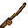 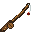 | Apprentice Rod | 1 | 65% | - | Free |
| 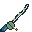 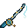 | Journeyman Rod | 2 | 74.75% | +5% | 600 Entropy |
| 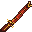 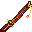 | Expert Rod | 3 | 84.5% | +12% | 1,800 Entropy |
| 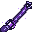 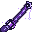 | Master Rod | 4 | 97.5% | +22% | 4,400 Entropy |
|   | Grandmaster Rod | 5 | 100% | +35% | 10,000 Entropy |

Buy rods through `/fish shop` and select **Rod Shop**. Every tier has a matching normal and cast-state texture; both are shown above.

## Bait

Hold bait in your offhand before casting. One bait is consumed when the line is cast, its luck bonus applies to that catch, and an action-bar message confirms which bait was used.

| Icon | Bait | Rarity luck | Price |
| --- | --- | ---: | ---: |
| 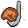 | Plain Bait | +4% | 15 Entropy |
| 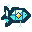 | Glimmer Bait | +11% | 60 Entropy |
| 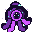 | Abyssal Bait | +22% | 180 Entropy |
|  | Leviathan Bait | +35% | 500 Entropy |

Players at Quasar [rank](ranks.md) or higher receive a 10% discount on bait in the Bait Shop.

## Augment Crystals

Open `/fish augment catalog` to compare crystals, or buy them through `/fish shop` and select **Augment Shop**. The six crystal types are split across two shop pages. Each type has its own texture; tiers of the same type share that icon but retain their tier-specific name, color, effect, and price.

| Icon | Crystal | Tier I | Tier II | Tier III | Tier IV |
| --- | --- | --- | --- | --- | --- |
|  | Luck | +6% rarity luck; 1,000 Entropy | +14%; 2,500 | +25%; 6,000 | +35%; 15,000 |
| 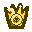 | Treasure | +5 percentage points fish chance; 1,000 Entropy | +12 points; 2,500 | +20 points; 6,000 | +28 points; 15,000 |
|  | Swift | 10% shorter wait; 1,000 Entropy | 25%; 2,500 | 45%; 6,000 | 65%; 15,000 |
|  | Autosell | Common; 1,500 Entropy | Up to Uncommon; 4,000 | Up to Rare; 9,000 | Up to Epic; 20,000 |
|  | Surge | 5% double catch; 2,000 Entropy | 12%; 5,000 | 20%; 11,000 | 28%; 24,000 |
|  | Titan | 15% size bias; 1,200 Entropy | 35%; 3,000 | 55%; 7,200 | 80%; 18,000 |

Swift reduces the actual bite wait time and works alongside the rod's vanilla Lure enchantment. Autosell immediately converts catches at or below its threshold into Capacity and Entropy. If Surge creates a bonus catch, that fish also respects the installed Autosell threshold; otherwise it goes to your inventory or drops beside you when the inventory is full.

Titan does not add a fixed number of centimeters and does not guarantee a maximum-size fish. It biases the random size roll toward the upper end of that species' range and also applies to Surge bonus catches. Luck, Treasure, Swift, Autosell, and Surge produce their own particle signatures around the bobber while active.

### Apply a Crystal

1. Hold the MasterFishing rod in your main hand.
2. Hold the crystal in your offhand.
3. Run `/fish augment apply`.

Each augment type occupies one slot. Applying a higher tier of an augment already on the rod upgrades it without taking another slot. Equal or lower tiers are rejected.

Run `/fish augment remove <augment-id>` to free its slot. Removal destroys the installed crystal; it is not returned.

Augment IDs are `luck`, `treasure`, `swift`, `autosell`, `surge`, and `titan`.

## Fish Glossary

Open `/fish` and select **Glossary**. It contains every species you have caught at least once and records:

- how many times you caught the species;
- your smallest and largest specimen;
- your best Capacity value;
- the species rarity, story, and resource-pack icon.

The Glossary can filter by rarity and sort by rarity, largest size, or best value. Right-click an entry to share a hoverable item preview in chat and relay its tooltip image to Discord.

The in-game Glossary tracks personal discoveries. The wiki's [Fish Species Catalog](fish-species.md) lists all 1,000 species, including undiscovered fish.

## Selling and Entropy

Every sold fish pays its stored value in [Capacity](capacity.md) and grants 1 Entropy. The value is based on species, rarity, and rolled size, with a current maximum of 4,000 Capacity per fish.

| Command | Action |
| --- | --- |
| `/fish sell` | Open the sell menu |
| `/fish sell hand` | Sell the fish stack in your main hand |
| `/fish sell all` | Sell every MasterFish in your inventory |

The sell menu lets you click individual fish or use **Sell All**. `/fish stats` shows your Entropy balance, total catches, and lifetime catch value; `/fish stats <player>` also works for offline players.

### MasterChest Auto Fish Sell

At Quasar [rank](ranks.md), the Automation Jobs menu gains **Auto Fish Sell**. When enabled, it checks your storage network every 60 seconds, removes every stored MasterFish, and pays one combined sale.

See [Automation Jobs](master-chest/automation.md) for access to the automation menu.

## Roadmap Progress

Selling fish advances four permanent roadmap milestones.

| Lifetime fish sold | Reward |
| ---: | --- |
| 100 | Mobile Grindstone |
| 500 | Mobile Smithing Table |
| 1,000 | Mobile Enchanting Table |
| 3,000 | Mobile Anvil |

The counter increases through manual selling, Autosell crystals, and MasterChest Auto Fish Sell.

## Fishing Tournaments

The server checks for an automatic tournament every 20 minutes. A random 10-minute tournament starts when at least two players are online and no tournament is already active.

| Mode | Winning score |
| --- | --- |
| Total Value | Highest combined Capacity value of tournament catches |
| Catch Count | Most fish caught |
| Biggest Fish | Largest single catch in centimeters |
| Biome Hunt | Most catches made in the announced target biome |
| Biome Variety | Most different biomes with at least one catch |

A boss bar shows the remaining time. Standings are broadcast every two minutes. Open `/fish top` to see the current tournament and the all-time top ten winners.

### Tournament Rewards

| Place | Capacity | Entropy |
| ---: | ---: | ---: |
| 1st | 1,500 | 150 |
| 2nd | 1,000 | 75 |
| 3rd | 500 | 30 |
| Participation | 100 | - |

You must record at least one scoring catch to receive a reward. Players with equal scores share a place and each receive the full reward for that place.

## Player Commands

| Command | Purpose |
| --- | --- |
| `/fish` | Open the main Fishing menu |
| `/fish shop` | Open the Rod, Bait, and Augment shops |
| `/fish sell [hand\|all]` | Sell catches |
| `/fish stats [player]` | View Fishing statistics, including offline players |
| `/fish augment catalog` | Browse augment effects and prices |
| `/fish augment apply` | Apply the offhand crystal to the main-hand rod |
| `/fish augment remove <id>` | Remove and destroy an installed augment |
| `/fish top` | Open tournament status and Hall of Fame |
| `/fish tournament info` | Show the current tournament mode and time |

## Useful Tips

- Use the free Apprentice Rod before spending Entropy on upgrades.
- Bait is consumed on cast, so reserve Leviathan Bait for sessions where rarity matters most.
- Treasure improves the chance of receiving any MasterFish; Luck improves its rarity afterward.
- Titan is useful for valuable large catches and Biggest Fish tournaments.
- Quasar and higher ranks pay 10% less for bait.
- Autosell affects both the primary catch and a Surge bonus catch.
- Check the active tournament mode before deciding between fast catches, high-value fish, large species, or biome travel.
- Use the in-game Glossary for personal records and the [Fish Species Catalog](fish-species.md) for the complete collection.

## Continue Learning

- [All Fish Species](fish-species.md)
- [Capacity](capacity.md)
- [Capacity World Counters](capacity-world/counters.md)
- [Ranks](ranks.md)
- [Automation Jobs](master-chest/automation.md)
