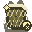

# Bait Ingredients

Bait Ingredients are 110 collectible materials used to research and reproduce [Baits](bait.md) at the [Fishing Table](fishing-table.md). There are 11 private ingredient pools—one for each bait track—with ten ingredients in every pool. Every ingredient has its own resource-pack texture.

## Sources and Base Chances

Ingredients have five tiers and five original source categories. Every ingredient rolls independently, so one chest or catch can award several different ingredients.

| Tier | Structure-loot chance | Fishing-source chance |
| ---: | ---: | ---: |
| 1 | 35% | 5% |
| 2 | 25% | 3.5% |
| 3 | 18% | 2.2% |
| 4 | 12% | 1.4% |
| 5 | 7% | 0.8% |

- **Trial Chambers:** normal and ominous reward chests of every rarity, corridor chests, intersection chests and barrels, and normal or ominous supply chests.
- **Villages:** fisher, fletcher, tannery, weaponsmith, toolsmith, armorer, butcher, cartographer, mason, shepherd, and temple chests, plus desert, plains, savanna, snowy, and taiga house chests.
- **Ancient Cities:** standard Ancient City and ice-box chests.
- **End Cities:** End City treasure chests.
- **Fishing:** an independent bonus roll after every successful MasterFish catch, including MasterFishing-rod lava catches.

## Fishing and Discovery Rules

Fishing-source ingredients are eligible from the start. A structure-source ingredient must first be found through its listed structure; after that permanent discovery, that same ingredient also becomes eligible as a fishing bonus using its structure-loot chance as the base rate.

Relic baits multiply the base rate. Salvage baits instead add flat percentage points. The final chance is `base chance × (1 + Relic bonus) + Salvage bonus`, capped at 100%; only the equipped bait contributes because one bait is consumed per cast.

A Surge or Shoal multicatch bonus fish triggers another complete set of ingredient rolls. Fishing rewards are deposited directly into MasterChest; if storage is unavailable or full, they fall back to your inventory and then drop beside you.

Structure ingredients are added only when an eligible vanilla loot container generates its contents for the first time. Opening the same generated chest again does not reroll its loot.

## Ingredient Catalog by Bait Track

Each ingredient below belongs only to the named track. Pools are sorted from lower to higher tiers for progression, and no ingredient is shared between two tracks.

### Fortune — Rarity Luck

| Ingredient | Tier | Original source | Base chance |
| --- | ---: | --- | ---: |
|  Waterlogged Twine | 1 | Successful MasterFish catch | 5% |
|  Vault Copper Shard | 1 | Eligible Trial Chamber loot | 35% |
|  Fletcher's Feather Bundle | 1 | Eligible village chest | 35% |
|  Reverberating Bone | 2 | Ancient City or ice-box chest | 25% |
|  Soul Fire Ember | 2 | Ancient City or ice-box chest | 25% |
|  Elytra Thread | 2 | End City treasure chest | 25% |
|  Shulker Shell Fragment | 2 | End City treasure chest | 25% |
|  Vault Latch Fragment | 2 | Eligible Trial Chamber loot | 25% |
|  Leatherworker's Awl Tip | 2 | Eligible village chest | 25% |
|  Tideworn Pearl | 3 | Successful MasterFish catch | 2.2% |

### Colossus — Size

| Ingredient | Tier | Original source | Base chance |
| --- | ---: | --- | ---: |
|  Trial Ember Dust | 1 | Eligible Trial Chamber loot | 35% |
|  Deep Dark Moss Clot | 2 | Ancient City or ice-box chest | 25% |
|  End Stone Grit | 2 | End City treasure chest | 25% |
|  Coral Polyp Fragment | 2 | Successful MasterFish catch | 3.5% |
|  Mason's Chalk Dust | 2 | Eligible village chest | 25% |
|  Nitwit's Lucky Button | 2 | Eligible village chest | 25% |
|  Warden Roar Fragment | 3 | Ancient City or ice-box chest | 18% |
|  Void-Touched Pearl Shard | 3 | End City treasure chest | 18% |
|  Kelp-Wrapped Hook | 3 | Successful MasterFish catch | 2.2% |
|  Trial Corridor Dust | 3 | Eligible Trial Chamber loot | 18% |

### Prosperity — Catch Value

| Ingredient | Tier | Original source | Base chance |
| --- | ---: | --- | ---: |
|  Sunken Net Fiber | 2 | Successful MasterFish catch | 3.5% |
|  Breeze Charm Fragment | 2 | Eligible Trial Chamber loot | 25% |
|  Shepherd's Wool Twine | 2 | Eligible village chest | 25% |
|  Sculk Shrieker Membrane | 3 | Ancient City or ice-box chest | 18% |
|  Soul Lantern Wax | 3 | Ancient City or ice-box chest | 18% |
|  Chorus Marrow | 3 | End City treasure chest | 18% |
|  End Ship Compass Needle | 3 | End City treasure chest | 18% |
|  Windcharge Residue | 3 | Eligible Trial Chamber loot | 18% |
|  Cartographer's Compass Needle | 3 | Eligible village chest | 18% |
|  Riverbed Clay Nodule | 4 | Successful MasterFish catch | 1.4% |

### Clockwork — Bite Speed

| Ingredient | Tier | Original source | Base chance |
| --- | ---: | --- | ---: |
|  Ominous Bolt Coil | 2 | Eligible Trial Chamber loot | 25% |
|  Catalyst Bloom Spore | 3 | Ancient City or ice-box chest | 18% |
|  Whispering Sculk Bud | 3 | Ancient City or ice-box chest | 18% |
|  Elytra Membrane Scrap | 3 | End City treasure chest | 18% |
|  Anglerfish Lure Node | 3 | Successful MasterFish catch | 2.2% |
|  Cartographer's Ink Vial | 3 | Eligible village chest | 18% |
|  Mason's Grindstone Dust | 3 | Eligible village chest | 18% |
|  End Crystal Splinter | 4 | End City treasure chest | 12% |
|  Deep Current Residue | 4 | Successful MasterFish catch | 1.4% |
|  Vault Rune Tablet | 4 | Eligible Trial Chamber loot | 12% |

### Shoal — Multicatch

| Ingredient | Tier | Original source | Base chance |
| --- | ---: | --- | ---: |
|  Ancient Bone Marrow Dust | 3 | Ancient City or ice-box chest | 18% |
|  Abyssal Silt Clump | 3 | Successful MasterFish catch | 2.2% |
|  Chamber Static Node | 3 | Eligible Trial Chamber loot | 18% |
|  Armorer's Rivet | 3 | Eligible village chest | 18% |
|  Silent Catalyst Dust | 4 | Ancient City or ice-box chest | 12% |
|  Dragon Scale Fragment | 4 | End City treasure chest | 12% |
|  Obsidian Star Fragment | 4 | End City treasure chest | 12% |
|  Mob Spawner Filament | 4 | Eligible Trial Chamber loot | 12% |
|  Armorer's Forge Slag | 4 | Eligible village chest | 12% |
|  Bioluminescent Gland | 5 | Successful MasterFish catch | 0.8% |

### Wayfinder — Biome Focus

| Ingredient | Tier | Original source | Base chance |
| --- | ---: | --- | ---: |
|  Resonant Trial Coil | 3 | Eligible Trial Chamber loot | 18% |
|  Chiseled Dark Tablet | 4 | Ancient City or ice-box chest | 12% |
|  Silent Vault Key | 4 | Ancient City or ice-box chest | 12% |
|  Void Rift Shard | 4 | End City treasure chest | 12% |
|  Pearlescent Shell Shard | 4 | Successful MasterFish catch | 1.4% |
|  Weaponsmith's Anvil Chip | 4 | Eligible village chest | 12% |
|  Weaponsmith's Whetstone | 4 | Eligible village chest | 12% |
|  Dragon Breath Residue | 5 | End City treasure chest | 7.0% |
|  Leviathan Whisker | 5 | Successful MasterFish catch | 0.8% |
|  Trial Chamber Sigil | 5 | Eligible Trial Chamber loot | 7.0% |

### Entropy — Entropy Bonus

| Ingredient | Tier | Original source | Base chance |
| --- | ---: | --- | ---: |
|  Trial Spawner Cog | 1 | Eligible Trial Chamber loot | 35% |
|  Resonating Skull Fragment | 4 | Ancient City or ice-box chest | 12% |
|  End Crystal Beam Dust | 4 | End City treasure chest | 12% |
|  Riptide Current Vial | 4 | Successful MasterFish catch | 1.4% |
|  Vault Alloy Splinter | 4 | Eligible Trial Chamber loot | 12% |
|  Butcher's Twine Hook | 4 | Eligible village chest | 12% |
|  Hollow Resonance Bell | 5 | Ancient City or ice-box chest | 7.0% |
|  End Void Filament | 5 | End City treasure chest | 7.0% |
|  Deepslate Vault Core | 5 | Eligible Trial Chamber loot | 7.0% |
|  Village Bell Chime Shard | 5 | Eligible village chest | 7.0% |

### Reserve — Capacity Bonus

| Ingredient | Tier | Original source | Base chance |
| --- | ---: | --- | ---: |
|  Silver Scale Flake | 1 | Successful MasterFish catch | 5% |
|  Copper Vent Filings | 1 | Eligible Trial Chamber loot | 35% |
|  Farmer's Seed Pouch | 1 | Eligible village chest | 35% |
|  Obsidian Spike Splinter | 4 | End City treasure chest | 12% |
|  Vindicator's Cinder | 4 | Eligible Trial Chamber loot | 12% |
|  Warden Heartcinder | 5 | Ancient City or ice-box chest | 7.0% |
|  Warden Sinew Thread | 5 | Ancient City or ice-box chest | 7.0% |
|  Leviathan Scale Plate | 5 | Successful MasterFish catch | 0.8% |
|  Elder Villager's Signet | 5 | Eligible village chest | 7.0% |
|  Toolsmith's Filings | 5 | Eligible village chest | 7.0% |

### Twofold — Double Value

| Ingredient | Tier | Original source | Base chance |
| --- | ---: | --- | ---: |
|  Sculk Sensor Splinter | 1 | Ancient City or ice-box chest | 35% |
|  Purpur Dust | 1 | End City treasure chest | 35% |
|  Brackish Roe Cluster | 1 | Successful MasterFish catch | 5% |
|  Breeze Vane Sliver | 1 | Eligible Trial Chamber loot | 35% |
|  Librarian's Bookmark Ribbon | 1 | Eligible village chest | 35% |
|  Deep Dark Core Shard | 5 | Ancient City or ice-box chest | 7.0% |
|  End Gateway Residue | 5 | End City treasure chest | 7.0% |
|  Abyssal Core Pearl | 5 | Successful MasterFish catch | 0.8% |
|  Vault Prism Sliver | 5 | Eligible Trial Chamber loot | 7.0% |
|  Temple Incense Ash | 5 | Eligible village chest | 7.0% |

### Relic — Ingredient Multiplier

| Ingredient | Tier | Original source | Base chance |
| --- | ---: | --- | ---: |
|  Deep Dark Charcoal Fleck | 1 | Ancient City or ice-box chest | 35% |
|  Sculk Vein Residue | 1 | Ancient City or ice-box chest | 35% |
|  Chorus Petal Dust | 1 | End City treasure chest | 35% |
|  Shulker Membrane Scrap | 1 | End City treasure chest | 35% |
|  Ominous Trial Key | 1 | Eligible Trial Chamber loot | 35% |
|  Barnacle Cluster | 2 | Successful MasterFish catch | 3.5% |
|  Fisher's Net Twine | 2 | Eligible village chest | 25% |
|  Void-Forged Pearl Core | 5 | End City treasure chest | 7.0% |
|  Krakenbone Splinter | 5 | Successful MasterFish catch | 0.8% |
|  Sovereign Trial Core | 5 | Eligible Trial Chamber loot | 7.0% |

### Salvage — Flat Ingredient Chance

| Ingredient | Tier | Original source | Base chance |
| --- | ---: | --- | ---: |
|  Warden Echo Shard | 1 | Ancient City or ice-box chest | 35% |
|  Purpur Tile Chip | 1 | End City treasure chest | 35% |
|  Minnow Scale Dust | 1 | Successful MasterFish catch | 5% |
|  Tanner's Hide Scrap | 1 | Eligible village chest | 35% |
|  Reinforced Deepslate Chip | 2 | Ancient City or ice-box chest | 25% |
|  End Ship Rivet | 2 | End City treasure chest | 25% |
|  Driftwood Splinter | 2 | Successful MasterFish catch | 3.5% |
|  Ember Conduit Coil | 2 | Eligible Trial Chamber loot | 25% |
|  Cleric's Blessed Chalk | 2 | Eligible village chest | 25% |
|  Maelstrom Whisker Coil | 5 | Successful MasterFish catch | 0.8% |

## Using Ingredients at the Fishing Table

Research checks your normal inventory and MasterChest together. When you unlock a recipe, ingredients are consumed from your inventory first and any remainder is removed from MasterChest automatically.

Repeat crafting uses the Fishing Table's 3×3 grid. For that screen, retrieve the required ingredient from MasterChest and place the exact item and amount in the grid.

## Related Articles

- [Baits](bait.md)
- [Fishing Table](fishing-table.md)
- [Fishing Guide](../fishing.md)
- [All Fish Species](../fish-species.md)
