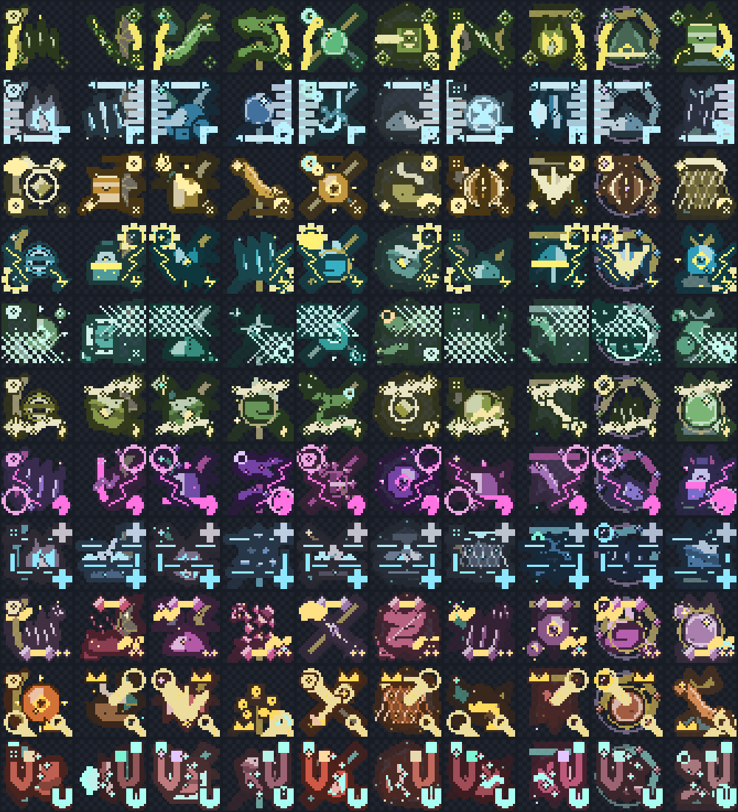

# Bait Ingredients

Bait Ingredients are 50 collectible materials used to research and reproduce [Baits](bait.md) at the [Fishing Table](fishing-table.md). They are split into five source groups and five tiers. Every ingredient has its own resource-pack texture.

Every group contains two ingredients at each tier. Higher tiers are rarer and are used by stronger bait families.

| Ingredient tier | Used by bait tiers | Structure chance per ingredient | Fishing chance per ingredient |
| ---: | ---: | ---: | ---: |
| 1 | 1–2 | 35% | 5% |
| 2 | 3–4 | 25% | 3.5% |
| 3 | 5–6 | 18% | 2.2% |
| 4 | 7–8 | 12% | 1.4% |
| 5 | 9–10 | 7% | 0.8% |

Each listed chance is an independent roll for that ingredient. An eligible chest or successful catch can therefore award more than one different ingredient.

## Trial Chamber Ingredients

These ingredients can appear when loot is generated in Trial Chamber reward chests of every normal and ominous rarity, corridor chests, intersection chests and barrels, and normal or ominous supply chests.

| Ingredient | Tier | Chance | Where to find it |
| --- | ---: | ---: | --- |
| Vault Copper Shard | 1 | 35% | Eligible Trial Chamber loot |
| Trial Ember Dust | 1 | 35% | Eligible Trial Chamber loot |
| Breeze Charm Fragment | 2 | 25% | Eligible Trial Chamber loot |
| Ominous Bolt Coil | 2 | 25% | Eligible Trial Chamber loot |
| Chamber Static Node | 3 | 18% | Eligible Trial Chamber loot |
| Resonant Trial Coil | 3 | 18% | Eligible Trial Chamber loot |
| Vault Alloy Splinter | 4 | 12% | Eligible Trial Chamber loot |
| Vindicator's Cinder | 4 | 12% | Eligible Trial Chamber loot |
| Vault Prism Sliver | 5 | 7% | Eligible Trial Chamber loot |
| Sovereign Trial Core | 5 | 7% | Eligible Trial Chamber loot |

## Village Ingredients

These ingredients can appear in village fisher, fletcher, tannery, weaponsmith, toolsmith, armorer, butcher, cartographer, mason, shepherd, and temple chests. Desert, plains, savanna, snowy, and taiga village-house chests are also eligible.

| Ingredient | Tier | Chance | Where to find it |
| --- | ---: | ---: | --- |
| Tanner's Hide Scrap | 1 | 35% | Eligible village chest |
| Fletcher's Feather Bundle | 1 | 35% | Eligible village chest |
| Mason's Chalk Dust | 2 | 25% | Eligible village chest |
| Shepherd's Wool Twine | 2 | 25% | Eligible village chest |
| Cartographer's Ink Vial | 3 | 18% | Eligible village chest |
| Armorer's Rivet | 3 | 18% | Eligible village chest |
| Weaponsmith's Whetstone | 4 | 12% | Eligible village chest |
| Butcher's Twine Hook | 4 | 12% | Eligible village chest |
| Toolsmith's Filings | 5 | 7% | Eligible village chest |
| Temple Incense Ash | 5 | 7% | Eligible village chest |

## Ancient City Ingredients

These ingredients can appear in both standard Ancient City chests and Ancient City ice-box chests.

| Ingredient | Tier | Chance | Where to find it |
| --- | ---: | ---: | --- |
| Sculk Vein Residue | 1 | 35% | Ancient City or ice-box chest |
| Warden Echo Shard | 1 | 35% | Ancient City or ice-box chest |
| Reverberating Bone | 2 | 25% | Ancient City or ice-box chest |
| Deep Dark Moss Clot | 2 | 25% | Ancient City or ice-box chest |
| Soul Lantern Wax | 3 | 18% | Ancient City or ice-box chest |
| Whispering Sculk Bud | 3 | 18% | Ancient City or ice-box chest |
| Silent Catalyst Dust | 4 | 12% | Ancient City or ice-box chest |
| Chiseled Dark Tablet | 4 | 12% | Ancient City or ice-box chest |
| Hollow Resonance Bell | 5 | 7% | Ancient City or ice-box chest |
| Warden Heartcinder | 5 | 7% | Ancient City or ice-box chest |

## End City Ingredients

These ingredients can appear in End City treasure chests.

| Ingredient | Tier | Chance | Where to find it |
| --- | ---: | ---: | --- |
| Purpur Dust | 1 | 35% | End City treasure chest |
| Shulker Membrane Scrap | 1 | 35% | End City treasure chest |
| End Ship Rivet | 2 | 25% | End City treasure chest |
| Elytra Thread | 2 | 25% | End City treasure chest |
| Void-Touched Pearl Shard | 3 | 18% | End City treasure chest |
| Chorus Marrow | 3 | 18% | End City treasure chest |
| End Crystal Splinter | 4 | 12% | End City treasure chest |
| Obsidian Star Fragment | 4 | 12% | End City treasure chest |
| Dragon Breath Residue | 5 | 7% | End City treasure chest |
| End Void Filament | 5 | 7% | End City treasure chest |

## Fishing Ingredients

These ingredients roll independently after every successful MasterFish catch, including catches made with a MasterFishing rod in lava. A Surge or Multicatch bonus fish triggers another full set of ingredient rolls. The ingredient enters your inventory or drops beside you when the inventory is full.

| Ingredient | Tier | Chance per MasterFish | How to obtain it |
| --- | ---: | ---: | --- |
| Silver Scale Flake | 1 | 5% | Successful MasterFish catch |
| Brackish Roe Cluster | 1 | 5% | Successful MasterFish catch |
| Barnacle Cluster | 2 | 3.5% | Successful MasterFish catch |
| Driftwood Splinter | 2 | 3.5% | Successful MasterFish catch |
| Tideworn Pearl | 3 | 2.2% | Successful MasterFish catch |
| Kelp-Wrapped Hook | 3 | 2.2% | Successful MasterFish catch |
| Riverbed Clay Nodule | 4 | 1.4% | Successful MasterFish catch |
| Deep Current Residue | 4 | 1.4% | Successful MasterFish catch |
| Bioluminescent Gland | 5 | 0.8% | Successful MasterFish catch |
| Leviathan Whisker | 5 | 0.8% | Successful MasterFish catch |

## Loot and Discovery Rules

Structure ingredients are added when an eligible vanilla loot container generates its contents for the first time. Opening the same generated chest again does not reroll its loot.

When you receive an ingredient from structure loot or fishing, the discovery is permanently recorded. The Fishing Table can use that history, your current inventory, and MasterChest storage to reveal the next relevant recipe in an effect track. Research itself still consumes ingredients from your normal inventory.

## Related Articles

- [Baits](bait.md)
- [Fishing Table](fishing-table.md)
- [Fishing Guide](../fishing.md)
- [All Fish Species](../fish-species.md)
