# Baits

Baits are one-cast consumables that modify the next fishing attempt. There are 99 baits in 11 independent effect tracks, with nine ranks in each track. Every track now has its own purpose-written names, visual theme, resource-pack textures, and private pool of [Bait Ingredients](bait-ingredients.md). Baits are researched and crafted at the [Fishing Table](fishing-table.md).

## Track Identity and Ranks

A bait's name and appearance now identify its gameplay track directly. All nine baits in a track share one palette and icon theme, while added detail and strength mark ranks 1 through 9. Rank 1 is the weakest entry and rank 9 is the strongest.

Each track also owns ten ingredients that no other track uses. This keeps research recipes visually and mechanically distinct across the catalog.

## How to Use a Bait

1. Hold a fishing rod in your main hand.
2. Put one bait in your offhand.
3. Cast the line.

The bait is consumed immediately on cast, and an action-bar message confirms which bait was applied. Only one bait applies to a cast. Baits work with normal water fishing and with MasterFishing-rod lava fishing.

## Visual Catalog by Effect Track

Each table is one complete weak-to-strong progression. A bait and its texture belong only to the section in which they appear.

### Fortune — Rarity Luck

Adds to the rarity-roll weight after a MasterFish catch succeeds, increasing the chance of higher-rarity species. It combines with rod luck and a Luck Crystal.

| Rank | Bait | Rarity luck |
| ---: | --- | ---: |
| 1 | 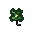 Clover Bait | +3.0% |
| 2 | 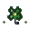 Lucky Minnow | +8.0% |
| 3 | 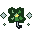 Fortune Fly | +13.0% |
| 4 |  Horseshoe Lure | +18.0% |
| 5 |  Serendipity Charm | +23.0% |
| 6 | 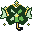 Gilded Clover | +28.0% |
| 7 |  Fateweaver Bait | +33.0% |
| 8 |  Fortune's Favor | +38.0% |
| 9 |  Destiny Lure | +43.0% |

### Colossus — Size

Biases the species' size roll upward without adding a fixed number of centimeters. It combines with the Titan Crystal's size bias.

| Rank | Bait | Size bias |
| ---: | --- | ---: |
| 1 | 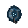 Weighted Grub | +3.0% |
| 2 | 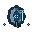 Measuring Lure | +9.0% |
| 3 |  Broadscale Bait | +15.0% |
| 4 |  Heavyweight Jig | +21.0% |
| 5 |  Colossus Morsel | +27.0% |
| 6 |  Titanhook Bait | +33.0% |
| 7 |  Giant's Measure | +39.0% |
| 8 |  Leviathan Feed | +45.0% |
| 9 |  Worldscale Lure | +51.0% |

### Prosperity — Catch Value

Applies a guaranteed multiplier to the caught fish's Capacity value. The result still respects the configured 4,000-Capacity maximum value per fish.

| Rank | Bait | Value bonus |
| ---: | --- | ---: |
| 1 | 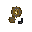 Copper Coin Bait | +2.0% |
| 2 | 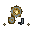 Silver Spinner | +6.8% |
| 3 | 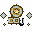 Gilded Jig | +11.5% |
| 4 |  Merchant's Lure | +16.3% |
| 5 |  Gemscale Bait | +21.0% |
| 6 |  Royal Coin Charm | +25.8% |
| 7 |  Treasuremint Lure | +30.5% |
| 8 |  Midas Morsel | +35.3% |
| 9 |  Emperor's Ransom | +40.0% |

### Clockwork — Bite Speed

Reduces the actual wait before a bite. The reduction stacks with a Swift Crystal and with the vanilla Lure enchantment.

| Rank | Bait | Bite wait |
| ---: | --- | ---: |
| 1 | 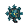 Ticking Grub | -2.0% |
| 2 | 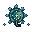 Springwound Jig | -6.8% |
| 3 | 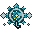 Quickhand Lure | -11.5% |
| 4 |  Clockwork Bait | -16.3% |
| 5 |  Lightning Wader | -21.0% |
| 6 |  Overclocked Spinner | -25.8% |
| 7 |  Chrono Fly | -30.5% |
| 8 |  Tempest Gear | -35.3% |
| 9 |  Instant Bite | -40.0% |

### Shoal — Multicatch

Adds a chance to receive a second fish from the same catch. It adds to the Surge Crystal's multicatch chance.

| Rank | Bait | Bonus-catch chance |
| ---: | --- | ---: |
| 1 | 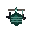 Twinhook Bait | +1.0% |
| 2 |  Forked Lure | +4.6% |
| 3 | 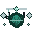 Triple Jig | +8.3% |
| 4 |  Schoolcaller Chum | +11.9% |
| 5 |  Netweaver Bait | +15.5% |
| 6 |  Shoal Charm | +19.1% |
| 7 |  Swarmhook Rig | +22.8% |
| 8 |  Ocean Harvester | +26.4% |
| 9 |  Ninefold Lure | +30.0% |

### Wayfinder — Biome Focus

Adds selection weight to fish restricted to the biome where you are fishing. Universal fish that can appear in any biome are unaffected.

| Rank | Bait | Biome focus |
| ---: | --- | ---: |
| 1 | 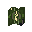 Moss Compass | +5.0% |
| 2 | 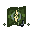 Riverfinder Bait | +15.6% |
| 3 | 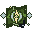 Desert Needle | +26.2% |
| 4 |  Frostbound Lure | +36.8% |
| 5 |  Jungle Waypoint | +47.4% |
| 6 |  Tide Compass | +58.0% |
| 7 |  Wildlands Atlas | +68.6% |
| 8 |  Worldroot Charm | +79.2% |
| 9 |  Perfect Horizon | +89.8% |

### Entropy — Entropy Bonus

Grants a fixed amount of Entropy immediately for each fish actually caught. A bonus fish produced by multicatch also counts as a catch.

| Rank | Bait | Entropy per catch |
| ---: | --- | ---: |
| 1 |  Static Crumb | +10 |
| 2 | 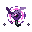 Entropy Shard | +35 |
| 3 | 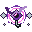 Discordant Jig | +60 |
| 4 |  Rift Lure | +85 |
| 5 |  Chaos Coil | +110 |
| 6 |  Eventide Core | +135 |
| 7 |  Singularity Bait | +160 |
| 8 |  Paradox Charm | +185 |
| 9 |  Entropy Heart | +210 |

### Reserve — Capacity Bonus

Grants a fixed amount of Capacity immediately for each fish actually caught. This direct reward is separate from the caught fish's sell value.

| Rank | Bait | Capacity per catch |
| ---: | --- | ---: |
| 1 | 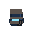 Pocket Pouch | +3 |
| 2 | 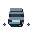 Bait Satchel | +12 |
| 3 |  Tackle Tin | +21 |
| 4 |  Reinforced Creel | +30 |
| 5 |  Deepwater Barrel | +39 |
| 6 |  Endless Bucket | +48 |
| 7 |  Vaulted Tank | +57 |
| 8 |  Bottomless Hold | +66 |
| 9 |  Ocean's Reserve | +75 |

### Twofold — Double Value

Provides an independent chance to double the caught fish's Capacity value. A successful double still respects the configured 4,000-Capacity maximum value per fish.

| Rank | Bait | Double-value chance |
| ---: | --- | ---: |
| 1 | 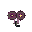 Twin Coin Bait | +3.0% |
| 2 | 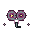 Mirrored Lure | +7.0% |
| 3 |  Doubledown Jig | +11.0% |
| 4 |  Gemini Grub | +15.0% |
| 5 |  Echoed Morsel | +19.0% |
| 6 |  Twofold Charm | +23.0% |
| 7 |  Duplicator Bait | +27.0% |
| 8 |  Fortune Mirror | +31.0% |
| 9 |  Perfect Double | +35.0% |

### Relic — Ingredient Multiplier

Multiplies each eligible bait ingredient's base fishing chance. For example, +215% makes the base chance 3.15 times as large.

| Rank | Bait | Ingredient chance |
| ---: | --- | ---: |
| 1 | 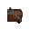 Rusty Key Bait | +15% |
| 2 | 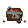 Treasure Map Lure | +40% |
| 3 |  Pearlfinder Jig | +65% |
| 4 |  Gilded Key | +90% |
| 5 |  Relic Seeker | +115% |
| 6 |  Crown Jewel Bait | +140% |
| 7 |  Vaultbreaker Lure | +165% |
| 8 |  King's Cache | +190% |
| 9 |  Sovereign Treasure | +215% |

### Salvage — Flat Ingredient Chance

Adds flat percentage points to every eligible bait ingredient's fishing roll. Unlike Relic's multiplier, the same flat amount is added even to a very rare ingredient.

| Rank | Bait | Flat chance per ingredient |
| ---: | --- | ---: |
| 1 | 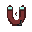 Scrapfinder Bait | +0.25 pp |
| 2 |  Sifting Lure | +0.50 pp |
| 3 |  Forager Jig | +0.75 pp |
| 4 |  Salvage Grub | +1.00 pp |
| 5 |  Prospector Charm | +1.25 pp |
| 6 |  Ingredient Magnet | +1.50 pp |
| 7 |  Deepfinder Bait | +1.75 pp |
| 8 |  Master Forager | +2.00 pp |
| 9 |  Perfect Salvage | +2.25 pp |

## Rank Requirements and Recipe Costs

All 11 tracks use the same fish prerequisites and recipe-size progression. Ingredient identities differ because every track draws from its own ten-item pool; the Fishing Table shows the exact items for the selected bait.

| Rank | Required fish | Rarity | One-time research amounts | Repeat-crafting cost |
| ---: | --- | --- | --- | --- |
| 1 | River Mackerel | Common | 2 + 1 | 1 primary ingredient |
| 2 | Stream Lungfish | Common | 2 + 2 | 1 primary ingredient |
| 3 | Rust Cowfish | Uncommon | 3 + 2 | 1 primary ingredient |
| 4 | Cinder Lungfish | Uncommon | 3 + 2 + 1 | 2 primary ingredients |
| 5 | Arcane Herring | Rare | 3 + 2 + 2 | 2 primary ingredients |
| 6 | Electric Sturgeon | Rare | 4 + 2 + 2 | 2 primary ingredients |
| 7 | Radiant Lanternfish | Epic | 4 + 3 + 2 | 2 primary ingredients |
| 8 | Behemoth Herring | Legendary | 4 + 3 + 2 | 2 primary ingredients |
| 9 | Alpha Anglerfish | Mythic | 5 + 3 + 1 | 2 primary ingredients |

## Unlock Order

The 11 tracks progress independently, but every track must be researched from rank 1 to rank 9. You cannot skip a lower rank.

The Research screen shows three complete tracks per page, with all nine ranks arranged from left to right. Researched ranks remain visible, the next rank shows its real bait and requirements, and later ranks appear as locked `???` placeholders until the previous steps are complete.

Research requires the listed fish in your Fishing Glossary and the displayed ingredients. The table counts ingredients in both your inventory and MasterChest, consumes inventory copies first and then takes any remainder from MasterChest. A successful research permanently unlocks the recipe and gives you the first bait.

See [Fishing Table](fishing-table.md) for the complete research and crafting workflow.

## Related Articles

- [Bait Ingredients](bait-ingredients.md)
- [Fishing Table](fishing-table.md)
- [Fishing Guide](../fishing.md)
- [Fishing Rods](rods.md)
- [Augment Crystals](augment-crystals.md)
- [All Fish Species](../fish-species.md)
