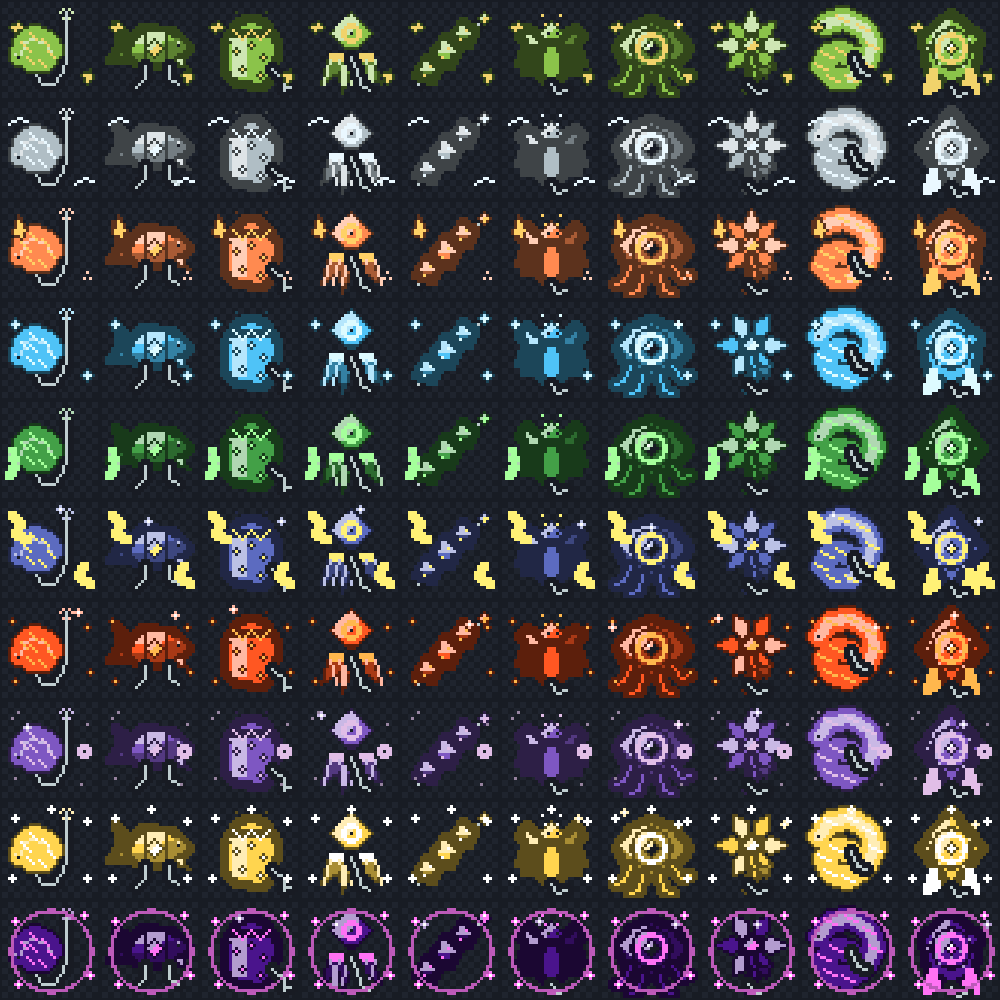

# Baits

Baits are one-cast consumables that modify the next fishing attempt. There are 100 baits across ten visual tiers and six effect tracks. Every bait has its own resource-pack texture and is researched and crafted at the [Fishing Table](fishing-table.md) from collectible [Bait Ingredients](bait-ingredients.md).

The preview contains one row per tier. Within each row, the designs are ordered as Bait, Lure, Chum, Jig, Morsel, Wader, Tempter, Bloom, Grub, and Charm.

## How to Use a Bait

1. Hold a fishing rod in your main hand.
2. Put one bait in your offhand.
3. Cast the line.

The bait is consumed immediately on cast. An action-bar message confirms which bait was applied. Baits work with normal water fishing and with MasterFishing-rod lava fishing.

## Six Effect Tracks

Each bait belongs to exactly one track. Its noun determines its effect, while Meadow through Void indicate its visual tier and general progression stage.

| Bait nouns | Effect track | Steps | Weakest to strongest | What the effect does |
| --- | --- | ---: | ---: | --- |
| Bait, Lure | Luck | 20 | +3.0% to +42.9% | Improves the rarity roll after a MasterFish is selected |
| Chum, Jig | Size | 20 | +3.0% to +50.5% | Biases the species' size roll upward; it does not add fixed centimeters |
| Morsel, Wader | Biome Focus | 20 | +5.0% to +90.5% | Adds selection weight to fish restricted to your current biome; universal fish are unaffected |
| Tempter, Bloom | Value | 20 | +2.0% to +40.0% | Multiplies the catch's Capacity value, up to the 8,000-Capacity per-fish cap |
| Grub | Speed | 10 | 2.0% to 39.8% shorter wait | Reduces the actual time until a bite |
| Charm | Multicatch | 10 | +1.0% to +29.8% | Adds a chance to receive a second fish from the catch |

Luck combines with rod luck and a Luck Crystal. Size combines with Titan, Speed works alongside Swift and vanilla Lure, and Multicatch adds to the Surge chance. A bonus fish receives the same active Luck, Size, Value, and Biome Focus bait modifiers as the primary fish.

No bait increases the base chance that a vanilla catch becomes a MasterFish. Use a stronger [Fishing Rod](rods.md) or a Treasure Crystal for that.

## Tiers and Recipe Costs

Every family contains one bait for each noun shown above. Research is a one-time, multi-ingredient cost; crafting additional copies afterward uses only the recipe's primary ingredient and is much cheaper.

| Tier | Family | Ingredient tier | One-time research amounts | Repeat-crafting cost |
| ---: | --- | ---: | --- | --- |
| 1 | Meadow | 1 | 2 + 1 | 1 primary ingredient |
| 2 | Whisper | 1 | 2 + 2 | 1 primary ingredient |
| 3 | Ember | 2 | 3 + 2 | 1 primary ingredient |
| 4 | Glacier | 2 | 3 + 2 + 1 | 2 primary ingredients |
| 5 | Verdant | 3 | 3 + 2 + 2 | 2 primary ingredients |
| 6 | Storm | 3 | 4 + 2 + 2 | 2 primary ingredients |
| 7 | Molten | 4 | 4 + 3 + 2 | 2 primary ingredients |
| 8 | Shadow | 4 | 4 + 3 + 2 | 2 primary ingredients |
| 9 | Radiant | 5 | 4 + 3 + 2 | 2 primary ingredients |
| 10 | Void | 5 | 5 + 3 + 1 | 2 primary ingredients |

The exact fish requirement and ingredient combination differ for every bait and are displayed in the Fishing Table.

## Unlock Order

The six effect tracks progress independently, but every track must be researched from weakest to strongest. You cannot skip a lower step just because you already own ingredients for a stronger one.

The first recipe in each track is always visible. After that, the table shows only the next locked recipe in a track, and only after you have encountered at least one of its research ingredients. This discovery check includes ingredients in your inventory, ingredients recorded as previously found, and ingredients stored in MasterChest. The full research cost must still be present in your normal inventory when you unlock the recipe.

Researching consumes the displayed research ingredients, permanently unlocks the bait for your account, and gives you the first copy. The **Craft Bait** screen then uses the cheaper repeat recipe for every additional copy.

See [Fishing Table](fishing-table.md) for the complete research and crafting workflow.

## Related Articles

- [Bait Ingredients](bait-ingredients.md)
- [Fishing Table](fishing-table.md)
- [Fishing Guide](../fishing.md)
- [Fishing Rods](rods.md)
- [Augment Crystals](augment-crystals.md)
- [All Fish Species](../fish-species.md)
