# Baits

Baits are one-cast consumables that modify the next fishing attempt. There are 99 baits in 11 independent effect tracks, with nine ranks in each track. Every bait has its own resource-pack texture and is researched and crafted at the [Fishing Table](fishing-table.md) from collectible [Bait Ingredients](bait-ingredients.md).

## Names, Looks, and Ranks

The two parts of a bait's name control only its appearance:

- **Meadow through Void** determines its color palette and visual motif.
- **Bait, Lure, Chum, Jig, Morsel, Wader, Tempter, Bloom, Grub, or Charm** determines its silhouette.

Neither word reliably identifies the bait's effect or strength. Gameplay progression is the bait's rank from 1 to 9 inside one of the 11 tracks below. Always use the catalog section and rank rather than trying to infer an effect from the name.

## How to Use a Bait

1. Hold a fishing rod in your main hand.
2. Put one bait in your offhand.
3. Cast the line.

The bait is consumed immediately on cast, and an action-bar message confirms which bait was applied. Only one bait applies to a cast. Baits work with normal water fishing and with MasterFishing-rod lava fishing.

## Visual Catalog by Effect Track

Each table is one complete weak-to-strong progression. A bait belongs only to the section in which it appears.

### Rarity Luck

Adds to the rarity-roll weight after a MasterFish catch succeeds, increasing the chance of higher-rarity species. It combines with rod luck and a Luck Crystal.

| Rank | Bait | Rarity luck |
| ---: | --- | ---: |
| 1 |  Meadow Bait | +3.0% |
| 2 | 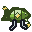 Meadow Lure | +8.0% |
| 3 |  Meadow Chum | +13.0% |
| 4 | 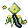 Meadow Jig | +18.0% |
| 5 |  Meadow Morsel | +23.0% |
| 6 | 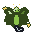 Meadow Wader | +28.0% |
| 7 |  Meadow Tempter | +33.0% |
| 8 | 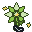 Meadow Bloom | +38.0% |
| 9 | 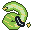 Meadow Grub | +43.0% |

### Size

Biases the species' size roll upward without adding a fixed number of centimeters. It combines with the Titan Crystal's size bias.

| Rank | Bait | Size bias |
| ---: | --- | ---: |
| 1 |  Meadow Charm | +3.0% |
| 2 | 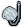 Whisper Bait | +9.0% |
| 3 | 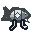 Whisper Lure | +15.0% |
| 4 | 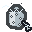 Whisper Chum | +21.0% |
| 5 | 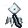 Whisper Jig | +27.0% |
| 6 | 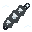 Whisper Morsel | +33.0% |
| 7 | 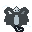 Whisper Wader | +39.0% |
| 8 | 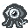 Whisper Tempter | +45.0% |
| 9 | 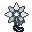 Whisper Bloom | +51.0% |

### Catch Value

Applies a guaranteed multiplier to the caught fish's Capacity value. The result still respects the configured 4,000-Capacity maximum value per fish.

| Rank | Bait | Value bonus |
| ---: | --- | ---: |
| 1 | 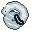 Whisper Grub | +2.0% |
| 2 |  Whisper Charm | +6.8% |
| 3 | 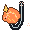 Ember Bait | +11.5% |
| 4 | 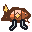 Ember Lure | +16.3% |
| 5 | 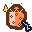 Ember Chum | +21.0% |
| 6 | 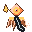 Ember Jig | +25.8% |
| 7 |  Ember Morsel | +30.5% |
| 8 | 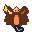 Ember Wader | +35.3% |
| 9 | 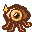 Ember Tempter | +40.0% |

### Bite Speed

Reduces the actual wait before a bite. The reduction stacks with a Swift Crystal and with the vanilla Lure enchantment.

| Rank | Bait | Bite wait |
| ---: | --- | ---: |
| 1 | 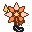 Ember Bloom | -2.0% |
| 2 | 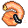 Ember Grub | -6.8% |
| 3 |  Ember Charm | -11.5% |
| 4 |  Glacier Bait | -16.3% |
| 5 | 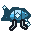 Glacier Lure | -21.0% |
| 6 |  Glacier Chum | -25.8% |
| 7 | 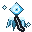 Glacier Jig | -30.5% |
| 8 |  Glacier Morsel | -35.3% |
| 9 |  Glacier Wader | -40.0% |

### Multicatch

Adds a chance to receive a second fish from the same catch. It adds to the Surge Crystal's multicatch chance.

| Rank | Bait | Bonus-catch chance |
| ---: | --- | ---: |
| 1 |  Glacier Tempter | +1.0% |
| 2 | 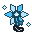 Glacier Bloom | +4.6% |
| 3 |  Glacier Grub | +8.3% |
| 4 |  Glacier Charm | +11.9% |
| 5 | 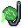 Verdant Bait | +15.5% |
| 6 | 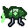 Verdant Lure | +19.2% |
| 7 | 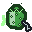 Verdant Chum | +22.8% |
| 8 | 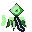 Verdant Jig | +26.4% |
| 9 | 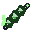 Verdant Morsel | +30.0% |

### Biome Focus

Adds selection weight to fish restricted to the biome where you are fishing. Universal fish that can appear in any biome are unaffected.

| Rank | Bait | Biome focus |
| ---: | --- | ---: |
| 1 | 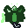 Verdant Wader | +5.0% |
| 2 | 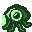 Verdant Tempter | +15.6% |
| 3 | 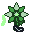 Verdant Bloom | +26.2% |
| 4 | 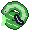 Verdant Grub | +36.8% |
| 5 | 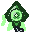 Verdant Charm | +47.4% |
| 6 | 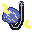 Storm Bait | +58.0% |
| 7 | 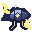 Storm Lure | +68.6% |
| 8 |  Storm Chum | +79.2% |
| 9 | 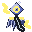 Storm Jig | +89.8% |

### Entropy Bonus

Grants a fixed amount of Entropy immediately for each fish actually caught. A bonus fish produced by multicatch also counts as a catch.

| Rank | Bait | Entropy per catch |
| ---: | --- | ---: |
| 1 |  Storm Morsel | +10 |
| 2 | 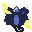 Storm Wader | +35 |
| 3 | 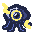 Storm Tempter | +60 |
| 4 | 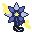 Storm Bloom | +85 |
| 5 | 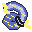 Storm Grub | +110 |
| 6 | 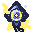 Storm Charm | +135 |
| 7 | 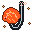 Molten Bait | +160 |
| 8 | 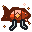 Molten Lure | +185 |
| 9 | 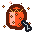 Molten Chum | +210 |

### Capacity Bonus

Grants a fixed amount of Capacity immediately for each fish actually caught. This direct reward is separate from the caught fish's sell value.

| Rank | Bait | Capacity per catch |
| ---: | --- | ---: |
| 1 | 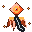 Molten Jig | +3 |
| 2 |  Molten Morsel | +12 |
| 3 | 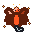 Molten Wader | +21 |
| 4 | 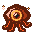 Molten Tempter | +30 |
| 5 | 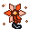 Molten Bloom | +39 |
| 6 |  Molten Grub | +48 |
| 7 |  Molten Charm | +57 |
| 8 |  Shadow Bait | +66 |
| 9 |  Shadow Lure | +75 |

### Double Value

Provides an independent chance to double the caught fish's Capacity value. A successful double still respects the configured 4,000-Capacity maximum value per fish.

| Rank | Bait | Double-value chance |
| ---: | --- | ---: |
| 1 |  Shadow Chum | +3.0% |
| 2 |  Shadow Jig | +7.0% |
| 3 |  Shadow Morsel | +11.0% |
| 4 |  Shadow Wader | +15.0% |
| 5 |  Shadow Tempter | +19.0% |
| 6 |  Shadow Bloom | +23.0% |
| 7 |  Shadow Grub | +27.0% |
| 8 |  Shadow Charm | +31.0% |
| 9 |  Radiant Bait | +35.0% |

### Treasure Luck

Increases every fishing-sourced bait ingredient's independent find roll on that catch. The listed percentage multiplies the ingredient's base chance: for example, +215% means 3.15 times its normal chance.

| Rank | Bait | Ingredient chance |
| ---: | --- | ---: |
| 1 |  Radiant Lure | +15% |
| 2 |  Radiant Chum | +40% |
| 3 |  Radiant Jig | +65% |
| 4 |  Radiant Morsel | +90% |
| 5 |  Radiant Wader | +115% |
| 6 |  Radiant Tempter | +140% |
| 7 |  Radiant Bloom | +165% |
| 8 |  Radiant Grub | +190% |
| 9 |  Radiant Charm | +215% |

### Retry Chance

Can rescue an attempt after its MasterFish catch-chance roll misses. The bait first rolls the listed retry chance; if that succeeds, the game repeats the same catch-chance roll once. The listed value is therefore not a flat addition to the normal catch chance.

| Rank | Bait | Retry chance |
| ---: | --- | ---: |
| 1 |  Void Bait | +5.0% |
| 2 |  Void Lure | +10.0% |
| 3 |  Void Chum | +15.0% |
| 4 |  Void Jig | +20.0% |
| 5 |  Void Morsel | +25.0% |
| 6 |  Void Wader | +30.0% |
| 7 |  Void Tempter | +35.0% |
| 8 |  Void Bloom | +40.0% |
| 9 |  Void Grub | +45.0% |

## Rank Requirements and Recipe Costs

All 11 tracks use the same nine-rank research structure. Rank determines the required fish rarity, ingredient tier, and recipe size; the bait's visual family does not.

| Rank | Required fish | Rarity | Ingredient tier | One-time research amounts | Repeat-crafting cost |
| ---: | --- | --- | ---: | --- | --- |
| 1 | River Mackerel | Common | 1 | 2 + 1 | 1 primary ingredient |
| 2 | Stream Lungfish | Common | 1 | 2 + 2 | 1 primary ingredient |
| 3 | Rust Cowfish | Uncommon | 2 | 3 + 2 | 1 primary ingredient |
| 4 | Cinder Lungfish | Uncommon | 2 | 3 + 2 + 1 | 2 primary ingredients |
| 5 | Arcane Herring | Rare | 3 | 3 + 2 + 2 | 2 primary ingredients |
| 6 | Electric Sturgeon | Rare | 3 | 4 + 2 + 2 | 2 primary ingredients |
| 7 | Radiant Lanternfish | Epic | 4 | 4 + 3 + 2 | 2 primary ingredients |
| 8 | Behemoth Herring | Legendary | 4 | 4 + 3 + 2 | 2 primary ingredients |
| 9 | Alpha Anglerfish | Mythic | 5 | 5 + 3 + 1 | 2 primary ingredients |

The Fishing Table displays the exact ingredient names and quantities for the selected recipe.

## Unlock Order

The 11 effect tracks progress independently, but every track must be researched from rank 1 to rank 9. You cannot skip a lower rank because you already own ingredients for a stronger one.

Rank 1 in every track is always visible. After that, the table shows only the next locked recipe in a track, and only after you have encountered at least one of its research ingredients. This discovery check includes ingredients in your inventory, ingredients recorded as previously found, and ingredients stored in MasterChest. The full research cost must still be present in your normal inventory when you unlock the recipe.

Research also requires the listed fish species to be recorded in your Fishing Glossary. Researching consumes the displayed ingredients, permanently unlocks the bait for your account, and gives you the first copy. The **Craft Bait** screen then uses the cheaper repeat recipe for every additional copy.

See [Fishing Table](fishing-table.md) for the complete research and crafting workflow.

## Related Articles

- [Bait Ingredients](bait-ingredients.md)
- [Fishing Table](fishing-table.md)
- [Fishing Guide](../fishing.md)
- [Fishing Rods](rods.md)
- [Augment Crystals](augment-crystals.md)
- [All Fish Species](../fish-species.md)
