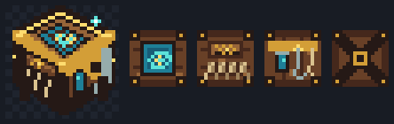

# Fishing Table

The Fishing Table is a placeable angler's workbench used to research and craft all 100 [Bait](bait.md) recipes from collectible [Bait Ingredients](bait-ingredients.md). It has its own block and item textures, remembers each player's unlocked recipes, and can be placed anywhere you can build.

## Craft the Table

The recipe is automatically added to your recipe book when you join.

|   |   |   |
| --- | --- | --- |
| Prismarine Crystals | Fishing Rod | Prismarine Crystals |
| Copper Ingot | Barrel | Copper Ingot |
| Copper Ingot | Copper Ingot | Copper Ingot |

You need two Prismarine Crystals, one Fishing Rod, one Barrel, and five Copper Ingots. Place the finished table and right-click it to open the menu. Breaking it normally drops the custom Fishing Table item again.

## Table Menu

The hub displays how many recipes you know out of 100 and provides two actions:

- **Research Bait Recipes** shows recipes you have unlocked and the next available recipe in each of the six effect tracks.
- **Craft Bait** opens a shapeless 3×3 ingredient grid for recipes you have already researched.

## Find Bait Ingredients

There are 50 custom ingredients found in Trial Chambers, villages, Ancient Cities, End Cities, and as MasterFish bonus drops. See [Bait Ingredients](bait-ingredients.md) for every ingredient, its exact source, tier, chance, and texture.

## Research a Recipe

1. Choose the currently available recipe in one of the six effect tracks. The first recipe of every track is always visible; later recipes must be unlocked from weakest to strongest.
2. Catch the fish species listed on the recipe at least once. The requirement uses your permanent Fishing Glossary history, so you do not need to keep the fish item.
3. Carry every displayed research ingredient in your normal inventory.
4. Click the recipe when every fish and ingredient requirement has a green check mark.

Research consumes the one-time research recipe, permanently unlocks that bait for your account at every Fishing Table, and gives you one bait immediately. Already researched recipes remain visible for reference.

After the first step of a track, its next recipe appears once you currently hold, previously found, or have stored in MasterChest at least one relevant ingredient. MasterChest and discovery history reveal the entry but do not pay the research cost; the required items must be in your normal inventory.

## Craft an Unlocked Bait

1. Open **Craft Bait**.
2. Move the exact repeat-crafting ingredient and amount into the 3×3 grid. Its position does not matter.
3. When the output changes from **No matching recipe** to the bait, click it to craft.

The repeat recipe is much cheaper than research and uses only that bait's primary ingredient: one item for tiers 1–3 and two for tiers 4–10. A recipe matches only when the ingredient and total amount are exact, with no extras. Crafting consumes the grid and produces one bait. The grid is not storage, so remove unused ingredients before leaving the screen.

## Progression Tips

- Use the [Bait Ingredients](bait-ingredients.md) list to target the exact structure or fishing source you need.
- Lower bait tiers use lower-tier ingredients, while the two highest bait families require tier-5 materials.
- Keep fishing while gathering structure loot. Fishing-source ingredients are required throughout the progression.
- Develop the six effect tracks independently and choose the next one that supports your current goal.
- Research unlocks belong to the player, not the placed table. You can use any Fishing Table afterward.

## Related Articles

- [Baits](bait.md)
- [Bait Ingredients](bait-ingredients.md)
- [Fishing Guide](../fishing.md)
- [Fishing Rods](rods.md)
- [All Fish Species](../fish-species.md)
