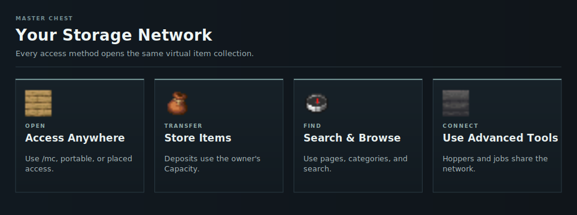

# Storage Network

The Master Chest is HOPSIPOP's virtual storage network. `/mc`, portable Master Chests, and placed access points all open the same contents.

The network limit is your [Capacity](../capacity.md). Advanced tools such as hoppers, OmniSync, automation, and [Chunk Drills](../capacity-world/chunk-drills.md) use the same network.

<!-- ARTICLE-VISUAL:storage-network:START -->

<!-- ARTICLE-VISUAL:storage-network:END -->

## Start Here

1. [Unlock and Open Storage](getting-started.md)
2. [Transfer Items](storing-and-retrieving.md)
3. [Find Items](search.md)
4. [Understand Capacity](../capacity.md)

## Other Storage Features

- [Item Categories](categories.md)
- [Shortcuts](shortcuts.md)
- [Daily Events](../daily-events.md)
- [Shared Networks](sharing-networks.md)
- [OmniSync](omnisync.md)
- [Mobile Workbench](../tools/mobile-workbench.md)
- [Hoppers](hoppers.md)
- [Automation Jobs](automation.md)
