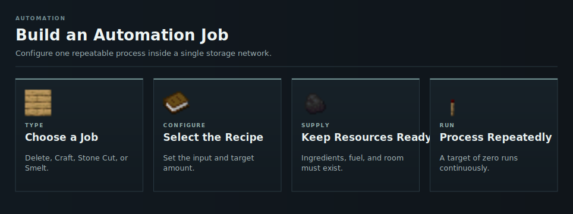

# Automation Jobs

Automation Jobs process items inside one storage network. Open them with `/mc jobs` or through the Automation Jobs button in the Master Chest menu.

<!-- ARTICLE-VISUAL:storage-automation:START -->

<!-- ARTICLE-VISUAL:storage-automation:END -->

## Job Types

Each job has its own detailed setup and behavior guide.

| Job | Unlock | Creation cost | What it does |
| --- | --- | --- | --- |
| [Delete](automation-delete.md) | Storage access | Free | Deletes all matching stock or only the amount above a keep value. |
| [Craft](automation-craft.md) | Complete Crafterlands | 10 Crafters | Repeats one shaped or shapeless crafting recipe. |
| [Stone Cut](automation-stone-cut.md) | Complete Stonemason | 10 Stonecutters | Converts one stored input into the selected stonecutter output. |
| [Smelt](automation-smelt.md) | Complete Furnacity | 10 Blast Furnaces | Runs one blasting recipe with a selected stored fuel. |

See [Progression Unlocks](capacity-and-progression.md) for the order of the milestones.

## Common Controls

All jobs are created enabled. Craft, Stone Cut, and Smelt start with a minimum stock of `0`. A new Delete job starts with its current matching network stock as the amount to keep.

| Control | Effect |
| --- | --- |
| Click | Enables or disables Delete, Stone Cut, and Smelt jobs. On a Craft job, it opens the recipe editor instead. |
| Drop key | Enables or disables a Craft job. |
| Shift-click | Advances the keep or minimum-stock value. |
| Right-click | Permanently removes the job. |

Shift-click advances to the next higher preset: `16`, `32`, `64`, `128`, `256`, `512`, `1,024`, `2,048`, `4,096`, `8,192`, `16,384`, `20,000`, `32,768`, `50,000`, `75,000`, or `100,000`. From `100,000` or any higher value, it returns to `0`.

- For Delete, the initial value is the matching stock present when the job is created. This protects the existing stock and deletes only later excess. If no matching items exist at creation, the initial value is `0`. At `0`, every matching item is deleted; a higher value is the amount to keep.
- For Craft, Stone Cut, and Smelt, `0` means run whenever the required items are available. A higher value is the minimum result stock the job tries to maintain.
- Changing the minimum on a processing job also changes it on every other processing job with the same output material, even across different job types.

## Processing Rules

- The automation runner checks enabled jobs every 5 server ticks, normally four times per second.
- Craft, Stone Cut, and Smelt perform at most one recipe operation per job and check. Delete removes all current excess in one check.
- A processing job checks its output stock before starting an operation. A recipe that returns multiple items can therefore finish slightly above its selected minimum.
- Ingredients, fuel, costs, and results all use the job owner's storage network.
- Player-provided setup items are only samples. They return to the player's inventory after saving or closing the setup menu; overflow is dropped at the player's location.
- Normal items are matched by material. Durability, enchantments, and other metadata do not distinguish them. Firework Rockets and the plugin's Master Chest, OmniSync, Lava Sponge, and Cell Tower items are matched exactly instead.
- Jobs keep running while their owner is offline.

## Capacity and Removing Paid Jobs

Processing inputs are removed before the result is stored. If the network has insufficient [Capacity](../capacity.md), any part of an automated result that does not fit has no player-inventory fallback. Leave enough free space for the complete output batch.

Right-clicking a paid job refunds part of its 10 machine items directly to the same network. The refund uses the owner's current Capacity rank:

| Current rank | Refund |
| --- | --- |
| Below Atom | None |
| Atom | 5 machines (50%) |
| Nova | 6 machines (60%) |
| Quasar | 7 machines (70%) |
| Singularity | 8 machines (80%) |
| Void | 9 machines (90%) |
| Cosmic or higher | 10 machines (100%) |

Delete jobs are free and have no refund. The refund also needs enough network Capacity to fit.

## Continue Learning

- [Hoppers](hoppers.md)
- [OmniSync](omnisync.md)
- [Storage Troubleshooting](troubleshooting.md)
