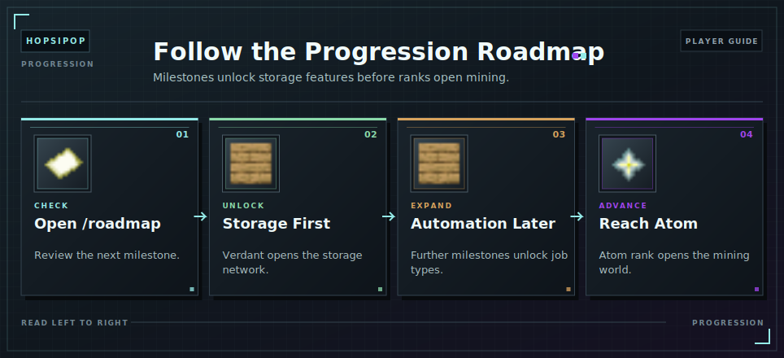

# Progression Unlocks

Use `/roadmap` to see milestone requirements and `/perks` to review [ranks](../ranks.md).

<!-- ARTICLE-VISUAL:progression-unlocks:START -->

<!-- ARTICLE-VISUAL:progression-unlocks:END -->

## Main Unlocks

| Requirement | Unlock |
| --- | --- |
| Complete Verdant | Storage network |
| Complete Mobmon | OmniSync crafting |
| Complete Stonemason | Stone Cut automation |
| Complete Crafterlands | Craft automation |
| Infinity wave 21 | Portable Workbench |
| Infinity wave 50 | Ender Chest access |
| Complete Furnacity | Smelt automation |
| Reach Atom [rank](../ranks.md) | [Capacity](../capacity.md) World |

Armor requirements shown in `/roadmap` are also part of the sequence. Use the in-game menus for current requirements.

## Continue Learning

- [Ranks](../ranks.md)
- [Automation Jobs](automation.md)
- [Mining Access](../capacity-world/getting-started.md)
