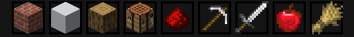

# Item Categories

Categories filter the storage menu by item type. In menu order, the filters are All, Building, Colored, Natural, Functional, Redstone, Tools, Combat, Food, and Ingredients.

All is selected by default whenever you open the Master Chest. Select another category at the top of `/mc` to show only matching items, or choose All to remove the filter.

## Continue Learning

- Find a specific item with [Item Search](search.md).
- Review [item transfer controls](storing-and-retrieving.md).
