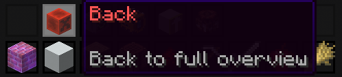

# Item Categories

The Master Chest opens in Full Overview by default. The category filters are Building, Colored, Natural, Functional, Redstone, Tools, Combat, Food, and Ingredients.

Select a category at the top of `/mc` to show only matching items. While a filter is active, click Back in the upper-left corner to return to Full Overview.

## Continue Learning

- Find a specific item with [Item Search](search.md).
- Review [item transfer controls](storing-and-retrieving.md).
