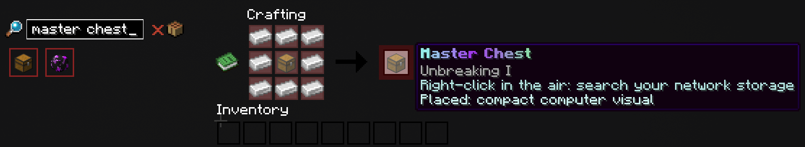

# Storage Access

Complete the Verdant dungeon to unlock the storage network. Afterward, use any of these access methods.

## Command Access

Run `/mc` or `/masterchest`.

## Portable Access

Craft a Master Chest by placing one Chest in the center and surrounding it with eight Iron Ingots.

Hold the finished Master Chest and right-click the air to open your storage network.

## Placed Access

Place the Master Chest in an allowed world and right-click it. Multiple placed access points open the same virtual network.

Sneak-right-click an access point with an empty hand to open its physical input buffer. Items in this buffer are moved into virtual storage automatically.

Breaking an access point returns the special item. Virtual contents remain safe, but items still in the physical buffer drop at the block.

## Appearance

Open `/mc`, select **Shortcuts**, then **Appearance → Master Chest** to choose the design used by all of your placed access points. Changing the selection refreshes existing Master Chests immediately.

The **Default** design is a compact futuristic data terminal styled after the Tinkerer Table. It uses a stepped black-glass core, a gently curved five-panel display, fine cyan telemetry lines, restrained gold accents, a tilted access pad, and a flat circuit-patterned crown without side modules or a raised top block. Its small status cell blinks red while idle and turns green while the Master Chest is open.

The **Cherry** design presents the Master Chest as an airy blossom data shrine with layered Cherry wood, a curved pink shoji display, a luminous five-petal core, a fine blossom arch, side posts, pearl lanterns, an access tray, and a shallow pagoda crown.

The **Copper** design is a separate patinated data-vault model built from Cut, Exposed, Weathered, and Oxidized Copper, with detailed rivets, integrated Copper Grate heat exchangers, patina pipework, a curved black-glass display, a mechanical copper iris, warm Copper Bulb lighting, an angled service pad, and ventilated top and rear panels.

The **Mangrove** design is a root-cradled seed archive. Sweeping roots carry the chest, branch horns frame its panoramic glass, amber ceramic collars bind the grown structure, and hanging Shroomlight pods provide warm status lighting.

The **Lapis Lazuli** design is an arcane astrolabe archive with deep-blue casing, blueprint glass, prism optics, a vertical faceted halo, and three uneven crystal needles.

The **Lush Cave** design is a moss-grown grotto archive. Rooted cave supports and pale Calcite ribs carry a curved botanical display, a recessed water lens, uneven Azalea terraces, and small hanging glow pods.

Default is always available. The five alternative designs are unlocked separately for each player by an operator with `/masterchest theme unlock <player> chest <cherry|copper|mangrove|lapis|lush>`. A locked design can be tried for two minutes by clicking it. After the preview ends, all placed access points return to Default and that design enters a one-hour preview cooldown.

Every design has a restrained ambient particle accent above the access point: cyan motes and an occasional End Rod for Default, pink motes and Cherry Leaves for Cherry, patina motes and electrical sparks for Copper, rust-red motes and spores for Mangrove, blue motes with enchantment glyphs for Lapis Lazuli, and green motes with falling Spore Blossoms for Lush Cave. These effects appear only while players are nearby.

## Continue Learning

- [Transfer Items](storing-and-retrieving.md)
- [Capacity](../capacity.md)
- [Hoppers](hoppers.md)
