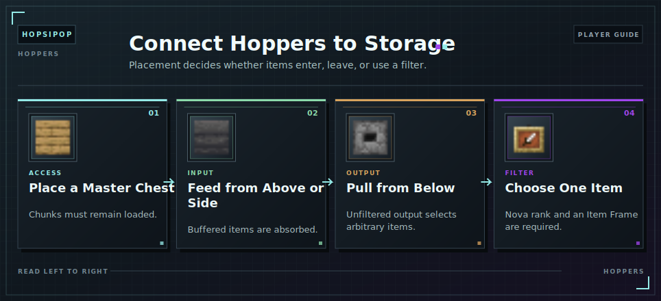

# Hoppers

Hoppers move items between physical containers and the virtual storage network while the relevant chunks are loaded.

<!-- ARTICLE-VISUAL:hoppers:START -->

<!-- ARTICLE-VISUAL:hoppers:END -->

## Input

Place a hopper above or beside a Master Chest access point. Items entering its physical buffer are absorbed into storage.

## Output

A hopper directly below the Master Chest pulls arbitrary stored items.

For filtered output, reach Nova [rank](../ranks.md), attach an Item Frame to a nearby hopper, dispenser, or dropper, and place the desired item in the frame. The network owner must be online.

Avoid an unfiltered hopper underneath unless random output is acceptable. Keep enough [Capacity](../capacity.md) for automatic input.

## Continue Learning

- [Storage Access](getting-started.md)
- [Automation Jobs](automation.md)
- [Storage Troubleshooting](troubleshooting.md)
