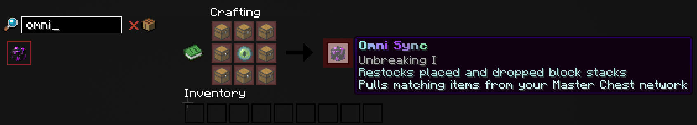

# OmniSync

OmniSync provides automatic restocking and network-assisted crafting from the selected storage network. Complete Mobmon before crafting it.

## Restocking

Keep OmniSync in your inventory. When a matching stack is used up, it can pull replacements from storage. Restocking fails if the selected network has none available.

## Crafting

Craft OmniSync by placing one Eye of Ender in the center and surrounding it with eight Chests.

While OmniSync is available, crafting can use missing ingredients from the linked network. Finished items still need inventory or storage space.

## Shared Network Link

Right-click OmniSync in the air to select your own network or a network shared with you. The selected network is also used for restocking and assisted crafting.

Return to My Own Network after shared work, and confirm the active owner before depositing items.

## Continue Learning

- [Shared Networks](sharing-networks.md)
- [Item Transfers](storing-and-retrieving.md)
- [Storage Troubleshooting](troubleshooting.md)
