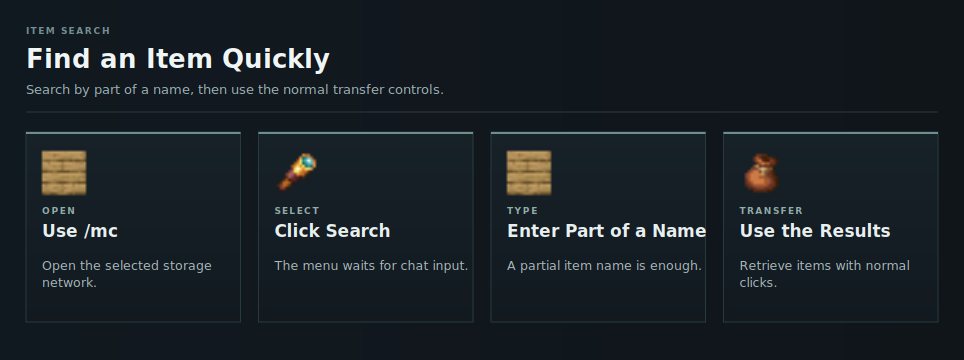

# Item Search

Use search when the storage network contains too many item types to browse comfortably.

<!-- ARTICLE-VISUAL:item-search:START -->

<!-- ARTICLE-VISUAL:item-search:END -->

## Searching

1. Open `/mc`.
2. Click Search.
3. Enter part of an item name in chat.

The menu shows matching stored items. Normal [item transfer](storing-and-retrieving.md) controls still apply.

## Continue Learning

- Browse by [item category](categories.md).
- Open connected features through [Shortcuts](shortcuts.md).
