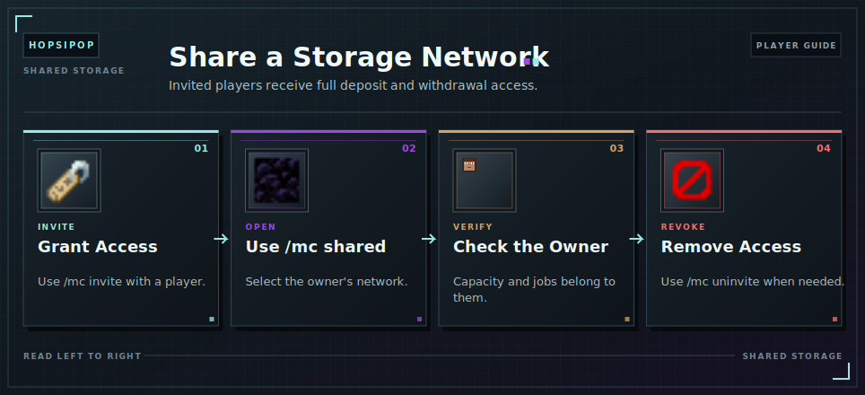

# Shared Networks

The network owner can grant another player full deposit and withdrawal access with `/mc invite <player>`.

Invited players open the network through `/mc shared` or the owner's placed Master Chest. The owner's [Capacity](../capacity.md) and automation settings apply.

Always check the displayed owner before transferring items. Anyone with access can remove stored items.

The owner can revoke access with `/mc uninvite <player>`. Revoking access does not reverse earlier transfers.

<!-- ARTICLE-VISUAL:shared-networks:START -->

<!-- ARTICLE-VISUAL:shared-networks:END -->

## Continue Learning

- [Item Transfers](storing-and-retrieving.md)
- [OmniSync](omnisync.md)
- [Storage Troubleshooting](troubleshooting.md)
