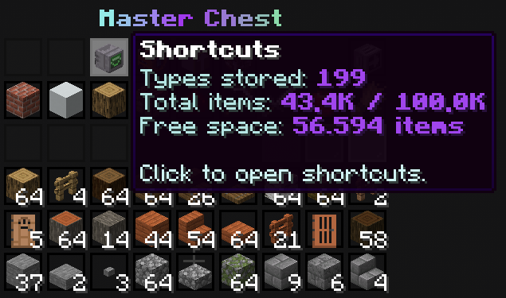

# Shortcuts

The Shortcuts menu opens storage statistics and connected HOPSIPOP features from one place.

Open it through `/shortcuts` or the Shortcuts button in `/mc`. It shows stored item types, total items, available [Capacity](../capacity.md), and links to unlocked features such as [claims](../claims.md), perks, guides, shared networks, the [Capacity](../capacity.md) World, and the [Cell Tower](../tools/cell-tower.md).

The [Scoreboard](scoreboard.md) button opens a separate settings menu. Use it to hide the sidebar completely or select up to seven live lines, including Capacity, rank, automation information, Daily Event results, Keyall progress, and the stored amount of one tracked item.

Hover over the Shortcuts button to see the number of stored item types, current storage use, and remaining [Capacity](../capacity.md) before opening the menu.

Some entries remain locked until their progression or [rank](../ranks.md) requirement is met.

## Continue Learning

- Check [Capacity](../capacity.md) and [rank](../ranks.md) progress.
- Customize the [Scoreboard](scoreboard.md).
- Compete in [Daily Events](../daily-events.md).
- Open a [shared network](sharing-networks.md).
- Review [progression unlocks](capacity-and-progression.md).
