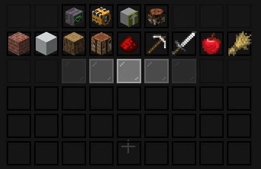
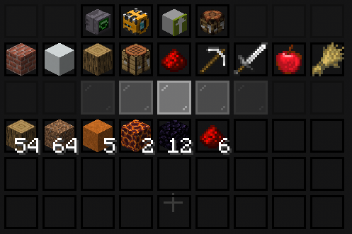
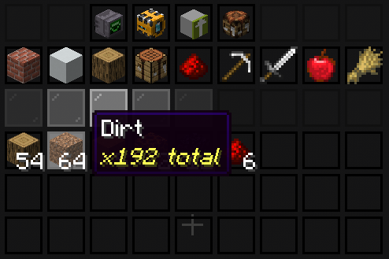
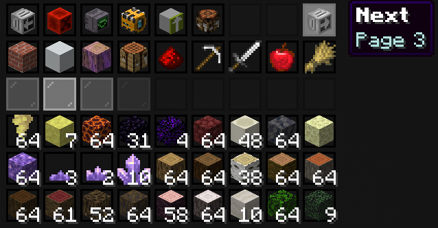

# Item Transfers

Open `/mc` to move items between your inventory and the storage network.

An empty network shows only the menu controls and category buttons. Stored items appear in the open slots after the first deposit.

After depositing items, each stored item type appears once.

Multiple stacks of the same item stay combined in one menu slot. Hover over the item to see the exact stored total in its tooltip.

## Browsing Pages

When more item types are stored than one page can show, a Next button appears in the upper-right corner. Hover over it to see the destination page, then click it to continue. A Previous button appears in the upper-left corner after leaving the first page.

The menu adds pages as needed, but the total number of stored items is still limited by [Capacity](../capacity.md).

## Depositing

- Shift-click an inventory stack to store it.
- Place a stack on the cursor and click the matching menu item to add it.
- Use the matching-item transfer control to deposit every matching inventory stack.

## Retrieving

- Left-click a stored item to take a stack.
- Right-click to take one item.
- Shift-click to move items directly into your inventory.

## Full Storage

Each individual item uses one [Capacity](../capacity.md). If only part of a deposit fits, the remainder stays in your inventory, on the cursor, or in the physical input buffer.

Always confirm the active network before a large transfer, especially when using [shared storage](sharing-networks.md) or [OmniSync](omnisync.md).

## Continue Learning

- [Item Search](search.md)
- [Item Categories](categories.md)
- [Storage Troubleshooting](troubleshooting.md)
