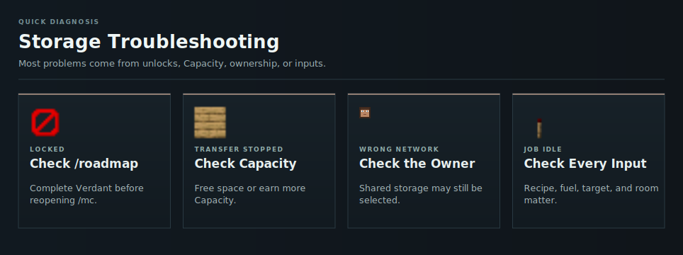

# Storage Troubleshooting

<!-- ARTICLE-VISUAL:storage-troubleshooting:START -->

<!-- ARTICLE-VISUAL:storage-troubleshooting:END -->

## Storage Is Locked

Complete Verdant, then reopen `/mc`. Check `/roadmap` if the requirement still appears incomplete.

## A Transfer Was Incomplete

The network may have reached its [Capacity](../capacity.md). Free space or earn more [Capacity](../capacity.md). Right-click retrieves one item; use left-click for a stack.

## Items Went to the Wrong Network

Check the displayed owner. [OmniSync](omnisync.md) may still be linked to shared storage. Select My Own Network before continuing.

## OmniSync Does Not Restock

Keep it in your inventory and confirm that the selected network contains a matching item.

## An Automation Job Is Idle

Check the input, recipe, fuel, output target, and free storage space. All required items must be in the job owner's network.

## Hopper Output Is Wrong

A hopper directly below a Master Chest is unfiltered. Use the [filtered-output setup](hoppers.md#output) for a specific item.

## Continue Learning

- [Storage Access](getting-started.md)
- [Item Transfers](storing-and-retrieving.md)
- [Automation Jobs](automation.md)
