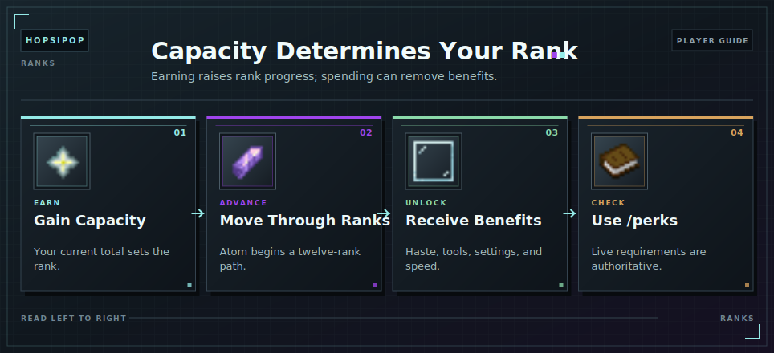

# Ranks

Ranks are determined by your current [Capacity](capacity.md). Earning [Capacity](capacity.md) can raise your rank; spending it can lower your rank and temporarily remove its benefits.

<!-- ARTICLE-VISUAL:ranks:START -->

<!-- ARTICLE-VISUAL:ranks:END -->

## Rank Order

Atom, Nova, Quasar, Singularity, Void, Cosmic, Celestial, Divine, Primordial, Multiversal, Omniversal, and Apex.

Open `/perks` and select Rank Overview for live requirements. Left-click a rank to track it with a boss bar; right-click to stop tracking.

## Important Benefits

- Atom unlocks the [Capacity](capacity.md) World, the [Cell Tower](tools/cell-tower.md) recipe, and Haste I in the mining world.
- Nova grants Haste II and filtered Master Chest hopper output.
- Quasar and higher grant Haste III.
- Quasar unlocks [Chunk Drill](capacity-world/chunk-drills.md) chest-content collection.
- Void unlocks per-claim [Claim Settings](claims/settings.md).
- Higher ranks improve [Chunk Drill](capacity-world/chunk-drills.md) speed until the fastest interval is reached.

Requirements and additional perks may change, so `/perks` is the current source of truth.

## Continue Learning

- [Capacity](capacity.md)
- [Progression Unlocks](master-chest/capacity-and-progression.md)
