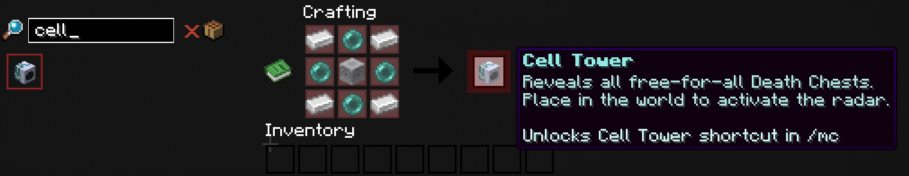

# Cell Tower

A Cell Tower locates free-for-all Death Chests and guides you to a selected chest with a GPS particle trail. Quasar and higher [ranks](../ranks.md) can also search for nearby biomes.

## Crafting

Reach the Atom [rank](../ranks.md) to discover the recipe. Place a Lodestone in the center, Ender Pearls on its four sides, and Iron Ingots in the four corners.

## Using the Tower

Place the Cell Tower inside your own [claim](../claims.md). You may have only one placed tower.

Right-click the tower or open `/mc` → Shortcuts → Cell Tower. Select a destination to start GPS navigation. Break your tower to recover the special item.

## Continue Learning

- [Ranks](../ranks.md)
- [Claims](../claims.md)
- [Shortcuts](../master-chest/shortcuts.md)
