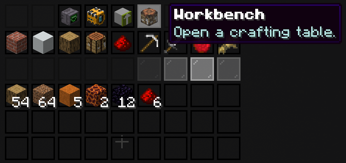

# Mobile Workbench

The Mobile Workbench opens a Crafting Table from anywhere without placing one in the world.

## Unlocking

Survive through wave 21 in the Infinity Arena to unlock it permanently.

## Opening the Workbench

Open your [Master Chest](../master-chest/getting-started.md) and click the Workbench icon in the top row.

If [OmniSync](../master-chest/omnisync.md) is available, crafting can also use missing ingredients from the selected storage network.

## Continue Learning

- [Master Chest Access](../master-chest/getting-started.md)
- [OmniSync](../master-chest/omnisync.md)
